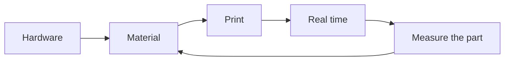
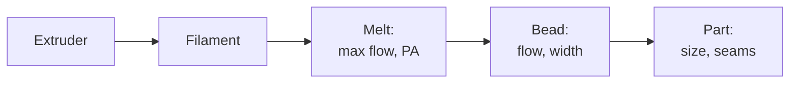

# Calibration as a control problem

How tuning works right now: print a test tower, squint at it, change a number, repeat. For every
nozzle, every filament, sometimes every spool. I'm the sensor and the controller, the slicer
settings are the knobs, and there are dozens of them. They aren't independent either, so fixing
one breaks another, and swapping a nozzle throws half the work away.

I want to treat this like a control problem instead of a black box:

- What are the actual physical states?
- Which sensors can see them, and which are hidden?
- What models link them?
- Which "settings" are real parameters, and which are just derived from something else?

Then automate whatever sensors can measure, and keep a human only for the stuff that's actually
taste (seam placement, how a surface looks).

The research behind all this (material science, control, and stuff borrowed from other
industries) is in [`research/`](../research/README.md). The long-form explanation, from basics
to the math, is the [handbook](../handbook/README.md).

**This is big and it's not getting solved in one go.** These pages are the breakdown, not the
answer. Work in progress.

| Page | What's in it |
|---|---|
| [Variables](variables.md) | Every variable: what kind it is, what it depends on, what can see it, how often it changes |
| [Sensors](sensors.md) | What I have, what's coming, cheap stuff to add, and which hidden states each one can see |
| [Models](models.md) | The physics linking them: flow chain, nozzle pressure, melt capacity, bead shape, dimensions, cooling |
| [Quality](quality.md) | Each print problem (seams, dimensions, first layer, stringing...) broken into its causes |
| [Filament](filament.md) | Brand and spool variation, fast tests and proxies, anchors, confidence tiers |
| [Library](library.md) | Getting a tested library without testing: borrowed data, mapping it to this machine, checking during normal prints |

## The idea

1. **Most slicer settings aren't real parameters.** They're functions of a few physical properties. Line width comes from the nozzle. Max speed comes from how fast the hotend can melt. How much retraction you need depends on how good PA is. Identify the physics, derive the settings.
2. **Every parameter belongs to exactly what it depends on.** PA depends on nozzle, hotend, extruder, material and temperature. Shrinkage depends on material and chamber temperature, not the nozzle. Store each one keyed by its real dependencies, and a nozzle swap only invalidates the nozzle stuff.
3. **The calibration order falls out of the dependency graph.** Measure what nothing else depends on first. Where two things depend on each other, identify them together or iterate.
4. **Swap "look at a test print" for a sensor wherever possible.** Pressure sensor for PA and max flow, filament width sensor for diameter and slip, a scale for mass, the accelerometer for motion, the probe for geometry. Camera and calipers for what's left.
5. **Learn the model, not the knob.** When a print comes out wrong, the measured error updates a physical parameter (shrinkage, flow residual), and the settings get re-derived from it. Fixing the knob directly is how you end up with forty profiles that disagree.

## Loops by timescale

Things change at very different rates, so this splits into nested loops:

| Loop | Runs when | What changes | How it's handled |
|---|---|---|---|
| **Hardware** | Nozzle, hotend or toolhead swap | Nozzle geometry, melt capacity, PA, toolhead mass, Z offset | Identification routine on the machine |
| **Material** | New filament or spool | Diameter, density, viscosity, max flow, PA, shrinkage, moisture | Material identification |
| **Print** | Every print | Chamber, frame temperature, Z, bed shape | `PRINT_START`: soak, QGL, autoz, mesh |
| **Real time** | During the print | Flow, hotend temp under load, nozzle pressure, Z drift, chamber | MPC feedforward, PA, chamber control, `z_thermal_adjust`, flow comp |
| **Learning** | After prints | Whatever the models got wrong | Measured results update the model parameters |

## Calibration order (first pass)

Rough dependency order. Each step only needs the ones before it.

1. **Machine:** skew, axis scale, belts, shaper, gantry level, Z. Hardware only
2. **Thermal plant:** hotend model (MPC), bed, chamber heat loss
3. **Extruder:** rotation distance. Extruder only
4. **Filament:** diameter, density, moisture. Spool only
5. **Melt:** max flow vs temperature, PA vs flow and temperature, ooze. Hotend × nozzle × material
6. **Bead:** flow residual, real line width, first-layer squish
7. **Part:** shrinkage, contour offset, cooling, seams
8. **Preferences:** speed vs quality, seam placement, looks

The core chain, where most of the pain is:

Tuning out of order is why it never converges. Dialing flow ratio while PA is wrong, or seams
while retraction is compensating for bad PA, just bakes one error into another knob.

## What a nozzle swap should look like

**Today:** edit `printer.cfg`, edit Orca, then redo flow, PA, retraction, line widths, max speeds
and seams by hand with test prints.

**Want:**

1. Tell the machine (a `NOZZLE_SET` macro or a button), stored as machine state, not in `printer.cfg`. Even better, it checks itself: with a pressure sensor, pressure at a known flow climbs steeply as the bore shrinks, so 0.4 vs 0.6 is roughly a 2 to 3× difference for a typical shear-thinning melt ([handbook](../handbook/04-extrusion-dynamics.md#the-nozzles-resistance-for-a-real-melt))
2. The machine reruns what depends on the nozzle: autoz (stickout changes), max flow, PA, ooze
3. Derived settings regenerate: line widths, layer limits, speed caps, retraction
4. Orca presets for that nozzle regenerate. Slicing for the wrong nozzle gets caught at `PRINT_START`
5. Untouched: shrinkage, shaper, skew, chamber. They don't depend on the nozzle

Most of step 2 needs the pressure sensor on the new toolhead. Until then it's test prints, but
still in the right order and stored in the right place.

## To do

- [ ] Go through [variables](variables.md) and mark what's already measured vs guessed
- [ ] Nozzle as machine state (`NOZZLE_SET` + `save_variables`) instead of a value in `printer.cfg`
- [ ] 0.001 g scale is ordered. What to do with it: [filament](filament.md#to-do)
- [ ] Design one dimensional test part that separates shrinkage from contour offset ([models](models.md#dimensions))
- [ ] Pick the storage format for parameters keyed by their dependencies (nozzle × material × temp...)
- [ ] Figure out which of these the bd_pressureE can identify on its own, before buying it
- [ ] Revisit [slicer.md](slicer.md) once this settles, it's still too static
