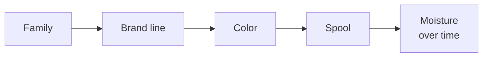

# Filament: brand and spool variation

Every brand, every color, sometimes every spool prints a little different. One PLA wants 205 °C,
another wants 230. A new PETG strings like crazy where the last one didn't. Same word on the
label, different plastic inside. Long term this is probably the biggest reliability problem: the
machine stays put, the filament keeps changing.

What I want: a few quick tests (or proxies) that tell me how a new filament compares to one I
already know prints well, plus a structure that turns that comparison into settings. Not a day
of test towers per spool.

The 0.001 g scale (ordered) is what makes most of this practical.

> **Most filaments shouldn't need any of this.** The normal path is borrowing data somebody else
> already measured and letting the machine check it during regular prints:
> [library.md](library.md). The tests on this page are for anchors, oddball materials, and
> whatever the machine flags.

## What actually varies

| Property | Why it varies | What it changes |
|---|---|---|
| Diameter, ovality | Extrusion line tolerance | Flow, on every print |
| Density | Fillers, pigments, additives (matte, silk, glow, CF, "PLA+") | Mass vs volume. Also a tell that the formulation is different |
| Viscosity vs temperature | Resin grade, molecular weight, additives, pigment loading | Best temperature, max flow, PA, ooze, seams |
| Stiffness | Material, additives | Extruder grip, PA |
| Moisture | Storage | Stringing, bubbles, seams, weak layers |
| Thermal (Tg, crystallization, heat capacity) | Material, grade | Cooling, overhangs, warping, chamber |
| Shrinkage | Material, fillers, chamber temperature | Dimensions, warping |

## Where it varies



| Level | Example | What changes | Re-test |
|---|---|---|---|
| Family | PLA vs PETG vs ABS | Everything | Full intake on the first brand, becomes the family's starting point |
| Brand line | Elegoo PLA vs Bambu PLA Basic | Grade and additives: viscosity, density, shrinkage | Tier 1 and 2 (below), check print against the anchor |
| Color within a line | White vs black of the same line | Pigment loading: density, some viscosity | Density, one-temperature ladder, compare to the line |
| Batch / lot | Another production run | Diameter, small drift | Weigh a meter. Ladder if something looks off |
| Spool | | Diameter, how it was stored | Weigh a meter, moisture check |
| Over time | Open spool | Moisture | Weight loss on drying, dry box humidity |

Write down the lot number. Brands change suppliers without telling anyone.

## Compare, don't start from scratch

Test a new filament **next to one I already know prints well (an anchor), on the same machine,
the same day.** Why relative beats absolute:

- **Machine effects cancel.** Nozzle, hotend, thermistor offset, extruder: the same for both, so the difference is the filament. Same trick as a bridge circuit
- **I already know the anchor's good settings.** The new filament doesn't need settings from scratch, only the difference
- **"Is A better than B" is a way easier call than "rate this 1 to 10."** Side by side beats memory

Anchors, one per family, picked for being consistent and already familiar: probably Bambu PLA
Basic for PLA, one of the PETGs I've already dialed on the Bambus, Bambu ABS for ABS. A sealed,
dry spool of each kept just for testing.

Bonus: anchors are also a **machine health check.** Rerun the anchor ladder monthly and after any
hardware change. If the anchor's numbers move and the filament didn't change, the machine did:
nozzle wear, a partial clog, thermistor drift, a tired heater. Plot it with limits from repeat
runs (a control chart) and drift shows up before the prints go bad.

## Keep the ratios that worked

The anchor's tuned settings get written as ratios to things I can measure. The new filament keeps
the ratios, and only the measured part changes:

| Setting | Stored as | Measured on the new filament |
|---|---|---|
| Nozzle temp | The temp where its knee flow matches the anchor's | Ladder at 2 temps |
| Max flow | A fraction $`\mu`$ of the knee flow | Ladder |
| Flow | Spool area from mass, bead residual from a weighed part | Scale |
| PA | Same as the anchor at the matched temp (same family only) | Pressure sensor later |
| Retraction | Relative to PA | Inherited |
| Cooling | Needed cooling rate vs chamber ΔT | Family |
| Chamber | Mode | Family |
| Shrinkage | Measured | Test part |

Raw numbers don't transfer between filaments, ratios mostly do.

## Fast tests

Roughly in order of how much they tell me per minute:

| Test | Time | Needs | Gives | Replaces |
|---|---|---|---|---|
| Weigh a meter | 2 min | Scale, tape | True cross-section | Calipers on filament |
| Density (Archimedes) | 5 min, once per line | Scale, cup of water, thread | Density, filler tell | Datasheet guess |
| Moisture | Dryer time | Scale | Water content | "It strings, must be the retraction" |
| Flow ladder by mass, 2 temps | About 15 min, then weighing | Scale, logger | Rotation distance, slip, max flow, temperature sensitivity | Max flow tower, marking filament, a lot of the temp tower |
| Test part: dimensions + mass | 15 min print | Scale, calipers | Shrinkage, contour offset, flow residual | Flow cube, XY compensation guessing |
| Pressure sweep | 5 min | bd_pressureE (later) | Viscosity curve, PA, ooze | PA, temp and retraction towers |
| Check print vs anchor | 30 to 60 min | Me | Seams, overhangs, stringing compared to the anchor | Endless test prints |

### Weigh a meter: true cross-section

Cut 1 m (or 2 m) of filament, measure it, weigh it. That's the linear density:

```math
\lambda = \frac{m}{L}, \qquad A_f = \frac{\lambda}{\rho}, \qquad d_{eff} = \sqrt{\frac{4 A_f}{\pi}}
```

Calipers are good to about ±0.01 mm on 1.75 mm filament, which is about ±1.1% in area. Weighing
gets the area to roughly 0.3% once density is known:

```math
\left(\frac{\sigma_A}{A}\right)^2 = \left(\frac{\sigma_m}{m}\right)^2 + \left(\frac{\sigma_L}{L}\right)^2 + \left(\frac{\sigma_\rho}{\rho}\right)^2
```

1 m of PLA is about 2.98 g, so a few mg of scale noise is about 0.1%, 1 mm of length error is
0.1%, and density at 0.3% dominates. And it averages ovality for free, since mass only cares
about area.

Take samples from two spots, the diameter drifts along a spool. BDwidth does this continuously
later.

### Density: Archimedes

Once per brand line, and per color if it's heavily pigmented. Cup of water on the scale, tare,
then hang a coil of filament from a thread fully under water without touching anything. The
reading is the mass of water it pushed aside:

```math
\rho = \rho_w \frac{m_{air}}{m_{disp}}
```

Good to a few tenths of a percent with thin thread and a drop of dish soap to knock the bubbles
off. Cup plus water has to fit under the scale's max capacity, check that when it shows up.

Density is a tell on its own. Matte, silk, glow and CF fillers all move it. A "PLA" at 1.32 is not
the same plastic as one at 1.24. Typical values to compare against:

| PLA | PETG | ABS | ASA | PC | PA6 | TPU |
|---|---|---|---|---|---|---|
| 1.24 | 1.27 | 1.04 | 1.07 | 1.20 | 1.13 | 1.21 |

### Moisture: weigh, dry, weigh

5 g from the outside of the spool. Weigh, dry until the mass stops dropping, weigh again:

```math
w = \frac{m_{wet} - m_{dry}}{m_{dry}}
```

1 mg on 5 g is 0.02%. Wet PETG, PA or TPU shows up as tenths of a percent to several percent.
When a filament prints badly, this is the first check, before touching a single setting.

### Flow ladder by mass

*What the two knees mean physically: [handbook chapter 3](../handbook/03-melting.md#two-ways-to-hit-the-wall).*

The main one, and it doesn't need the pressure sensor.

The nozzle hovers about 30 mm over a cool bed and extrudes a fixed volume at stepped flow rates,
each into its own pile at its own spot. After each step it waits a few seconds so the leftover
pressure bleeds out into that pile (everything pushed in comes out eventually), then moves to
the next spot. Afterwards, weigh every pile.

Delivered fraction per step, with $`E_i`$ the commanded filament length:

```math
\varphi_i = \frac{m_i}{\lambda E_i}
```

What comes out of it:

- **Low steps, before any slip:** $`\varphi_0 = r_{true}/r_{cfg}`$. That's the extruder rotation distance, measured hot and under real pressure. No more marking filament with a sharpie
- **Slip curve:** $`s(q) = 1 - \varphi(q)/\varphi_0`$
- **Mechanical knee** $`q^{\ast}_{mech}`$: where $`\varphi/\varphi_0`$ drops under 0.97
- **Thermal knee** $`q^{\ast}_{th}`$: logged at the same time from the hotend, where the temperature drops more than 3 °C under target or the heater sits above 95%

Steps for the 0.6 Conch:

| Step | Flow (mm³/s) | Volume (mm³) | Time (s) |
|---|---|---|---|
| 1 | 3 | 300 | 100 |
| 2 | 6 | 300 | 50 |
| 3 | 10 | 500 | 50 |
| 4 | 15 | 500 | 33 |
| 5 | 20 | 500 | 25 |
| 6 | 25 | 500 | 20 |
| 7 | 30 | 500 | 17 |
| 8 | 35 | 500 | 14 |
| 9 | 40 | 500 | 12.5 |

About 6 minutes and 5 g of PLA per temperature. A 500 mm³ pile of PLA is 0.62 g, so a few mg of
scale noise is under 0.5%. Stop early once two steps come in under 90%. Run it at the family's
normal temperature and 15 °C above.

**What the knee means.** At the mechanical knee the extruder is at its force limit, so the melt
pressure there is about the same for every filament, $`P^{\ast} = F_{max}/A_f`$. Pressure goes as
viscosity times flow ([models](models.md#nozzle-pressure)), so:

```math
q^{\ast} \propto \frac{1}{\eta}
```

Knee ratios between two filaments are viscosity ratios, as long as both are limited by extruder
force. A viscosity proxy without a pressure sensor.

**Which knee shows up first** says what's limiting:

| First sign | Means | What helps |
|---|---|---|
| Hotend temperature drops | Heater can't keep up | More heater power, MPC |
| Mass drops, temperature holds | Plastic not melting through, too thick | Hotter, longer melt zone, HF nozzle |

Same ladder with the anchor is also how I'll compare hotends (Conch vs Rapido 2 UHF) with
numbers instead of vibes.

Caveats:

- Free extrusion has no back pressure from the bed or the layer below, so real printing gets into trouble before the knee. That's what $`\mu`$ from the anchor absorbs
- Undermelted plastic goes matte or rough before it actually slips. Note the first step where the strand changes (camera later)

### Matching temperature

*Why matching one temperature brings other behavior along with it: [handbook chapter 2](../handbook/02-polymers-101.md#temperature-the-shift-factor).*

Over a 15 °C span the knee vs temperature is close enough to a straight line:

```math
q^{\ast}(T) \approx q^{\ast}(T_1) + \beta\,(T - T_1), \qquad \beta = \frac{q^{\ast}(T_2) - q^{\ast}(T_1)}{T_2 - T_1}
```

Pick the temperature where the new filament's knee equals the anchor's knee at the anchor's good
temperature:

```math
T_{new} = T_1 + \frac{q^{\ast}_{ref}(T_{ref}) - q^{\ast}_{new}(T_1)}{\beta_{new}}
```

clamped to the family's safe range. When both knees are force-limited, that's matching viscosity,
which is why PA, ooze and seams roughly carry over at that temperature. If the clamp kicks in, the
max flow drops instead of the temperature going somewhere stupid:

```math
Q_{new} = \mu_{ref}\, q^{\ast}_{new}(T_{new}), \qquad \mu_{ref} = \frac{Q_{ref}}{q^{\ast}_{ref}(T_{ref})}
```

### Test part: dimensions + mass

The dimensional test part from [models](models.md#dimensions) (outside widths and holes at a few
sizes), but weighed too:

- slope → shrinkage $`s`$
- offset → contour offset $`b`$
- mass → flow residual $`f = m/(\rho V_{cmd})`$. With the spool area and rotation distance already corrected, this is only the bead

One 15 minute print, three numbers.

### Pressure sweep (bd_pressureE, later)

The same ladder with pressure logged, at 2 or 3 temperatures. Fits the viscosity model directly
([models](models.md#nozzle-pressure)), the step response gives PA and the decay gives ooze. That
turns the inherited PA and retraction into measured ones. 5 minutes, no weighing.

### Check print against the anchor

The final word. One small part with seams, overhangs, a bridge, holes and a stringing section,
printed in the new filament **and** the anchor, side by side. Call which one is better per feature,
not a score. Photos go in my lab notes.

## Confidence tiers

How far a filament got. Every profile carries its tier, so I know how much to trust it. The
first three cost nothing:

| Tier | How it got there | Effort | What it adds |
|---|---|---|---|
| 0 | Family defaults | None | A starting point |
| 1 | Imported: someone else's data, mapped through the anchors ([library](library.md)) | None | Temps, max flow, flow ratio, density, sometimes PA |
| 2 | Confirmed in normal prints, no flags | None, just printing | Heater load, slip and part mass agree with the import |
| 3 | Measured: weigh + ladder + test part | About 35 min | Area, rotation distance, max flow, shrinkage, contour offset, flow residual |
| 4 | + pressure sweep | + 5 min | PA vs flow and temperature, ooze, viscosity |
| 5 | + check print vs anchor | + 45 min | Seams, overhangs, looks |

Tier 5 filaments can become anchors.

## How sure is each number

Every value carries where it came from (family default, datasheet, measured) and how sure it is.
A new measurement gets combined with what's already there, weighted by how much each is trusted:

```math
\hat{x} = \frac{x_{prior}/\sigma_{prior}^2 + x_{meas}/\sigma_{meas}^2}{1/\sigma_{prior}^2 + 1/\sigma_{meas}^2}, \qquad \frac{1}{\hat{\sigma}^2} = \frac{1}{\sigma_{prior}^2} + \frac{1}{\sigma_{meas}^2}
```

A tight measurement overrides a loose family guess, a sloppy one only nudges it. Same math as a
Kalman filter update.

Which anchor is closest, in units of measurement noise:

```math
D = \sqrt{\sum_i \left(\frac{x_i - a_i}{\sigma_i}\right)^2}
```

Small $`D`$: inherit from it with confidence. Big $`D`$: I'm extrapolating, get it to tier 2 or more
before trusting it.

## Library structure

This extends the library in [slicer.md](slicer.md#the-library): family → line → color →
spool. Each level only stores what was measured at that level, everything else is inherited.
Anything that depends on hardware records what it was measured on, so a nozzle swap knows what's
stale.

```toml
[family.PLA]
mode = "cool"
temp_range = [195, 235]
density = { v = 1.24, sd = 0.03, src = "prior" }

[line."Elegoo PLA"]
family = "PLA"
anchor = "Bambu PLA Basic"
tier = 1
density = { v = 1.251, sd = 0.003, src = "archimedes", date = 2026-10-12 }
knee = { q = [17.8, 23.9], temp = [215, 230], hw = "conch-0.6-brass", src = "ladder" }

[spool.elegoo-pla-black-3]
line = "Elegoo PLA"
color = "black"
lot = "?"
lambda = { v = 2.991, sd = 0.004, src = "weighed", date = 2026-10-12 }   # g/m
moisture = { v = 0.12, src = "dried", date = 2026-10-12 }               # %
```

(Numbers made up, it's the shape that matters.)

**Spool stuff lives on the machine, not in the slice.** The active spool gets set on the printer
(`SPOOL_SET`), and its area correction goes in as an extrusion factor at `PRINT_START`. Later
BDwidth replaces it live. Swapping spools then never needs a re-slice. Same idea as the nozzle.

## Getting smarter over time

Every filament that reaches tier 4 is a data point: measurements in, good settings out. Start with
the nearest-anchor rules. After ten or so per family, fit simple relations instead (good
temperature vs knee, PA vs knee, retraction vs PA), and the tier 1 numbers start predicting more
than the anchor rule does.

An assumption to check: do the ratios carry across hardware? If a filament is 10% runnier than
the anchor on the 0.6, is it also 10% runnier on the 0.4? Test it with two or three filaments on
two nozzles. If it holds, a nozzle swap only needs the anchors re-run, and every other filament
updates from its stored ratio.

## Weighing tips (milligrams are fussy)

- Weigh away from the printer's fans and blowers, with the draft shield closed if the scale has one
- Let samples cool to room temperature first, warm samples read light
- Plastic builds up static and makes milligram readings drift. Touch something grounded, use a metal tray, wait for it to settle
- Check it with the calibration weight every session. Find its real repeatability once (same object 10 times)
- Keep samples above about 0.5 g so a few mg of noise stays under half a percent
- Hygroscopic stuff (PA, PETG) picks up water on the bench, so weigh it quickly

## The intake plate (where this is going)

One G-code, one sitting: the ladder at two temperatures along the front edge, the dimensional
test part, a PA pattern, and a small overhang, bridge and stringing section. Then weigh the piles
and the part, caliper the part, take photos, type the numbers in, and a script writes the library
entry and regenerates the Orca preset.

## To do

When the scale shows up:

- [ ] Calibration weight check and repeatability (same object 10 times)
- [ ] Linear density and density for every open spool. First density table
- [ ] Pick the anchors per family, seal a test spool of each
- [ ] `FLOW_LADDER` macro: stepped extrusion, dwell, a fixed spot per pile, step markers in the console
- [ ] Logger on the Pi: hotend temperature and heater power per step, from Moonraker
- [ ] Run the anchor ladder twice: how repeatable is it?
- [ ] First new filament through tiers 1 and 2, then compare with the check print
- [ ] Design the dimensional + mass test part
- [ ] `SPOOL_SET` and the area correction in `PRINT_START`
- [ ] Ratios across hardware: 0.4 vs 0.6
- [ ] The intake plate
