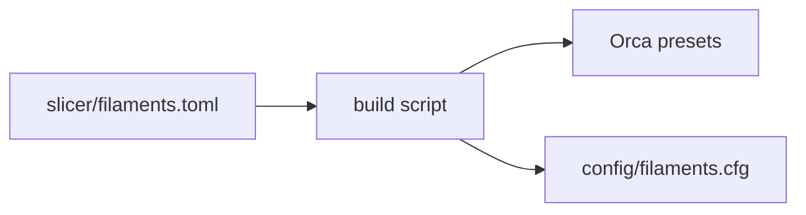
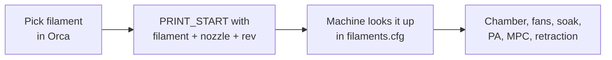

# Slicer and machine as one system

Slicers treat the printer like a dumb box that eats G-code. Everything the machine knows about
itself (shaper limits, how fast the hotend can actually melt plastic, what the chamber should do
for ABS vs PLA, pressure advance for this nozzle) gets retyped into slicer profiles by hand, then
drifts out of date the moment I retune anything. Then I wonder why a print looks bad, and it's
because some profile still thinks it's last month.

Goal: Orca and Kalico act like one system. Pick a filament in Orca, hit print, and the machine
does the right thing for that material: chamber, fans, soak, temps, PA, speed limits. No retyping.

> This page is the plumbing between Orca and the machine. Still too static: it assumes the numbers
> in the library are known. Where they come from, and how to measure them instead of tuning them by
> eye, is the bigger problem: [calibration as a control problem](README.md).

## What's wrong right now

Looked through the current config with this in mind. Not great:

- **PLA gets zero air movement.** The circulation fan is a `heater_fan` on the chamber heater with `heater_temp: 40`, so it only spins when the chamber heater is on or the chamber's above 40 °C
- **Air cleaner and bed fans follow the bed** (on above 45 °C), not the material
- **`PRINT_START` sets the chamber target and never waits for it.** ABS starts in a cold box
- **`PRINT_END` sets the chamber to 42 °C after every print.** Including PLA. Idle timeout kills it 30 min later, but still, why
- **No pressure advance at all.** Not in the config, not in the slicer
- **The hotend is on plain PID**, so it only reacts to a flow change after the temperature has already dropped
- **No Orca printer profile exists.** Every limit the slicer uses is whatever the defaults were

## Who should own what

The rule I'm going with: **the machine owns anything that's about the machine or the material's
physics. The slicer owns geometry.** Anything both need comes from one file, never typed twice.
Same idea as the buffer plugin: one source of truth, everything else derived from it.

| Thing | Owner | Why |
|---|---|---|
| Layer height, walls, infill, supports, per-feature speeds | Orca | Geometry. That's what slicers are good at |
| Part cooling fan per layer | Orca | Depends on the layer and the overhangs |
| Chamber target, fans, soak | Machine | Depends on the material and the enclosure, not on the model |
| Pressure advance, retraction | Machine | Depends on this extruder, nozzle and filament. Tune once on the machine, applies to every slice |
| Hotend model (MPC), Z offset, mesh, QGL, purge, buffer | Machine | Already lives there |
| Temps, max flow, chamber temp, shrinkage, accel limits | **One file, generated into both** | Both sides need them |

## Options I looked at

| Option | How | Good | Bad | Verdict |
|---|---|---|---|---|
| Slicer is the boss (how everyone does it) | Fat start G-code and per-filament G-code in Orca | Nothing to build | Every filament profile has to carry machine knowledge. Drifts. Exactly the problem | No |
| Machine is the boss | Orca only sends `FILAMENT_TYPE=ABS`, the machine looks up the rest | One place for machine stuff | Orca doesn't know the flow limits, so speeds and time estimates are wrong | Half of it |
| **One library, generated into both** | `filaments.toml` in my printer's repo, a script writes the Orca presets *and* the Kalico table | Can't disagree, versioned in git, review the diff | Need a small generator, and I have to edit the library, not Orca | **Yes** |
| Spoolman as the library | Spoolman holds filaments; [spoolman2slicer](https://github.com/bofh69/sm2ss) or [PipSpool](https://github.com/JP-Reitsma/pipspool-orcaslicer) make Orca presets | Per-spool tracking, nice UI | Another service. Macros can't read Spoolman directly, custom fields are clunky | Maybe later as a front end for the same library |
| Orca's filament start G-code | Per-filament commands typed into Orca | Easy | It's option 1 again with extra steps | No |

## The plan: one library, two outputs





### The library

One entry per material, brands inherit and override (family → line → color → spool, see
[filament](filament.md#library-structure)). Rough shape:

```toml
[ABS]
nozzle_temp = [255, 260]      # first layer, rest
bed_temp = 105
chamber = 55                  # target, °C
mode = "hot"                  # see chamber modes below
max_flow = 24                 # mm³/s, Conch 0.6, measured
pressure_advance = 0.035      # 0.6 nozzle
retract = { length = 0.4, speed = 35 }
mpc = { density = 1.06, heat_capacity = 2.40 }
shrink_xy = 100.6             # %

["ABS eSun"]
inherits = "ABS"
max_flow = 26
```

The shrinkage and flow numbers I already dialed in on the Bambus (PETG 100.21%, etc.) come over
as starting points.

### What Orca sends

The generated printer profile carries this start G-code, so I never type it:

```gcode
PRINT_START EXTRUDER_TEMP=[nozzle_temperature_initial_layer] BED_TEMP=[bed_temperature_initial_layer_single] CHAMBER_TEMP=[chamber_temperature] FILAMENT_TYPE=[filament_type] FILAMENT="[filament_settings_id]" NOZZLE=[nozzle_diameter] REV=<generated>
```

Kalico parses quoted parameters, so preset names with spaces are fine.

### Handshake

Prusa does this with `M862`: the printer checks the G-code was sliced for it. Same idea here:

- `NOZZLE` doesn't match the nozzle the machine thinks is installed: **stop.** A 0.4 slice on a 0.6 nozzle is a wasted print. The installed nozzle is machine state set by `NOZZLE_SET` (later checked by the pressure sensor), not a line in `printer.cfg`, so a swap is one command, not two config edits
- `REV` doesn't match the library revision: **warn**, the Orca presets are stale, rerun the install script
- Filament not in the library: **fall back to the safe mode** for its type (no chamber heat), warn
- `CHAMBER_TEMP` higher than the material's max: clamp and warn

### What `PRINT_START` does with it


Everything after that is the existing sequence.

## Chamber modes

*Why the chamber matters for strength and warp: [handbook chapter 6](../handbook/06-layer-bonding.md) and [chapter 7](../handbook/07-shrink-stress-warp.md#why-hot-chambers-fix-warping).*

The machine picks a mode from the material. Fans, heater, soak and (later) shaper and Z
compensation all key off the mode, so there's one switch instead of ten.

| Mode | Materials | Heater | Recirc blowers | Air cleaner / vent | Soak |
|---|---|---|---|---|---|
| **Cool** | PLA, PLA-CF, TPU | Off | Low, just to even things out | Vent open, keep it under about 35 °C | None |
| **Warm** | PETG, PETG-CF | Off | Low | Filter on, cap about 40 °C | None |
| **Hot** | ABS, ASA, HIPS | 50 to 60 °C | Fast to heat, slow to hold | Filter, recirculate, no venting | Until it's ready (below) |
| **Hotter** | PC, PA, PA-CF, PPA-CF | 60 to 70 °C | Same | Same | Same |

Numbers are starting points, the real ones live in the library.

### PLA in an insulated box is a problem

Something I didn't think about with the foam panels: the better the insulation, the hotter the box
gets with the heater **off**. The bed alone heats it. At steady state:

```math
T_{ss} = T_{room} + \frac{P_{bed}}{UA + \dot{V}\rho c_p}
```

where $`\dot{V}\rho c_p`$ is what venting adds (air is about 1.2 W/K per L/s of flow). Foam makes
$`UA`$ small, so with no venting PLA cooks. To stay under $`T_{max}`$:

```math
\dot{V} \geq \frac{1}{\rho c_p}\left(\frac{P_{bed}}{T_{max} - T_{room}} - UA\right)
```

Guessing 100 W from the bed into the chamber, 22 °C room, 35 °C max and $`UA`$ around 3 W/K for the
foam box: about 4 L/s, roughly 10 CFM. A small fan and a damper. **So the rear thermal module needs
a fresh-air path with a damper, not just recirculation.** Real numbers once $`UA`$ is measured.

## Speed

### Limits come from the machine

The Orca printer profile gets its limits from what the machine measured, not defaults:

| Orca setting | Value | From |
|---|---|---|
| Max speed | 500 mm/s | Speed test |
| Travel accel | 10000 mm/s² | Speed test |
| Max accel while extruding | about 3800 mm/s² | Shaper recommendation on my printer |
| Z speed / accel | 20 mm/s, 500 mm/s² | My Z test: 40 was loud, 50 stalled the motors |

When the shaper changes (A/B fix, Monolith), I regenerate and the slicer follows. Bonus: Orca's time
estimates get way more accurate when its limits match the machine.

### The hotend is the real speed limit

*Where max flow comes from: [handbook chapter 3](../handbook/03-melting.md#the-graetz-number).*

Max print speed for a line is set by how fast the hotend can melt:

```math
v_{max} = \frac{Q_{max}}{w\,h}
```

0.6 nozzle, 0.65 mm line, 0.3 mm layer, and say 30 mm³/s for the Conch (not measured yet):
$`v_{max} \approx 150`$ mm/s. So for real printing the hotend, not the motion system, is the limit
for most features. That's why `max_flow` per filament in the library matters more than the speed
numbers, and why Orca has to have it.

### Shaper per chamber mode

Belts and frame change with temperature. If the shaper results come out different at 70 °C, the
machine loads the right one per mode (`SET_INPUT_SHAPER` in `PRINT_START`). Measure first, maybe
it doesn't matter.

## Hotend: MPC with filament feedforward

*Longer version: [handbook chapter 9](../handbook/09-heat-control.md#mpc-the-hotend-as-a-model).*

Kalico has **MPC** (model predictive control) for heaters. It models the heater block, sensor,
ambient and the filament, and it knows the extrusion rate from the planned moves. Power needed to
heat the plastic going through:

```math
P_{fil} = \rho\,c\,Q\,(T_{nozzle} - T_{fil})
```

PETG at 30 mm³/s and 240 °C: $`1.27 \times 10^{-3}`$ g/mm³ × 2.2 J/(g·K) × 30 mm³/s × 215 K ≈
**18 W**. On a hotend heater that's a big chunk. PID only finds out after the temperature drops,
so you get underextrusion right when you go fast. MPC adds that power *as* the flow goes up.
Feedforward for the bulk, feedback for the rest.

Density and heat capacity per material come from the library (`MPC_SET` in `PRINT_START`).
Needs the Conch's heater wattage first.

## Soak: stop guessing

*Why the frame lags the air: [handbook chapter 9](../handbook/09-heat-control.md#the-chamber-is-a-small-building).*

Fixed soak times are either too long (waste) or too short (Z drifts during the first layers). What
actually matters is how much the frame still has to move. The frame sensor warms like

```math
T(t) = T_{\infty} - (T_{\infty} - T_0)\,e^{-t/\tau}
```

Take three readings $`T_1, T_2, T_3`$ a fixed time apart. Then

```math
r = \frac{T_3 - T_2}{T_2 - T_1} = e^{-\Delta t/\tau}, \qquad D = T_{\infty} - T_3 = (T_3 - T_2)\,\frac{r}{1 - r}
```

$`D`$ is how many degrees the frame still has to go. With $`k_z`$ (mm of Z per °C of frame, measured
once):

```math
\text{ready when}\quad k_z\,D < \varepsilon
```

With `z_thermal_adjust` running, it compensates most of that drift, so only the error in the
compensation is left and the soak can end way earlier:

```math
\text{ready when}\quad |k_z - \hat{k}_z|\,D < \varepsilon
```

Readings are noisy, so this wants a least-squares fit over a sliding window, not three points.
Too much for a Jinja macro. Small Kalico plugin, same style as the buffer one, that blocks
`PRINT_START` and prints an ETA. $`\varepsilon`$ comes from the precision tolerances once I set them.

## Pressure advance, retraction, shrinkage

*Why PA changes with flow and temperature: [handbook chapter 4](../handbook/04-extrusion-dynamics.md#why-pa-changes-with-flow-and-temperature).*

- **PA** lives in the library per filament × nozzle, applied by `PRINT_START`. Orca's PA option stays off so there's one source. Once bd_pressure is on the toolhead, its `PA_CALIBRATE` results get written back into the library. Machine measures, library updates, slicer regenerates
- **Retraction** goes to firmware retraction (`[firmware_retraction]`, Orca "use firmware retraction"). Tuned on the machine, applies to every slice, `SET_RETRACTION` per filament
- **Shrinkage** is geometry, so Orca applies it, but the number still comes from the library

## Orca printer profile

Generated, not hand-made:

- [ ] Klipper flavor, relative E, 0.6 nozzle, 350 × 350 bed, 300 mm height
- [ ] Limits from the table above
- [ ] Label objects on (exclude_object, adaptive mesh)
- [ ] Firmware retraction
- [ ] Thumbnails for Mainsail
- [ ] Physical printer: Moonraker at the Pi, so upload works and the Device tab shows Mainsail inside Orca
- [ ] Start/end G-code from the generator
- [ ] Orca's aux fan and exhaust fan controls off. The machine owns those

## To do

Work in progress. Roughly in order:

- [ ] Install Orca, make it the Voron slicer (Bambus stay on Bambu Studio)
- [ ] Chamber circulation fan to `fan_generic` so the machine controls it per mode. Heater fan stays a `heater_fan` (safety)
- [ ] Kill the 42 °C chamber in `PRINT_END`
- [ ] Measure Conch max flow per material (Orca has a flow test)
- [ ] PA per material on the 0.6 nozzle
- [ ] `slicer/filaments.toml` with PLA, PETG, ABS, ASA to start
- [ ] Generator: `filaments.toml` → Orca presets + `config/filaments.cfg`, plus an install script that copies the presets into Orca
- [ ] New `PRINT_START`: handshake, filament apply, chamber modes
- [ ] Firmware retraction
- [ ] Find the Conch heater wattage, switch the hotend to MPC
- [ ] Measure $`k_z`$ (Z vs frame temp), turn on `z_thermal_adjust`
- [ ] Soak plugin
- [ ] Vent damper in the rear thermal module design
- [ ] Shaper at 70 °C vs cold, see if per-mode shapers are worth it
