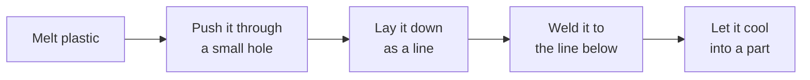

# 1. The big picture

*Level 1. No math.*

## What a printer actually does

Strip away the marketing and an FFF printer is a machine that does five things in a row, thousands
of times a minute:

Each of those is its own little physics problem, and each one has a way of going wrong. The slicer
plans all five ahead of time from a 3D model, writes it out as G-code, and the printer executes it.
That's the whole thing.

What I find interesting is that the slicer makes its plan **without knowing much about the
machine or the plastic.** It assumes the plastic comes out exactly when asked, exactly as wide as
planned, welds perfectly, and shrinks by one fixed percentage. None of those are true, and most of
"tuning a printer" is really just patching over those wrong assumptions one setting at a time.

## Every link in the chain

| Step | What's really going on | What we control | What actually measures it today |
|---|---|---|---|
| Melt | Heat conducting into a moving rod of plastic | Nozzle temperature, how fast we push | One thermistor in the block. Not the plastic |
| Push | Pressure building up in a squishy system, plastic flowing through a tiny tube | Extruder steps, pressure advance | Nothing, on most printers |
| Lay down | A blob of hot goo getting squished into a line | Line width, layer height, speed | Nothing |
| Weld | Polymer chains wiggling across the boundary before it freezes | Temperatures, fan, layer time | Nothing |
| Cool | Shrinking, stress building up, maybe warping | Chamber, bed, fan | Nothing |
| Move | A heavy toolhead on stretchy belts, shaking | Speed, acceleration, input shaper | An accelerometer, once, during tuning |

Look at that last column. That's the problem in one table.

## Open loop, with a few islands

Engineers call a system **open loop** when it does what it's told and never checks the result. A
toaster is open loop. Cruise control is closed loop: it measures your speed and corrects.

A 3D printer is mostly open loop, with a few small closed loops:

- **Temperatures** are closed loop (thermistor + heater + controller)
- **Homing and probing** measure where things are before the print starts
- **That's about it**

Everything else, the actual plastic coming out, the width of the line, how well layers weld, how
much it shrinks, is a guess made ahead of time and never checked. When the guess is right the print
is great. When the filament changes, or the room gets cold, or the nozzle wears, the guess goes
stale and nobody notices until the print looks bad.

## Why prints fail

Almost every bad print comes from one of these:

1. **The plastic isn't what the profile thinks it is.** Different brand, wet, different diameter
2. **The machine isn't what the profile thinks it is.** Nozzle swapped, worn, partially clogged, belts loosened
3. **The environment changed.** Colder room, drafty, chamber not warmed up
4. **The plan asked for something physically impossible.** Faster than the hotend can melt, sharper corners than the motion can take
5. **The physics was never modeled in the first place.** Warping, weak layers, seams

The first three are drift: things that change over time. The fourth is not knowing the machine's
limits. The fifth is the slicer's model of the world being too simple.

## How I'm approaching it

For every variable that matters, I ask three questions:

1. **What is it, physically?** Not "the flow ratio," but what actual physical thing that number stands in for
2. **Can anything see it?** A sensor, a measurement, a weighed part
3. **What knob moves it, and does that knob also move something else?**

Then the plan is to stop tuning settings by eye and start doing what every other mature industry
does:

- **Model** the physics well enough to know which settings are really the same thing
- **Measure** what can be measured, with sensors instead of test prints where possible
- **Learn** from every print, so the models stay current without me redoing calibrations

That's what the rest of this handbook builds up to. The next few chapters are the physics, because
you can't model what you don't understand. The later ones are control and estimation, which is how
you turn understanding into a machine that adjusts itself.

## A few honest disclaimers

- I'm an engineer, not a polymer chemist. Where I lean on materials science, I link the papers
- Some of what follows is well established. Some is my own theory. I mark the theory
- Numbers are usually rounded and meant to give a feel for the size of things, not to be copied into a config

Next: [Polymers 101](02-polymers-101.md), because everything downstream depends on what plastic
actually is.
