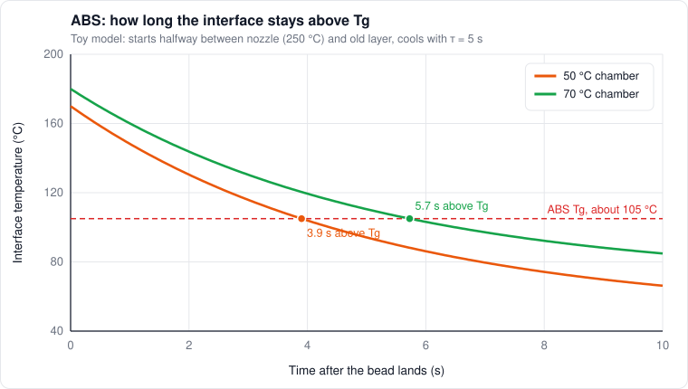
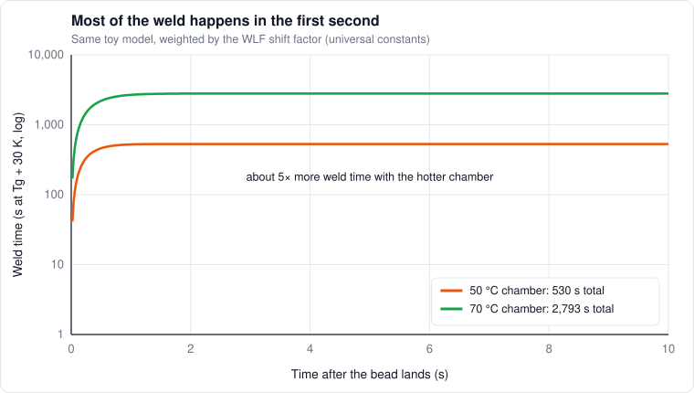

# 6. The Z axis: how layers bond

*Level 3 to 4. The chapter I care most about.*

Z is the weak direction of every FFF part. ORNL's z-pinning paper puts it plainly: tensile strength
in the build direction is commonly 50 to 75% lower than in the plane. If you've ever snapped a print
along a layer line, you know.

This chapter is about what actually happens at that boundary, what the research says (and where it
disagrees), and what we can do about it inside the limits of a process that stacks hot spaghetti.

## The setup

A new bead comes out of the nozzle at roughly nozzle temperature $T_n$ and lands on the previous
layer, whose surface is at some temperature $T_s$. That $T_s$ depends on the chamber, how long ago
that layer was printed, how hard the part fan is blowing, and how big the part is.

Everything that follows comes down to the temperature at the interface, and how long it stays hot.

## The first instant: contact temperature

When two bodies at different temperatures touch, the interface jumps to a temperature set by their
thermal effusivities $e = \sqrt{k\rho c}$:

```math
T_c = \frac{e_1 T_1 + e_2 T_2}{e_1 + e_2}
```

Same plastic on both sides means the same effusivity, so the interface simply lands **halfway
between the nozzle temperature and the old layer's surface temperature.**

| Case | Nozzle | Old layer surface (guess) | Interface | Above $T_g$ |
|---|---|---|---|---|
| PLA, cool box | 215 °C | 60 °C | about 138 °C | about 78 K |
| ABS, 50 °C chamber | 250 °C | 90 °C | about 170 °C | about 65 K |
| ABS, 70 °C chamber | 250 °C | 110 °C | about 180 °C | about 75 K |

The old layer temperatures are guesses for illustration, they depend a lot on the part. The point
holds anyway: **the old layer's temperature matters just as much as the nozzle's.** A hotter chamber
that keeps the old layer 20 K warmer lifts the interface by 10 K. And from the WLF table in chapter 2,
going from 65 K to 75 K above $T_g$ makes chain motion about **4× faster**, right at the moment it
counts most.

## Then it cools, fast

Three time scales:

**Conduction across the bead.** Heat crosses a 0.3 mm layer in about

```math
t \sim \frac{h^2}{\alpha} \approx 1\ \text{s}
```

so the new bead and the top of the old layer equalize within about a second.

**Convection off the top.** Treating the bead as a lump cooling from its top face:

```math
\tau_{conv} = \frac{\rho\,c\,h}{h_{conv}}
```

| Air | $h_{conv}$ (W/m²K, rough) | $\tau_{conv}$ for a 0.3 mm PLA bead |
|---|---|---|
| Still | 20 | about 30 s |
| Part fan, moderate | 100 | about 7 s |
| Part fan, hard | 300 | about 2 s |

The Biot number $h_{conv} h / k$ comes out around 0.2, so the bead is roughly the same temperature
through its thickness. The part fan and the chamber decide how fast the whole top region cools.

**Reheating from the next layers.** Heat from a new layer reaches down a depth of about

```math
\delta \sim \sqrt{\alpha\,t}
```

With a 10 second layer time that's close to a millimeter, so **each new layer reheats the last two
or three interfaces.** Every weld gets several hot hits, each smaller than the last.

Put together: an interface spends seconds above $T_g$, and most of its useful hot time is in the
first second or two after the bead lands.



*A toy model of the ABS case. The hotter chamber starts the interface 10 K hotter and keeps it above Tg almost 2 seconds longer.*

## Stage 1: making contact

Two things can bring the surfaces together:

- **Pressure.** The nozzle pushes the bead down (squish, chapter 5)
- **Surface tension.** The bead and the layer below slowly flow together like two droplets merging. That's sintering

For sintering, Frenkel's model for two touching cylinders of radius $a$ gives the neck radius $x$:

```math
\left(\frac{x}{a}\right)^2 = \frac{3\,\Gamma}{2\,a}\int \frac{dt}{\eta(T(t))}
```

[Bellehumeur et al. (2004)](https://doi.org/10.1016/S1526-6125(04)70071-7) used a modified version of
this with the cooling history of ABS beads. Plug in rough numbers ($\Gamma \approx 0.03$ N/m,
$a \approx 0.15$ mm, $\eta \approx 1000$ Pa·s right after deposition) and the neck grows at about
0.3 per second in $(x/a)^2$. Then the viscosity shoots up as it cools, and sintering basically stops
within a second.

[Coogan & Kazmer (2020)](https://www.sciencedirect.com/science/article/abs/pii/S2214860420307405)
predicted interlayer contact from in-line pressure measurements instead. Putting those together,
my read is: **in FFF, contact is mostly made by the nozzle pressing the bead down, not by sintering
afterwards.** That's why geometry (squish, $h/w$, flow) decides how much area gets bonded.

## Stage 2: chains crossing over

Touching isn't bonding. For the interface to be as strong as solid plastic, chains from both sides
have to wiggle across the boundary and re-tangle. The classic result (Wool and O'Connor, 1981) is
that weld strength grows with contact time to the 1/4 power, until the chains have fully crossed,
which takes about one reptation time:

```math
\frac{\sigma}{\sigma_\infty} = \left(\frac{t}{\tau_{rep}}\right)^{1/4}, \qquad t < \tau_{rep}
```

But the temperature isn't constant, it's dropping fast, and $\tau_{rep}$ shoots up as it cools.
[Seppala et al. (2017)](https://pubs.rsc.org/en/content/articlelanding/2017/sm/c7sm00950j) at NIST
handled that with an **equivalent isothermal weld time**, measured with an IR camera and linked to
fracture energy:

```math
t_{eq} = \int \frac{dt}{a_T(T(t))}
```

Every moment counts, weighted by how fast chains move at that moment's temperature. With the
universal WLF constants, one second at $T_g + 60$ K counts as much as about 15 minutes at
$T_g + 30$ K. **The first hot second does nearly all the work.**



*Same toy model, weighted by the WLF shift factor. The hotter chamber ends up with about 5× more weld time, almost all of it from the first second.*

I find it useful to think of it as a healing number:

```math
H = \frac{t_{eq}}{\tau_{rep}}
```

(both at the same reference temperature). $H \gg 1$ means the weld fully healed and is as strong as
the material. $H < 1$ means it's partial, and strength goes roughly as $H^{1/4}$. That 1/4 power is
sobering: **100× more weld time only buys about 3× more weld strength, and nothing at all once
you're fully healed.**

## Stage 3: what else gets in the way

- **Flow-induced alignment.** Squeezing through the nozzle stretches chains near the bead surface. [McIlroy & Olmsted (2017)](https://www.sciencedirect.com/science/article/abs/pii/S0032386117306213) showed it partly untangles them. [Cunha & Robbins (2020)](https://arxiv.org/abs/2006.15742) simulated it and found diffusion across the interface isn't actually slowed, but the stretched material right next to the weld stays weaker until it relaxes
- **Crystallization racing diffusion.** In semi-crystalline plastics (nylon, PPA, PLA), once crystals form at the interface, chains stop crossing. [Costanzo et al. (2020)](https://doi.org/10.3390/polym12122980) studied exactly this for polyamides
- **Voids and notches.** The groove between stacked beads (chapter 5) is a notch, and stress concentrates there
- **Residual stress** (chapter 7) pre-loads the weld before you ever pull on it

## The debate: geometry or temperature?

This is where it gets interesting, because the research looks like it disagrees.

**Camp one: temperature matters.**

- Seppala et al. (2017): weld time predicts fracture energy
- Coogan & Kazmer (2020): contact from pressure plus diffusion from temperature predicted interlayer strength, validated on HIPS
- [Aliheidari et al. (2018)](https://www.sciencedirect.com/science/article/abs/pii/S0264127518305318): a 20 °C hotter nozzle gave 38% more apparent fracture resistance, split into 15% better interlayer bonding and 23% more fracture surface area
- [Kishore et al. (2017)](https://doi.org/10.1016/j.addma.2016.11.008): IR-heating the previous layer to near $T_g$ before printing on it raised bond strength a lot (CF-filled ABS, large format)
- [Ravi, Deshpande & Hsu (2016)](https://asu.elsevierpure.com/en/publications/an-in-process-laser-localized-pre-deposition-heating-approach-to-): laser preheating just ahead of the nozzle, 50% stronger bonds
- [ULTEM 9085 study](https://www.sciencedirect.com/science/article/abs/pii/S0142941819317337): thermal process parameters changed interlayer strength in a high-$T_g$ material

**Camp two: geometry dominates.**

- [Allum, Moetazedian, Gleadall & Silberschmidt (2020)](https://www.sciencedirect.com/science/article/abs/pii/S2214860420306692): in PLA, the interface has the strength of the bulk filament. The anisotropy comes from the shape of the extruded lines and strain concentrating at the interface, not incomplete bonding. Print speed and layer time didn't change bond strength
- [Moetazedian et al. (2023)](https://pmc.ncbi.nlm.nih.gov/articles/PMC10280202/): PLA bond strength stayed at bulk strength across a 60 °C nozzle temperature span, a 16× speed range and an 8× layer time range. They recommend refocusing interlayer work on extrusion geometry
- [Allum et al.](https://www.sciencedirect.com/science/article/pii/S2214860422007230) extra-wide lines: 40 to 48% stronger purely from more contact area

**My reconciliation (theory):** it's the healing number. PLA has $T_g$ around 60 °C and gets printed
at 200 °C or more, so the interface lands 70 to 90 K above $T_g$. Chain motion there is so fast that
$H \gg 1$ within milliseconds. The weld always fully heals, so geometry is the only thing left to
change. ABS ($T_g$ about 105 °C), PC (about 145 °C), ULTEM and PPA only get 40 to 70 K above $T_g$
at the interface, cool fast, and often have stiffer or longer chains. There $H$ can sit near or below
1, and temperature matters. **Both camps are right, for their materials.** Aliheidari's split shows
both effects in one experiment: part of the gain was better bonding, part was more bonded area.

The test that would settle it on my machine: print identical Z coupons in ABS at two chamber
temperatures, cut them, measure the actual bonded width under a microscope, and divide strength by
bonded area. If the normalized strength changes with chamber temperature, it's thermal. If it
doesn't, it's geometry.

## A strength budget

To keep it all straight, I think of Z strength as a product of factors:

```math
\sigma_z \approx \sigma_{bulk}\cdot\phi_c\cdot\min\left(1, H^{1/4}\right)\cdot\frac{1}{k_{notch}} - \sigma_{res}
```

It's a way to organize thinking, not something to compute strength from.

| Factor | What it is | Levers |
|---|---|---|
| $\phi_c$ | Fraction of the layer actually bonded | $h/w$, wider lines, a bit more flow, wide nozzle land, squish |
| $H$ | Healing number | Chamber, nozzle temp, layer time, part fan, local preheat |
| $k_{notch}$ | Stress concentration at the groove | Squish, flatter beads, interlocking layers, remelting |
| $\sigma_{res}$ | Built-in stress | Chamber close to $T_g$, slow cooling, annealing |

For PLA, $H$ is already maxed, so only $\phi_c$ and $k_{notch}$ are worth chasing. For ABS, PC and
PPA in a cool box, all four matter.

## Making Z stronger, within FFF's limits

Roughly ranked by how solid the evidence is and how cheap it is to try.

**Geometry (works for every material):**

1. **Wider lines,** at least 2.5× the nozzle for inner walls and infill ([Allum et al.](https://www.sciencedirect.com/science/article/pii/S2214860422007230)). Needs a wide flat nozzle tip and the melt capacity
2. **Lower $h/w$:** thinner layers, wider lines, or both
3. **A touch of overextrusion** to fill the corner voids
4. **A nozzle with a wide flat land** that irons down the groove
5. **Interlocking layers.** [BrickLayers](https://github.com/GeekDetour/BrickLayers) is a post-processing script that staggers inner walls by half a layer so they interlock like bricks. There's a US patent on the technique, which is probably why slicers haven't built it in
6. **Z-pinning.** [ORNL](https://www.ornl.gov/publication/z-pinning-approach-3d-printing-mechanically-isotropic-materials) left aligned voids in the infill and filled them with vertical extrusions across many layers. Z strength and toughness went up more than 3.5×, and the biggest pins made PLA isotropic within the scatter. Research only, no slicer does it
7. **Orientation.** Put the layers along the load. The extreme version is multi-axis printing that aligns filaments with the stress field ([Reinforced FDM](https://github.com/GuoxinFang/ReinforcedFDM): up to 6.35× the load), which needs more axes than a Voron has

**Thermal (matters for high-$T_g$ materials):**

1. **Hotter chamber.** Lifts the old layer, which lifts the interface
2. **Hotter nozzle,** within what the material tolerates
3. **Less part cooling** where overhangs don't need it. Every bit of cooling costs weld time
4. **Layer time in a window.** Too short and the layer sags, too long and it's cold when the next one lands. Slicers enforce a minimum layer time but nothing like a maximum
5. **Local preheat** of the old layer just ahead of the nozzle (IR or laser, Ravi 2016 and Kishore 2017)

**After the print:**

1. **Annealing.** Relieves stress, and crystallizes nylon and PPA (chapter 7)
2. **Remelting in salt.** [CNC Kitchen](https://www.cnckitchen.com/blog/testing-the-strength-of-3d-prints-re-melted-in-salt) packed 100% solid parts in powdered salt and baked them past the melting point. ABS layer adhesion went up 150%, to about 90% of the solid material. Dimensions change and it only works on fully dense parts, but it's a real option for small structural parts
3. **Vapor smoothing ABS** rounds off the surface grooves. I'd expect it to help notch sensitivity more than raw strength, but I haven't tested that

**Exotic, for completeness:**

- [Microwave welding](https://www.science.org/doi/10.1126/sciadv.1700262) with carbon nanotube coated filament: 275% stronger welds
- [In-situ solvent treatment](https://link.springer.com/article/10.1007/s00170-024-14077-7) layer by layer, and [cold plasma](https://link.springer.com/article/10.1007/s40964-025-01509-3) treatment

## What I'd like to try on this printer

For structural ABS, ASA and PPA-CF parts, this is where I'd start:

- 70 °C chamber (it's the plan anyway)
- Extra-wide inner walls and infill on the 0.6 nozzle, if the tip allows
- Thinner layers relative to width
- Part fan only where overhangs need it
- Try BrickLayers on a few test parts
- Anneal the PPA-CF parts (chapter 11)

## What I'd love to measure

None of this is set up yet, but it's the experiment I'm most excited about in the whole handbook:

- Z tensile coupons: ABS at two chamber temperatures, PLA as a control
- Bonded width from polished cross-sections under a USB microscope
- Interface temperature history, with a cheap thermal camera or an IR sensor at the toolhead. Kalico doesn't have an IR thermometer module yet, so that'd mean writing one

## References

- [Allum, Moetazedian, Gleadall, Silberschmidt (2020)](https://www.sciencedirect.com/science/article/abs/pii/S2214860420306692). Interlayer bonding has bulk strength in PLA
- [Moetazedian et al. (2023)](https://pmc.ncbi.nlm.nih.gov/articles/PMC10280202/). Bulk bond strength over wide temperature, speed and layer time ranges
- [Allum et al.](https://www.sciencedirect.com/science/article/pii/S2214860422007230). Extra-wide deposition
- [Seppala et al. (2017)](https://pubs.rsc.org/en/content/articlelanding/2017/sm/c7sm00950j). Weld formation and equivalent weld time
- [Coogan, Kazmer (2020)](https://www.sciencedirect.com/science/article/abs/pii/S2214860420307405). Predicting interlayer strength from pressure and temperature
- [Bellehumeur et al. (2004)](https://doi.org/10.1016/S1526-6125(04)70071-7). Bond formation and sintering
- [McIlroy, Olmsted (2017)](https://www.sciencedirect.com/science/article/abs/pii/S0032386117306213) and [Cunha, Robbins (2020)](https://arxiv.org/abs/2006.15742). Flow-induced alignment at the weld
- [Costanzo et al. (2020)](https://doi.org/10.3390/polym12122980). Crystallization and welds in polyamides
- [Aliheidari et al. (2018)](https://www.sciencedirect.com/science/article/abs/pii/S0264127518305318). Interlayer fracture vs process parameters
- [Kishore et al. (2017)](https://doi.org/10.1016/j.addma.2016.11.008) and [Ravi et al. (2016)](https://asu.elsevierpure.com/en/publications/an-in-process-laser-localized-pre-deposition-heating-approach-to-). Preheating the previous layer
- [Z-pinning (ORNL)](https://www.ornl.gov/publication/z-pinning-approach-3d-printing-mechanically-isotropic-materials)
- [Reinforced FDM (Fang et al. 2020)](https://github.com/GuoxinFang/ReinforcedFDM)
- [BrickLayers](https://github.com/GeekDetour/BrickLayers)
- [CNC Kitchen: salt remelting](https://www.cnckitchen.com/blog/testing-the-strength-of-3d-prints-re-melted-in-salt)
- [Sweeney et al. (2017)](https://www.science.org/doi/10.1126/sciadv.1700262). Microwave welding with nanotubes
- Wool, O'Connor (1981). *A theory of crack healing in polymers.* J. Applied Physics 52
