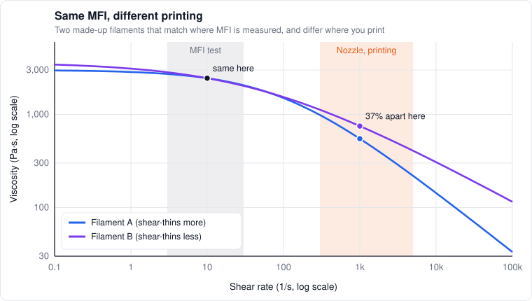
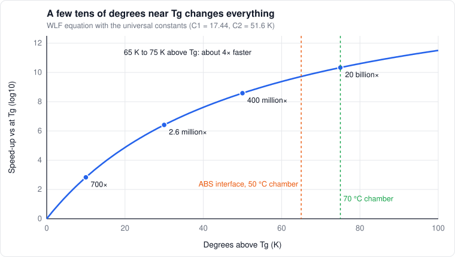

# 2. Polymers 101

*Level 1 to 3. Starts plain, ends with the equations everything else leans on.*

If you only read one chapter of physics, make it this one. Almost every weird thing a printer does
(pressure advance, stringing, weak layers, warping, wet filament printing badly) comes straight
out of what plastic is at the molecular level.

## Spaghetti the loooong way

A polymer is a really long molecule made of the same small unit repeated thousands of times. PLA,
ABS, nylon, all the same idea, different repeat unit. The chains are absurdly long compared to how
thick they are, and in a melt they're all tangled up like a bowl of spaghetti.

Those tangles (**entanglements**) are the whole story. They act like temporary knots. Pull on the
melt quickly and the knots hold, so it behaves a bit like rubber. Pull slowly and the chains have
time to slide past each other, so it flows like a liquid. That one fact explains a surprising
amount of this handbook.

Longer chains mean more entanglements per chain. More entanglements mean a tougher, stronger solid,
but also a thicker melt that's slower to weld. Every resin grade is a compromise on chain length.

## Amorphous vs semi-crystalline

Two families, and they behave really differently in a printer:

- **Amorphous** plastics stay a tangled mess when they cool. They just get stiffer and stiffer until they're glass. ABS, ASA, PETG, PC
- **Semi-crystalline** plastics partly organize into tidy crystals as they cool, with tangled stuff in between. PLA, nylon, PPA, PP, PEEK

| Plastic | Family | $`T_g`$ (°C) | $`T_m`$ (°C) |
|---|---|---|---|
| PLA | Semi-crystalline (prints mostly amorphous) | about 60 | about 150 to 180 |
| PETG | Amorphous | about 80 | none |
| ABS | Amorphous | about 105 | none |
| ASA | Amorphous | about 100 | none |
| PC | Amorphous | about 145 | none |
| PA6 (nylon) | Semi-crystalline | about 50 dry, lower when wet | about 220 |
| PA12 (nylon) | Semi-crystalline | about 40 to 50 | about 178 |
| Bambu PPA-CF | Semi-crystalline | 85 (DSC, from the TDS) | 258 |
| PP | Semi-crystalline | about −10 | about 160 |
| PEEK | Semi-crystalline | about 143 | about 343 |

Ballpark numbers. Grades vary a lot, check the datasheet for the real ones.

## The glass transition

$`T_g`$ is where the tangled parts of the plastic go from frozen glass to soft rubber. Below it the
chains can barely move. Above it they can wiggle. The stiffness drops by roughly a thousand times
across $`T_g`$, from GPa down to MPa.

For amorphous plastics that's it: above $`T_g`$ it softens, and well above it, it flows. For
semi-crystalline plastics the crystals keep holding the part together until $`T_m`$. That's why a
crystallized nylon or PPA part stays stiff way above its $`T_g`$, and why annealing those materials
raises their heat resistance so much (chapter 7).

## Springs and dashpots

Plastic is **viscoelastic**: part spring, part honey. The simplest model is a spring (stiffness
$`G`$) in series with a dashpot (viscosity $`\eta`$), the Maxwell model:

```math
\sigma + \lambda\,\frac{d\sigma}{dt} = \eta\,\dot\gamma, \qquad \lambda = \frac{\eta}{G}
```

$`\lambda`$ is the **relaxation time**: how long the material takes to forget it was stretched.
Stretch it suddenly and hold, and the stress dies off like

```math
\sigma(t) = G\,\gamma_0\,e^{-t/\lambda}
```

Whether plastic acts solid or liquid depends on how $`\lambda`$ compares to how fast you're deforming
it. That ratio is the Deborah number:

```math
De = \frac{\lambda}{t_{process}}
```

$`De \gg 1`$ means it acts solid, $`De \ll 1`$ means it acts liquid. Here's the fun part: melt in a
0.6 mm nozzle at 20 mm³/s moves at about 70 mm/s, so it crosses a 1 mm bore in about 14 ms.
Melt relaxation times at print temperatures are in the milliseconds-to-tenths-of-a-second range.
So $`De`$ is around 1. **The melt in your nozzle is neither fully solid nor fully liquid.** That's
why the strand swells when it comes out (it remembers being squeezed) and part of why the flow
lags behind the extruder.

## Why it gets runnier when you push it

Push a melt faster and the chains line up with the flow and partly untangle, so it resists less.
That's **shear thinning**, and every FFF plastic does it. At low shear rates the viscosity sits on a
plateau $`\eta_0`$. At high rates it drops off. The Cross model covers both:

```math
\eta(\dot\gamma) = \frac{\eta_0}{1 + (\lambda\dot\gamma)^{1-n}}
```

At high shear it turns into a simple power law, which is what I'll use most of the time:

```math
\eta = K\,\dot\gamma^{\,n-1}, \qquad 0 < n < 1
```

$`n`$ is the power-law index. $`n = 1`$ is honey (Newtonian), and smaller means more shear thinning.
Printing plastics are often somewhere around 0.3 to 0.6 at printing rates.

How fast is "printing rates"? The apparent wall shear rate in the nozzle bore (the Newtonian
formula, a shear-thinning melt runs a bit higher right at the wall) is about

```math
\dot\gamma_w \approx \frac{4Q}{\pi R^3}
```

At 20 mm³/s that's about 900 per second in a 0.6 nozzle and about 3,200 in a 0.4. For comparison,
the melt flow index on a datasheet (MFI, grams through a standard die in 10 minutes under a
standard weight) is measured at something like 10 per second. **MFI is measured about 100 times
slower than you print.** Two filaments with the same MFI can print differently if they shear-thin
differently. That's why I treat datasheet MFI as a rough hint and nothing more.



*Two made-up filaments that would get the same MFI, and end up 37% apart in the nozzle.*

## Temperature: the shift factor

Heat makes melts runnier, and the way it does it is the single most useful idea in this handbook.

Far above $`T_g`$, viscosity follows an Arrhenius law:

```math
\eta_0(T) = \eta_0(T_r)\,\exp\left[\frac{E_a}{R_g}\left(\frac{1}{T} - \frac{1}{T_r}\right)\right]
```

Closer to $`T_g`$ (up to about $`T_g + 100`$ K) it follows the WLF equation (Williams, Landel and
Ferry, 1955), which is much steeper:

```math
\log_{10} a_T = \frac{-C_1\,(T - T_r)}{C_2 + T - T_r}
```

With $`T_r = T_g`$, the "universal" constants are $`C_1 = 17.44`$ and $`C_2 = 51.6`$ K. Real polymers vary,
but the universal ones give a feel for the size of it:

| Above $`T_g`$ | $`\log_{10} a_T`$ | Molecular motion vs at $`T_g`$ |
|---|---|---|
| 10 K | −2.8 | about 700× faster |
| 30 K | −6.4 | about 2.6 million× faster |
| 50 K | −8.6 | about 400 million× faster |
| 75 K | −10.3 | about 20 billion× faster |
| 100 K | −11.5 | about 300 billion× faster |

Read that table twice. A few tens of degrees near $`T_g`$ changes how fast the chains move by
**factors of millions.** That's why layer bonding is so sensitive to temperature (chapter 6) and
why warping cares so much about the chamber (chapter 7).



*The same table as a curve. It flattens out, but near the top every 10 K still multiplies chain motion by several times.*

And here's the part I find beautiful: **one shift factor $`a_T`$ rescales everything at once.**
Viscosity, relaxation time, how fast chains diffuse across a weld. They all shift by the same
factor with temperature. That's called time-temperature superposition. For viscosity the shift is
sideways, along the shear rate axis, so in the shear-thinning range the viscosity at a given rate
only moves by about $`a_T^{\,n}`$ ([chapter 15](15-trying-to-prove-it-wrong.md#does-temperature-do-something-the-model-cant-predict)
is where I tripped over that). It means if you match the
"melt state" of two plastics, a bunch of other behavior comes along for free. The filament matching
idea in [calibration](../calibration/filament.md#matching-temperature) rests on this.

## Reptation: how chains actually move

How does a tangled chain move at all? The picture from de Gennes (1971) and later Doi and Edwards:
each chain is trapped in a "tube" made by its neighbors, and it can only escape by sliding along
its own length, like a snake slithering out of a pipe. That's **reptation**.

The time to escape the tube, the reptation time, grows steeply with chain length $`M`$:

```math
\tau_{rep} \propto M^3 \quad \text{(theory)}, \qquad \eta_0 \propto M^{3.4} \quad \text{(measured)}
```

Two consequences that show up later:

- **Healing a weld takes about one reptation time** at the interface temperature, because the chains have to cross over and re-tangle (chapter 6)
- **Longer chains: stronger plastic, thicker melt, slower welds.** "High flow" grades often trade some chain length for printability

## Water, heat and time

- **Hydrolysis.** Polyesters (PLA, PETG, PC) and nylons react with water in the melt, and it cuts the chains. Because viscosity goes as $`M^{3.4}`$, small damage has big effects: cut the average chain length by 10% and the melt viscosity drops by about 30% ($`0.9^{3.4} \approx 0.70`$). That's why wet filament prints runny, strings, and makes weaker parts. **Drying afterwards doesn't fix chains that are already cut**
- **Plasticization.** Water sitting between nylon chains lowers $`T_g`$ and makes it softer and tougher
- **Thermal and oxidative damage.** Plastic sitting hot for a long time (long pauses, slow prints, a big melt zone) degrades. Yellowing, viscosity drift
- **Physical aging.** Below $`T_g`$, glassy plastic slowly settles and densifies over days and weeks. Properties drift a little after printing

## Fillers and additives

- **Carbon and glass fiber:** much stiffer, conduct heat better, shrink less along the fibers. Abrasive
- **Mineral fillers** (a lot of matte filaments): denser, different flow
- **Impact modifiers** (a lot of "PLA+"): rubber particles, tougher, changes the melt
- **Pigments:** loading varies a lot by color, so two colors of the same filament can print differently
- **Nucleating agents:** make crystals form faster (some heat-resistant PLAs)

## What this means for printing

- The melt is partly elastic, so it lags and swells → [chapter 4](04-extrusion-dynamics.md) and [chapter 5](05-laying-a-line.md)
- It shear-thins, so pressure advance can't be one number → [chapter 4](04-extrusion-dynamics.md)
- Its behavior changes by orders of magnitude near $`T_g`$, so welds and warping are all about temperature history → [chapter 6](06-layer-bonding.md) and [chapter 7](07-shrink-stress-warp.md)
- Chain length and water decide viscosity more than the label does → [chapter 11](11-materials.md)

## References

- de Gennes (1971). *Reptation of a polymer chain in the presence of fixed obstacles.* J. Chemical Physics 55
- Doi, Edwards (1986). *The Theory of Polymer Dynamics.* Oxford
- Williams, Landel, Ferry (1955). *The temperature dependence of relaxation mechanisms in amorphous polymers and other glass-forming liquids.* J. American Chemical Society 77
- Macosko (1994). *Rheology: Principles, Measurements, and Applications.* Wiley
- Dealy, Wang (2013). *Melt Rheology and Its Applications in the Plastics Industry.* Springer
- [Das et al. 2021](https://doi.org/10.1021/acsapm.0c01228). Rheology review for material extrusion, the best single place to go deeper
- [Duty et al. 2018](https://doi.org/10.1016/j.jmapro.2018.08.008). Viscoelastic printability model
- [Bambu PPA-CF technical data sheet](https://store.bblcdn.eu/s8/default/f592e57fe69c40289897513bdd2b61bc/Bambus_PPA-CF_Technical_Data_Sheet_2ab26420-79f5-4692-888e-090006814050.pdf)
