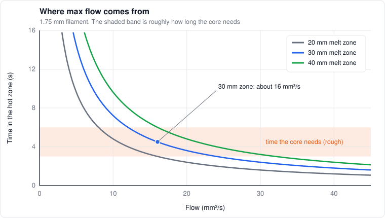

# 3. Melting

*Level 2 to 3.*

## The hotend in one paragraph

The extruder gears push solid filament down through the heatbreak, a thin tube whose whole job is
to keep heat from creeping up, into the heater block. The block is hot, heat conducts into the
moving filament, the filament melts from the outside in, and the melt gets pushed out the nozzle.
The thermistor sits in the block. **It measures the metal, not the plastic.** Keep that in mind,
it comes back a lot.

## Heat creep

If heat leaks up the heatbreak, the filament softens before it's supposed to. Soft filament swells,
drags on the walls, and eventually jams. The heatbreak's heatsink and fan are what stop that.

This matters a lot for a hot chamber. The hotend fan cools the heatsink with chamber air, and its
cooling power goes roughly with the temperature difference between the heatsink and that air. At
70 °C chamber air there's much less difference to work with. PLA softens around 60 °C, so **PLA in
a 70 °C chamber is asking for heat creep jams.** That's one of several reasons the chamber modes in
[slicer.md](../calibration/slicer.md#chamber-modes) keep PLA cool. High-temperature plastics soften much higher,
so they don't care.

## How long it takes heat to get in

Heat conducts into the filament over a time that scales with the radius squared over the thermal
diffusivity:

```math
t_{cond} \sim \frac{r^2}{\alpha}, \qquad \alpha = \frac{k}{\rho\,c}
```

Common plastics have $`\alpha`$ around 0.06 to 0.11 mm²/s. For 1.75 mm filament ($`r = 0.875`$ mm)
that's on the order of 10 seconds for the center to fully catch up. The center doesn't have to reach
nozzle temperature, just get soft enough to flow, so call it a few seconds in practice.

Now compare that to how long the plastic actually spends in the hot zone. With a heated length $`L`$:

```math
t_{res} = \frac{L\,A_f}{Q}
```

For a 30 mm melt zone and 1.75 mm filament ($`A_f \approx 2.4`$ mm²):

| Flow | Time in the hot zone |
|---|---|
| 10 mm³/s | 7.2 s |
| 20 mm³/s | 3.6 s |
| 40 mm³/s | 1.8 s |

Somewhere around 20 mm³/s the middle of the filament stops getting enough time. That's why normal
hotends top out in the 15 to 30 mm³/s range, and why it's a heat problem, not a motor problem.



*Where each curve drops into the shaded band is roughly where that melt zone runs out of time.*

## The Graetz number

Put those two times together. The Fourier number (how far the heat got) is

```math
Fo = \frac{\alpha\,t_{res}}{r^2} = \frac{\pi\,\alpha\,L}{Q}
```

and its flipped version is the Graetz number, which compares how fast stuff flows through to how
fast heat conducts in:

```math
Gz = \frac{Q}{\alpha\,L}
```

Melting keeps up while $`Gz`$ stays under some critical value $`Gz^{\ast}`$, so per melt channel:

```math
Q_{max} \approx Gz^{\ast}\,\alpha\,L
```

That little formula explains most hotend marketing:

- **Longer melt zone, more flow.** Volcano, UHF, and so on. $`Q_{max}`$ scales with $`L`$
- **Splitting the filament multiplies it.** CHT-style and "high flow" nozzles split the melt into $`N`$ thinner streams. Each stream gets its own $`\alpha L`$ budget, so ideally $`Q_{max}`$ goes up by $`N`$. In practice less, since they share the heat going in
- **Filament diameter drops out,** at least in this crude version. Surprising, but it falls out of the math: a fatter filament has more area but needs more time
- **Material matters through $`\alpha`$.** Carbon fiber fillers conduct heat better, so CF filaments can melt faster than their base plastic

[Phan, Swain & Mackay (2018)](https://doi.org/10.1122/1.5022982) did this properly with a Nusselt vs
Graetz correlation built from pressure data. My version is the back-of-envelope cousin. The useful
thing about it: fit $`Gz^{\ast}`$ once with a known filament, and you can predict roughly how a longer
melt zone or a different material changes max flow before buying anything.

## Energy bookkeeping

The heater has to pay for two things: losses to the air and fans, and heating the plastic going
through.

```math
P_{heater} = P_{loss}(T,\ \text{fan}) + \rho\,Q\left[c\,(T_{n} - T_{f}) + X\,\Delta H_m\right]
```

The last term only matters for semi-crystalline plastics: $`X`$ is how crystalline the filament is
and $`\Delta H_m`$ is the heat it takes to melt those crystals.

Some numbers to get a feel:

| Plastic | Flow | Nozzle | Power for the plastic |
|---|---|---|---|
| PLA | 20 mm³/s | 210 °C | about 8 W |
| PETG | 30 mm³/s | 240 °C | about 18 W |

A typical hotend heater is 40 to 70 W, and losses eat 10 to 20 W of that at temperature. So there's
usually headroom on paper. **The heater rarely runs out first. Heat transfer into the core does.**

## The block isn't the melt

[Anderegg et al. (2019)](https://www.researchgate.net/publication/330392702_In-Situ_Monitoring_of_Polymer_Flow_Temperature_and_Pressure_in_Extrusion_Based_Additive_Manufacturing)
put a thermocouple and a pressure sensor right in the melt flow. The melt temperature dropped at
higher flow rates while the block happily sat at its setpoint. So the "nozzle temperature" in your
slicer is really "block temperature." At high flow, the plastic coming out is cooler than you think.

How much cooler? [Kapusuzoglu et al. (2026)](https://arxiv.org/abs/2608.18431) printed ABS through
a 0.8 mm nozzle in an enclosed printer, and at the printer's 260 °C limit the filament came out
roughly 40 to 50 °C below the setpoint. That's a big nozzle and a lot of plastic, so it's close to
the worst case, but it's the same story: the number on the screen is a heater setting, not a melt
temperature.

Which means it makes sense to run hotter when flowing more. There's already a post-processing
script that does exactly that:
[G-Code Flow Temperature Controller](https://github.com/sb53systems/G-Code-Flow-Temperature-Controller),
which ties nozzle temperature to volumetric flow (their example: 190 °C at 1 mm³/s, 220 °C at 15,
235 °C at 22). Nobody has built it into a mainstream slicer or firmware that I know of.

**Theory, untested:** I'd rather control the *melt* temperature than the block temperature. With a
pressure sensor and a viscosity model (chapter 2), measured pressure at a known flow tells me the
effective viscosity, and inverting the temperature shift gives an effective melt temperature. **The
pressure sensor becomes a melt thermometer.** Then the block target can be whatever it takes to
hold the melt where I want it.

## The nozzle is part of the heat path

Here's something the slicer pretends doesn't exist. The thermistor sits in the block. The plastic
is in the nozzle. Between the two, heat has to cross the thread joint and then conduct down the
nozzle wall, and both of those are thermal resistances. Anyone who's cooled a CPU knows this
picture, it's the same stack-up running backwards:

```math
T_{melt} \approx T_{block} - P_{fil}\left(R_{contact} + R_{nozzle}\right), \qquad R_{nozzle} \approx \frac{L}{k\,A}
```

$`P_{fil}`$ is the power going into the plastic (the energy bookkeeping above: about 7 W for ABS at
15 mm³/s), $`L`$ and $`A`$ are the length and cross-section the heat travels through, and $`k`$ is
the nozzle material's conductivity. And $`k`$ is all over the place:

| Nozzle material | $`k`$ (rough, W/m·K) | Notes |
|---|---|---|
| Copper alloys (plated copper, CuCrZr) | 300 to 390 | The best conductors, soft, usually plated |
| Silicon carbide | 120 to 200 | Varies a lot with grade |
| Brass | about 115 | The baseline everyone tuned their profiles on |
| Tungsten carbide | about 80 to 110 | Hard and still conducts well |
| Ruby (sapphire tip) | about 35 to 40 | Only the tip, the body is usually brass |
| Hardened tool steel | about 20 to 30 | Stainless is worse, around 16 |

Hardened steel conducts four to five times worse than brass, so whatever temperature drop brass has
across the nozzle, steel has four or five times that, at the same flow. My lumped estimate puts
brass at maybe 10 K at ABS flows and steel at several times that. Treat those absolute numbers
loosely (the heat really goes in along the whole bore, not through one tidy rod), but the ratio is
just the ratio of $`k`$, and it doesn't care how good my geometry is.

And the community testing lines up with it. [CNC Kitchen](https://www.cnckitchen.com/blog/prusament-pc-blend-review)
printed PC Blend layer adhesion samples at the same 275 °C, swapped between a steel and a brass
nozzle back to back, and brass came out **73% stronger**. [MyTechFun](https://mytechfun.com/video/308)
saw hardened steel give about a third of brass's layer adhesion at the same temperature. Same
setpoint, same plastic, very different welds. That's chapter 6 in action: the weld lives on the
first hot second, and a cooler melt simply has less of it.

**Matching flow doesn't mean matching melt.** This is the part that I think trips people up. Two
hotends can hit the same max volumetric flow and still deliver plastic at different temperatures.
A max flow test only tells you when the extruder can't push anymore, or when the core is too thick
to get through. It says nothing about whether the plastic that did get through came out at 245 or
225 °C. Your Z strength cares a lot about that difference. Your flow test doesn't see it.

**The thread joint is the other resistance.** Dry threads touch at the tips of the surface
roughness and trap air everywhere else. Contact conductance for a joint like that spans an order of
magnitude depending on finish and torque, so $`R_{contact}`$ can be anywhere from negligible to as
big as the nozzle wall itself. A thin layer of real high-temperature paste fills the gaps: 20 µm of
something at 3 W/m·K is about 0.07 K/W over the thread area, basically nothing.

That's why [Slice Engineering's boron nitride paste](https://www.sliceengineering.com/products/boron-nitride-paste)
exists. It's rated far beyond hotend temperatures, it isn't electrically conductive (so it can go
on the thermistor and heater cartridge too), and it doubles as an anti-seize on the threads. I'd
take its headline conductivity with a grain of salt, a filled paste isn't the filler, but even a
few W/m·K in a thin layer is plenty. What I'd avoid:

- **Regular CPU paste.** It's made for maybe 150 to 180 °C. At ABS temperatures the oil bakes out,
  it dries, cracks and smells, and then it's a worse interface than nothing, sitting where you
  can't see it
- **Silver or metal-filled pastes** near the thermistor or heater, since they conduct electricity
- **Liquid metal, ever, on an aluminum block.** Gallium attacks aluminum and makes it brittle

**The tip is a heater too (theory).** The flat land at the end of the nozzle rides on the bead it
just laid down, pressing it onto the layer below. A conductive tip stays close to block temperature
right there. A steel tip is the far, cold end of a long, poor conductor, with the part fan blowing
on it. I'd bet part of the steel nozzle's weld penalty comes from the land, not just the melt
temperature, but I haven't seen anyone separate those two.

**Where this leaves a gap.** Orca and Bambu Studio both ask for your nozzle type and hardness. As
far as I can tell, that's only used to warn you about abrasive filaments. Nothing offsets the
temperature, nothing changes the flow model, and every filament profile assumes the brass nozzle it
was tuned on. If you swap nozzle materials, recalibrate MPC at least (chapter 9), because the block
now sees a different load. And then, honestly, bump the temperature and test, until something
smarter exists.

## Two ways to hit the wall

| | Thermal limit | Heat transfer / force limit |
|---|---|---|
| What runs out | Heater power | Time for heat to reach the core |
| Block temperature | Drops | Holds steady |
| Pressure | Rises a bit | Spikes (cold, thick core) |
| What you see | Temperature droop, then underextrusion | Extruder clicking or skipping, matte rough strands |
| What helps | Bigger heater, MPC feedforward | Longer melt zone, HF nozzle, hotter, slower |

The [flow ladder](../calibration/filament.md#flow-ladder-by-mass) logs both at once, so it tells you
which wall you hit.

## Where MPC fits

Kalico's MPC (chapter 9) knows the flow coming from the planned moves and adds heater power before
the temperature drops. That fixes the thermal limit's droop. It can't fix the heat transfer limit,
because that's about time and distance, not power. Different problems, different fixes.

## The printer as a calorimeter

**Theory, untested.** That energy equation is also a measurement. At steady flow, the slope of heater
power against flow is

```math
\frac{dP_{heater}}{dQ} = \rho\left[c\,(T_n - T_f) + X\,\Delta H_m\right]
```

If $`\rho`$ and $`c`$ are known, the slope tells me $`X`$: how crystalline the filament came off the spool.
That varies by brand (PLA especially) and changes how it melts and prints. A printer is already a
crude differential scanning calorimeter. I haven't seen anyone use it that way.

## What I'd love to measure first

None of this is set up yet. These are the experiments I'm most curious about, if time allows:

- The flow ladder with heater power and block temperature logged at each step: which wall comes first, and where
- The same ladder on two hotends with the same anchor filament: how much a longer melt zone actually buys
- Heater power vs flow during normal prints, against the energy equation: does the slope match the material?
- Brass, tungsten carbide and hardened steel nozzles in the same hotend, each with and without boron nitride paste: the flow ladder plus Z coupons at the same setpoint, to see how much is the melt and how much is the joint

## References

- [Go, Schiffres, Stevens, Hart (2017)](https://www.sciencedirect.com/science/article/abs/pii/S2214860416302834). Rate limits of FFF: extruder force, heat transfer, motion
- [Go, Hart (2017)](https://arxiv.org/abs/1709.05918). Fast desktop-scale extrusion with a screw and laser heating
- [Phan, Swain, Mackay (2018)](https://doi.org/10.1122/1.5022982). Rheology and heat transfer in FFF, Nusselt vs Graetz
- [Anderegg et al. (2019)](https://www.researchgate.net/publication/330392702_In-Situ_Monitoring_of_Polymer_Flow_Temperature_and_Pressure_in_Extrusion_Based_Additive_Manufacturing). Pressure and melt temperature in the flow
- [Kapusuzoglu, Sato, Mahadevan, Witherell (2026)](https://arxiv.org/abs/2608.18431). ABS bond quality optimization; filament came out 40 to 50 °C below a 260 °C setpoint
- [Turner, Strong, Gold (2014)](https://www.semanticscholar.org/paper/A-review-of-melt-extrusion-additive-manufacturing-Turner-Strong/2f47b171bb818a99a3f1f3a4b652bdc0db682d19). Review of liquefier modeling
- [G-Code Flow Temperature Controller](https://github.com/sb53systems/G-Code-Flow-Temperature-Controller). Flow-dependent temperature as a post-processor
- [CNC Kitchen, Prusament PC Blend review](https://www.cnckitchen.com/blog/prusament-pc-blend-review). Brass vs steel nozzle at the same temperature: 73% stronger layers with brass
- [MyTechFun, hardened steel vs brass layer adhesion](https://mytechfun.com/video/308). About a third of the layer adhesion with hardened steel at the same temperature
- [Slice Engineering, boron nitride paste](https://www.sliceengineering.com/products/boron-nitride-paste). High-temperature, electrically insulating thermal paste for hotends
