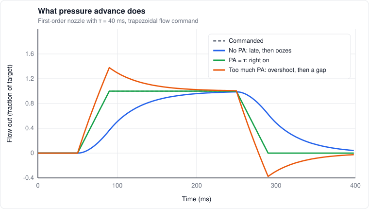
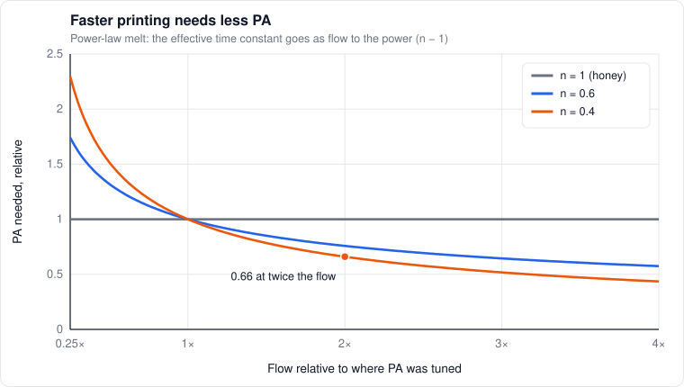
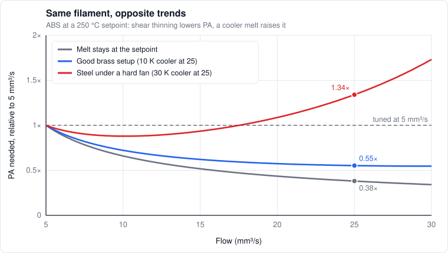
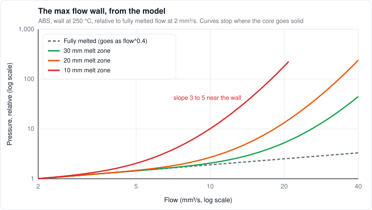
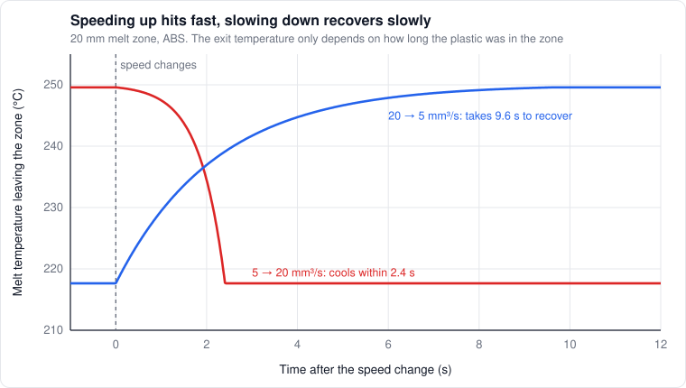
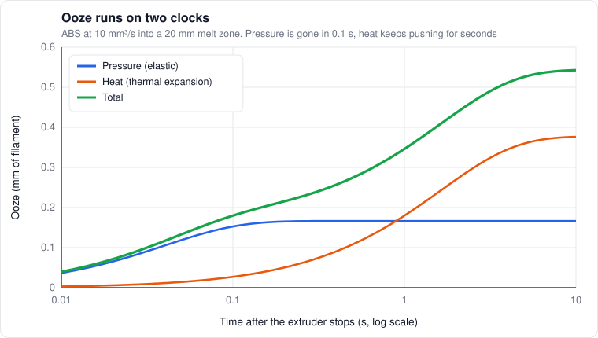

# 4. Extrusion dynamics

*Level 3 to 4. This is where it turns into control theory.*

## The problem in one sentence

The extruder pushes filament in, but plastic comes out late, and keeps coming out after the
extruder stops.

Every corner bulge, every zit at a seam, every gap after a travel move comes from that one
sentence. So let's model it.

## A spring and a resistor

Between the drive gears and the nozzle tip, the system stores a bit of plastic under pressure.
Filament squishes, the melt compresses, things flex. Call that **compliance** $`C`$: push in a little
extra volume and the pressure goes up by $`dP = dV/C`$. Meanwhile the nozzle resists flow. For now,
assume flow out is just pressure over a resistance $`R`$.

Volume in minus volume out equals volume stored:

```math
C\,\frac{dP}{dt} = q_{in} - q_{out}, \qquad q_{out} = \frac{P}{R}
```

Substitute and you get a first-order lag between what the extruder pushes and what comes out:

```math
\tau\,\frac{dq_{out}}{dt} = q_{in} - q_{out}, \qquad \tau = RC
```

That's an RC circuit, same as electronics. Start extruding at flow $`q_0`$ and the output creeps up:

```math
q_{out}(t) = q_0\left(1 - e^{-t/\tau}\right)
```

Stop, and it bleeds off:

```math
q_{out}(t) = q_0\,e^{-t/\tau}
```

The plastic missing at the start is exactly the plastic that oozes at the end, $`q_0 \tau`$. On a
direct drive, $`\tau`$ is usually tens of milliseconds. Tiny, but at 200 mm/s the toolhead covers
several millimeters in that time.

## What pressure advance does

If we know $`\tau`$, we can cheat: push a little extra while the flow is ramping up, and a little less
while it ramps down.

```math
q_{in} = q + \tau\,\frac{dq}{dt}
```

Plug that into the lag equation and $`q_{out} = q`$ exactly. In terms of extruder position $`e`$
(millimeters of filament):

```math
e_{cmd}(t) = e(t) + K\,\dot{e}(t), \qquad K = \tau
```

That's literally what Klipper does: the extruder position becomes the nominal position plus
pressure advance times the nominal extruder velocity (see the
[Kinematics doc](https://www.klipper3d.org/Kinematics.html)). $`K`$ is in seconds. **Pressure advance
isn't a magic tuning number, it's the time constant of your nozzle.**

During deceleration $`\dot e`$ drops, so the extruder actually pulls back a bit. That's why PA looks
like tiny retractions at every corner.

## Seeing it in the frequency domain

Same thing in Laplace terms. The nozzle is a first-order low-pass:

```math
G(s) = \frac{Q_{out}(s)}{Q_{in}(s)} = \frac{1}{\tau s + 1}
```

Pressure advance is a lead term:

```math
C(s) = 1 + K s \quad\Rightarrow\quad C(s)\,G(s) = \frac{1 + K s}{1 + \tau s} = 1 \ \text{when}\ K = \tau
```

It's an exact inverse of the plant. The catch: $`1 + Ks`$ is a differentiator, and a trapezoidal
velocity profile has sharp corners where acceleration jumps. Differentiate a jump and you ask the
extruder for infinite acceleration. So Klipper smooths the advance over a short window,
`pressure_advance_smooth_time` (40 ms by default). Smoothing is a low-pass, so the real system is
more like

```math
H(s) \approx \frac{(1 + K s)\,S(s)}{1 + \tau s}
```

with $`S(s)`$ the smoothing filter. It rounds off the corners of the compensation and adds a little
delay. Shorter smoothing tracks better but jerks the extruder harder. That's the trade.

**What wrong PA does.** During steady acceleration the flow ramps at a constant rate $`\dot q`$, and
the output settles to

```math
q_{out} = q - (\tau - K)\,\dot{q}
```

Too little PA ($`K < \tau`$) underextrudes while speeding up and overextrudes while slowing down,
which is the classic bulging corner. Too much does the opposite and leaves gaps.

How big is that? A 0.65 × 0.3 mm line (0.176 mm², chapter 5's rounded rectangle) at 5,000 mm/s²
ramps the flow at about 880 mm³/s². If $`K`$ is off by just 0.01 s, that's about 9 mm³/s of error. At
150 mm/s the line itself is only about 26 mm³/s, so **a 10 ms PA error is a 30% flow error at the
corners.** That's why PA matters more
the harder you accelerate.



*Same nozzle, three PA settings. The dashed line is what the slicer asked for.*

## The nozzle's resistance, for a real melt

So far I assumed $`q_{out} = P/R`$, a constant resistance. Real melts shear-thin (chapter 2). For a
power-law melt through a round bore of radius $`R`$ and length $`L`$, the pressure drop works out to

```math
\Delta P = \frac{2 L K}{R}\left[\frac{(3n+1)\,Q}{n\,\pi R^3}\right]^{n}
```

Here $`R`$ is the bore radius and $`K`$ the melt's consistency, not the resistance and PA from above. I
ran out of letters. Sanity check: with $`n = 1`$ (Newtonian, $`K = \mu`$) that becomes the classic
Hagen-Poiseuille $`8 \mu L Q / (\pi R^4)`$. Good.

Two things fall out:

- **Pressure goes as $`Q^n`$,** not linearly. Double the flow and pressure only goes up by $`2^n`$
- **Pressure goes as $`R^{-(1+3n)}`$.** For a Newtonian fluid that's the famous $`1/d^4`$. For $`n = 0.4`$ it's $`d^{-2.2}`$

That second one corrects something I wrote earlier in the calibration docs. I said a pressure sensor
could tell a 0.4 from a 0.6 nozzle because pressure goes as $`1/d^4`$, a 5× difference. For a
realistic shear-thinning melt it's more like $`(0.6/0.4)^{2.2} \approx 2.4`$×, and the melt zone and
taper add resistance that doesn't depend on the bore at all. Still easy to tell apart, just not 5×.

## Why PA changes with flow and temperature

Linearize the power law around whatever flow you're printing at. The incremental resistance is

```math
R_{inc} = \frac{dP}{dq} = n\,\frac{P}{q}
```

so the effective time constant is

```math
\tau_{eff} = C\,R_{inc} = C\,n\,\frac{P(q)}{q} \propto q^{\,n-1}
```

With $`n = 0.4`$, doubling the flow multiplies $`\tau_{eff}`$ by $`2^{-0.6} \approx 0.66`$. **Faster
printing needs less PA.** That's exactly what people found empirically, and it's why Orca added
[adaptive pressure advance](https://github.com/OrcaSlicer/OrcaSlicer/wiki/adaptive_pressure_advance_calib):
you run at least six PA tests at different flows and accelerations, and it fits a curve
through them.



*The more a melt shear-thins (smaller n), the faster the PA it needs drops off with flow.*

Temperature does the same thing through the shift factor from chapter 2, though not the way I
first wrote it. Heating a melt slides its whole viscosity curve along the shear rate axis, so in the
power-law range the consistency $`K`$ scales with $`a_T^{\,n}`$, not $`a_T`$:

```math
\tau_{eff}(q, T) \approx \tau_0\left(\frac{q}{q_0}\right)^{n-1}\left(\frac{a_T(T)}{a_T(T_0)}\right)^{n}
```

Hotter means runnier, which means less PA, but less than the shift factor alone suggests: 10 K
hotter takes about 18% off PA for ABS, not 40%. This used to say $`a_T`$, and
[chapter 15](15-trying-to-prove-it-wrong.md#does-temperature-do-something-the-model-cant-predict) is where that got caught.

Acceleration is the one I couldn't derive cleanly. Orca's testing says higher accel wants less PA
too. Part of it turns out to be shear thinning itself: a fast corner rushes through the sluggish
low-flow region before the nozzle settles into it, and a simulated pattern test picks 10 to 20% less
PA at 4,000 than at 1,000 mm/s² from that alone
([chapter 15](15-trying-to-prove-it-wrong.md#does-the-time-constant-change-with-flow)). The rest is still guesses:
the smoothing window, a spring that stiffens under load, slack when PA reverses the extruder. I'd
want pressure data before believing any of them.

**Theory, untested:** the plumbing for variable PA already exists. Orca emits per-feature PA, and
Kalico has `per_move_pressure_advance`, which applies PA changes to moves already in the queue
instead of about 250 ms later. What's missing is the physics. If a pressure sweep gives me $`n`$ and
the temperature shift, the formula above gives PA everywhere from two numbers instead of a six-test
grid.

## Flow and temperature aren't independent

That formula treats flow and temperature as separate knobs, but they aren't. The melt gets cooler
the more you push through it (chapter 3), by an amount set by the hotend's heat path:

```math
T_{melt} \approx T_{set} - \beta\,q, \qquad \beta = \rho\,c\,(T_{set} - T_f)\left(R_{contact} + R_{nozzle}\right)
```

So flow pulls PA two ways: shear thinning lowers it, cooler melt raises it. Which one wins depends on
the hotend. For ABS (Seppala's constants from chapter 6, $`n = 0.4`$, 250 °C setpoint), going from
5 to 25 mm³/s:

| Hotend | Melt drop at 25 mm³/s | PA needed, 25 vs 5 mm³/s |
|---|---|---|
| Melt stays at setpoint | none | 0.38× |
| Good brass setup | about 10 K | 0.44× |
| Steel nozzle | about 30 K | 0.63× |

The drops come from chapter 3's tip resistances. At 25 mm³/s the plastic needs about 10 W, and if
roughly a quarter of it comes through the tip, 2.8 K/W in brass gives about 7 K, plus a few kelvin
across the thread and contact, and 12.7 K/W in steel gives about 33 K. A hard part fan on a steel
tip takes more off on top of that (chapter 3's fin model), so the steel row is the gentle case.



*The steel curve bottoms out near 22 mm³/s and then climbs, slowly.*

**The trend flattens, and on a hot-running tip it flips.** At 25 mm³/s the steel nozzle needs about
40% more PA than the brass one, relative to where each was tuned, and past about 22 mm³/s its PA
starts climbing again. An adaptive PA curve belongs to the filament plus the nozzle, the paste and
the heater, so copying one to a different hotend can compensate in the wrong direction.

It also lags: PA acts in milliseconds, the melt over seconds. Exactly how is in "Melt age" below.

And it changes how much plastic lands, not just the corners. During a ramp the output is off by
$`(\tau - K)\,\dot q`$. At 5,000 mm/s² on a 0.65 × 0.3 mm line, a PA tuned at 40 ms when the hot,
fast nozzle is really at 15 ms puts down roughly 22 mm³/s extra during the ramp. Max volumetric
speed is a steady-state number, and every speed change is a transient.

A possible fix: MPC already predicts flow from the planned moves, and Kalico's
`per_move_pressure_advance` can change PA per move. Estimate the melt temperature from the recent
flow and set PA from it, or measure $`\tau`$ directly with a pressure sensor. Nobody does this that I
know of.

## The melt zone in the pressure

The nozzle doesn't see one viscosity, it sees the profile from chapter 3. For flow through a bore
where viscosity varies across the radius, integrating the momentum balance gives, Newtonian first,

```math
Q = \frac{\pi\,\Delta P}{2L}\int_0^R \frac{r^3}{\eta(r)}\,dr \quad\Longrightarrow\quad \frac{1}{\eta_{eff}} = \frac{4}{R^4}\int_0^R \frac{r^3}{\eta(r)}\,dr
```

The $`r^3`$ weights the wall, so the hot outer layer carries most of the flow and lubricates the
stiff core. A power-law melt is even more lopsided. With $`\xi = r/R`$ and the temperature profile
inside $`a_T(\xi)`$:

```math
\frac{1}{a_{eff}} = \left(3 + \frac{1}{n}\right)\int_0^1 \frac{\xi^{\,2+1/n}}{a_T(\xi)}\,d\xi, \qquad P \propto q^{\,n}\,a_{eff}^{\,n}
```

For $`n = 0.4`$ that's the 4.5th power of the radius, and the pressure only feels the result to the
power $`n`$. So the local slope of pressure against flow,

```math
m = \frac{d\ln P}{d\ln q} = n\left(1 + \frac{d\ln a_{eff}}{d\ln q}\right)
```

stays tame even with a cold core:

| $`Fo`$ | 1.0 | 0.5 | 0.25 | 0.13 |
|---|---|---|---|---|
| $`m`$ (ABS, $`n = 0.4`$) | 0.42 | 0.57 | 0.68 | 0.64 |



*Every curve peels off the fully melted line once the core stops keeping up, but not by much. The hot sleeve at the wall carries the flow.*

This table used to say $`m`$ climbs to 3 to 5 near the knee, which made a great story: the max flow
wall as a pressure spike from the cold core. That came from using the mean temperature instead of
the wall-weighted one, and [chapter 15](15-trying-to-prove-it-wrong.md#the-max-flow-wall-isnt-viscous) is where it fell
apart. Viscous flow in the bore doesn't make the wall. My best guess now is the cone: the unmelted
core reaches the taper, can't fit through, and has to be melted by contact under force, the regime
[Osswald et al. (2018)](https://doi.org/10.1016/j.addma.2018.04.030) modeled. A pressure trace through
the knee would show it as a step on top of a gentle climb.

PA follows with $`n`$ instead of $`m`$: PA acts in milliseconds, too fast for the melt temperature to
move, so $`\tau = C\,n\,P/q`$, and with $`m < 1`$ that still falls with flow. A colder melt only
flattens the PA curve, to $`\tau \propto q^{\,m-1}`$ instead of $`q^{\,n-1}`$, more so in a short melt
zone near its limit. Same direction as the heat path above, and the two add.

One partial self-correction: pushing melt through a pressure drop heats it by about
$`\Delta P/(\rho c)`$, roughly 5 K per 10 MPa. A stiff melt at high pressure warms itself a little on
the way out.

## Longer isn't always better

A longer melt zone isn't free. It adds a little compliance (melt at about 1 GPa stores only about
0.024 mm³ per mm of 1.75 mm bore at 10 MPa), and, more importantly, resistance: the molten column is
a tube too. From the power-law pressure formula above, bore against nozzle land goes as

```math
\frac{\Delta P_{bore}}{\Delta P_{land}} \approx \frac{L_b}{L_n}\left(\frac{R_n}{R_b}\right)^{1+3n}
```

which is about 1.3 for a 20 mm column and a 0.6 mm land on a 0.4 nozzle, if the column were fully
molten. So past some length, more melt zone adds more resistance than better melting removes.
[Wüst et al. (2026)](https://doi.org/10.3390/jmmp10070233) measured exactly that with PLA: an optimum melt zone length for
1.75 mm filament, while 2.85 mm, whose bore is about 3× less resistive, kept improving. The CFD of
[Serdeczny et al. (2020)](https://doi.org/10.1016/j.addma.2020.101454) also reproduces the switch from stable to unstable
extrusion at high feed rates, which is this wall seen from the inside, and
[Kazmer et al. (2021)](https://doi.org/10.1016/j.addma.2021.102106) fit compressibility and viscosity together from pressure on an
instrumented ABS hot end and could flag limited melting capacity in real time.

## Melt age

Plug flow has a property that makes the dynamics exact. Each slice of filament only exchanges heat
with the wall, not with its neighbors, so its temperature depends only on how long it's been in the
hot zone, its age $`a`$, not on how the speed changed along the way:

```math
\bar\theta_{exit} = \sum_k \frac{4}{\lambda_k^2}\,e^{-\lambda_k^2 \alpha a/R^2}, \qquad \int_{t-a}^{t} q(s)\,ds = V_z
```

The second equation says the slice leaving now entered when the extruder was one melt zone of filament
behind. So the age at the nozzle is just the time since the extruder position was one melt zone
length back, which the firmware already knows (ignoring retractions). Linearized, it's a moving
average of flow over the last transit time:

```math
\delta a(t) = -\frac{1}{q_0}\int_{t-a_0}^{t} \delta q(s)\,ds
```

A box filter, not a first-order lag. And it's lopsided. Step from 5 to 20 mm³/s on a 20 mm zone:
nothing happens, then the melt cools over 2.4 s (the new, short transit), ending 32 °C colder and 5×
stiffer, most of it in the last second. Step back down and the recovery takes 9.6 s (the new, long
transit). **Speeding up hits within one fast transit, slowing down recovers over one slow transit.**
So fast infill straight into a slow outer wall means the first several seconds of the wall run on
melt that's stiffer than steady state, with PA too low on the most visible line on the part. The 5×
is at low shear, though. The hot plastic at the wall carries the flow, and at printing shear rates
the pressure only feels $`a_T^{\,n}`$, so the PA it needs is more like 1.2×
([chapter 14](14-bringing-everything-together.md#eight-seconds-of-infill-then-a-wall)). That's a
prediction, and a pressure trace would confirm it or kill it.



*Speeding up: the old, well-heated plastic leaves first, then the temperature falls off a cliff.
Slowing down: a slow climb over the long new transit.*

It's also what per-move PA should run on: age from the extruder history, melt temperature from the
series (plus the wall temperature MPC already estimates), PA from $`\tau_{eff}`$ above. Every input
already exists in Kalico.
## Where the spring is

What actually makes up $`C`$? My list, roughly in order of how much I suspect each one matters on a
direct drive:

- **Gear teeth biting into the filament.** They bite deeper as the force goes up
- **Softened filament just above the melt,** which can bulge into the clearance of the bore
- **The filament column between the gears and the heatbreak** flexing in its clearance
- **The idler spring**
- **Melt compressibility.** Polymer melts have a bulk modulus around a GPa, so 50 mm³ of melt at 5 MPa only stores about 0.25 mm³

On a Bowden setup, the tube stretching and the long filament compressing dwarf all of that, which is
why Bowden PA values are several times bigger.

I haven't found anyone who measured cleanly which of these dominates on a direct drive. A pressure
sensor would settle it: $`C = \tau / R_{inc}`$, and $`\tau`$ and $`R_{inc}`$ both come straight off a
pressure trace.

## How much is actually stored

At steady flow the stored volume is

```math
V_s = C\,P = \tau\,q \quad \text{(linear case)}
```

With $`\tau = 0.04`$ s and $`q = 15`$ mm³/s that's 0.6 mm³, about **a quarter of a millimeter of
filament.**

A shear-thinning melt holds more than that. $`\tau`$ is only the slope of pressure against flow,
while the spring is charged to the full pressure. PA acts in milliseconds, far too fast for the melt
temperature to move, so the slope that counts is the shear-thinning one, $`n`$:

```math
V_s = C\,P = \frac{\tau\,q}{n}
```

With $`n`$ around 0.4 to 0.5 that's twice as much or more, about half a millimeter of filament, and
PA only takes back $`K q = \tau q`$ of it when the move stops. The other half drains slowly, because the nozzle gets
sluggish at low flow. In general the stored volume is $`\int_0^q \tau\,dq`$, whatever is nonlinear,
so it's the PA curve at low flow that decides it
([chapter 15](15-trying-to-prove-it-wrong.md#the-degeneracy-no-print-test-gets-out-of)). It's also why a scarf seam wants its own restart ([chapter 5](05-laying-a-line.md#the-restart-is-tuned-for-the-wrong-start)).

## Retraction's second job

Direct drive retractions are usually 0.4 to 1 mm. What PA leaves of the pressure is about a quarter
of a millimeter of that, so retraction is doing a second job, and that one's thermal. When flow
stops, the under-heated core in the melt zone keeps heating to wall temperature and expands. Adding up the temperature deficit over the zone
with chapter 3's series:

```math
\Delta V_{th} = \beta_v\,(T_w - T_{in})\,\frac{R^2 q}{\alpha}\sum_k \frac{4}{\lambda_k^4}\left(1 - e^{-\lambda_k^2 Fo_L}\right) \;\le\; \frac{\beta_v\,(T_w - T_{in})\,R^2\,q}{8\,\alpha}
```

The sum of $`4/\lambda_k^4`$ is exactly 1/8, which gives the clean limit. For ABS ($`\beta_v`$ about
4 × 10⁻⁴ /K, averaged over glass and melt) at 10 mm³/s that's 0.75 to 0.95 mm³ for melt zones from
10 to 30 mm, or 0.3 to 0.4 mm of filament, about as much as the pressure at that flow. It scales with the flow
just before the stop and grows a bit with zone length. And it arrives slowly, mode by mode, each with
its own time $`\tau_k = R^2/(\lambda_k^2\alpha)`$ (1.65, 0.31, 0.13 s...):

```math
\Delta V_{th}(t) = \beta_v\,(T_w - T_{in})\,\frac{R^2 q}{\alpha}\sum_k \frac{4}{\lambda_k^4}\left(1 - e^{-\lambda_k^2 Fo_L}\right)\left(1 - e^{-t/\tau_k}\right)
```



*The pressure part is mostly out before a short travel ends. The heat part is still going at the end of a long one.*

At 10 mm³/s on a 20 mm zone, the pressure part is half out by 0.1 s and 87% by 0.5 s, while the
thermal part is 13% done at 0.2 s, half at 1 s and 95% at 5 s. Short travels are a pressure problem, long travels after
fast sections are a thermal one (theory, but the size lines up with real retraction lengths). It also
explains seam blobs: with a retraction in place, that expansion fills the gap instead of oozing, so a
full unretract after a long travel over-primes. The restart should shrink by
$`\Delta V_{th}(t_{travel})/A_f`$. Slicers use a constant "extra length on restart". Gravity, steam
from wet filament and the meniscus at the tip add the rest. And with PA on, about half the pressure is already gone by the time the move
ends. **If you tuned retraction without PA, your retraction is doing PA's job.**
That's why the order is PA first, retraction second.

## Seams are pressure transients

What happens at the end of a loop:

1. Decelerate. PA pulls back, pressure drops
2. Retract (maybe), wipe (maybe)
3. Travel. Whatever pressure is left oozes out, plus thermal expansion
4. Unretract
5. Accelerate. PA pushes extra, pressure builds back
6. Start the next loop, and hope the pressure is exactly right

Any error in that sequence shows up right at the seam as a zit, a blob, or a gap. The scarf joint
seam attacks it with geometry, and it turns out to cancel most of the PA error instead of just
spreading it ([chapter 5](05-laying-a-line.md#the-scarf-joint)). [Wu, Qian & Okwudire (2023)](https://doi.org/10.1016/j.addma.2023.103850) attacked it with
control: they measured extrusion force with a servo extruder, modeled retraction and re-advance,
and built a feedforward for starts and stops.

**Theory, untested:** pressure-aware retraction. The PA model already knows the pressure state at
the moment the extrusion stops. Retract exactly what's left plus a learned ooze term, and unretract
exactly what's needed to land at the next loop's starting pressure, which is zero when the loop
starts with a scarf. With a pressure sensor you
can check it on every single loop.

## Slip

The gears grip the filament with some maximum force. Extrusion force is pressure times filament
area, $`F = P A_f`$. As $`F`$ gets close to the grip limit the filament starts slipping a little, before
it outright skips. Slip doesn't announce itself, it just quietly underextrudes.

Greeff & Schilling (2017) measured the
real filament speed and closed the loop on slip. With an encoder (BDwidth, or the motion sensors
people already use for jam detection), the slip ratio is

```math
s = 1 - \frac{v_{actual}}{v_{cmd}}
```

and the fix is to command $`e/(1 - s)`$, up to a point. Past that point you're at the force wall from
chapter 3 and no amount of compensation helps. Klipper currently uses motion sensors for runout and
jam detection only. Nothing compensates slip.

## Diameter wobble

Area goes as diameter squared, so

```math
\frac{\Delta A}{A} = 2\,\frac{\Delta d}{d}
```

A ±0.02 mm wobble on 1.75 mm filament is ±2.3% flow. Klipper already compensates for this if you
have a width sensor: `hall_filament_width_sensor` reads the diameter and applies a flow correction
(`M221`) after the filament has traveled `measurement_delay` millimeters, the distance from the
sensor to the melt zone. So the "index by filament distance, not time" idea is already in there.
What it doesn't do: correct for slip, or see ovality with a single-axis sensor.

## What I'd like to build next

They're the gaps I find most exciting, in the order I'd tackle them if time allows:

1. PA as a function of flow and temperature from a two-parameter physical model, fit from a pressure sweep, then driven by the melt age at the nozzle
2. Pressure-aware retraction and unretraction, plus a thermal term from the flow before the stop and a restart that shrinks with travel time
3. Slip compensation from an encoder
4. Melt temperature control instead of block temperature (chapter 3)
5. Closed-loop extrusion force, like the [ETH Zurich work](https://arxiv.org/abs/2403.16042), which used force to hold line width (chapter 5)

## References

- [Bellini, Güçeri, Bertoldi (2004)](https://orbit.dtu.dk/en/publications/liquefier-dynamics-in-fused-deposition/). The liquefier as a dynamic system
- [Tronvoll et al. (2019)](https://www.emerald.com/rpj/article/25/5/830/363878/Investigating-pressure-advance-algorithms-for). First academic look at advance algorithms
- [Wu, Qian, Okwudire (2023)](https://doi.org/10.1016/j.addma.2023.103850). Retraction and advancement modeling with feedforward
- [Wüst, Kattinger, Dahmen, Spiehl, Bonten, Blaeser (2026)](https://doi.org/10.3390/jmmp10070233). Melting zone length and filament diameter vs force and max flow: an optimum for 1.75 mm
- [Serdeczny, Comminal, Mollah, Pedersen, Spangenberg (2020)](https://doi.org/10.1016/j.addma.2020.101454). Hot end CFD, stable to unstable extrusion at high feed rates
- [Kazmer, Colon, Peterson, Kim (2021)](https://doi.org/10.1016/j.addma.2021.102106). Compressibility and viscosity from an instrumented ABS hot end, with fault detection
- Greeff, Schilling (2017). *Closed loop control of slippage during filament transport in molten material extrusion.* Additive Manufacturing 14
- [Guidetti et al. (2024)](https://arxiv.org/abs/2403.16042). Force controlled printing
- [Klipper: Pressure advance](https://www.klipper3d.org/Pressure_Advance.html) and [Kinematics](https://www.klipper3d.org/Kinematics.html)
- [Orca: adaptive pressure advance](https://github.com/OrcaSlicer/OrcaSlicer/wiki/adaptive_pressure_advance_calib)
- [Kalico](https://github.com/KalicoCrew/kalico) for `per_move_pressure_advance`
