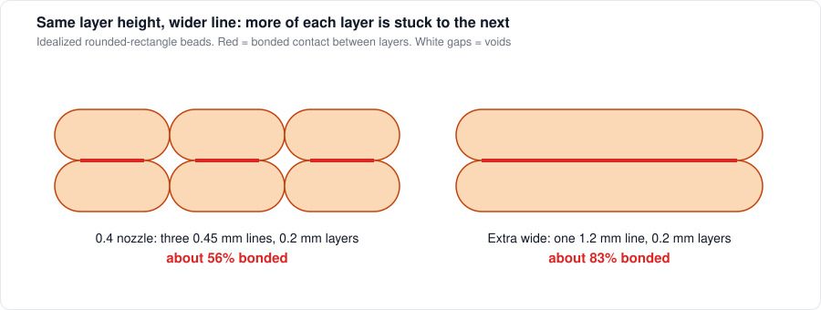
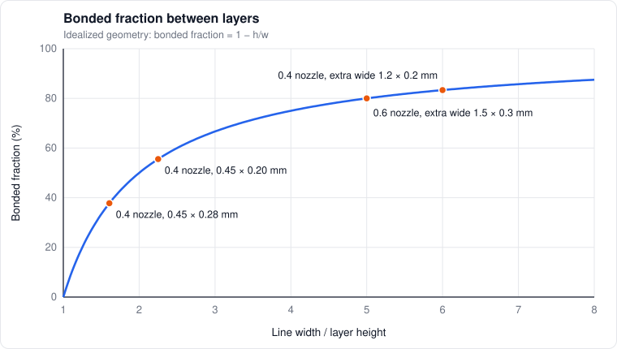
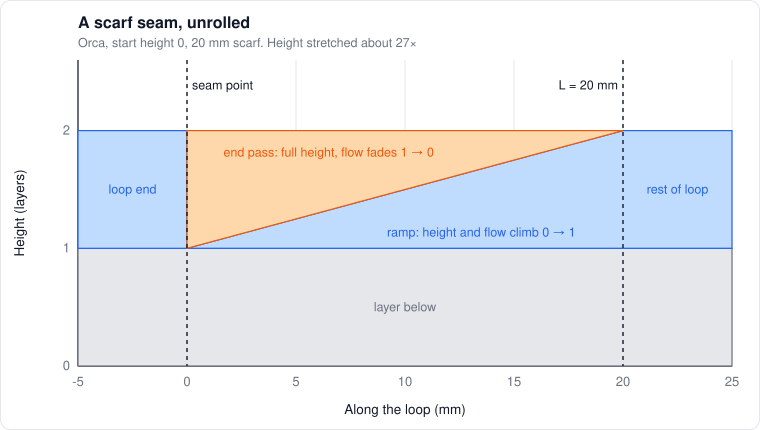
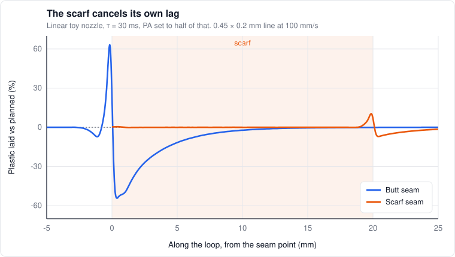
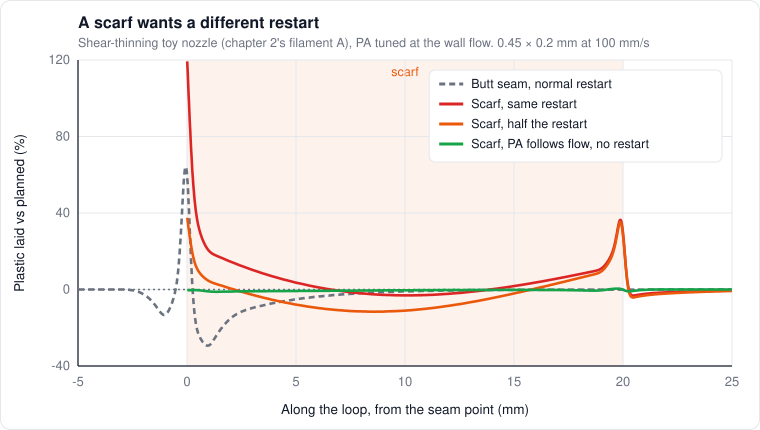

# 5. Laying down a line

*Level 2 to 3.*

## Mass conservation is the whole slicer

The slicer's core assumption is simple: whatever volume goes out of the nozzle ends up as a line
of a known shape. If the line has cross-section $`A`$ and the toolhead moves at $`v`$, then

```math
Q = A\,v
```

Pick a line width $`w`$ and layer height $`h`$, assume a shape, get $`A`$, and the extrusion per
millimeter falls right out. Everything about extrusion amounts in a slicer is this one equation.
The interesting question is what shape the line really is.

## The bead shape

Most slicers (Orca included) model a line as a rectangle with round ends:

```math
A = (w - h)\,h + \frac{\pi h^2}{4}
```

That's what you get if a blob gets flattened between the nozzle and the layer below and bulges out
at the sides. It's a decent model when the line is well squished, and it gets worse when it isn't.

[Comminal et al. (2018)](https://doi.org/10.1016/j.addma.2017.12.013) simulated the actual deposition
flow and found two numbers decide the shape:

- **The gap:** nozzle height above the layer below, relative to the nozzle diameter
- **The speed ratio:** how fast the toolhead moves compared to how fast the melt flows in the nozzle

Fast with a big gap gives an almost round strand that barely touches what's under it. Slow with a
small gap gives a flat one with rounded edges, pressed firmly down. And the force the strand pushes
down with drops linearly as the speed ratio goes up. **Printing faster at the same line width
means less squish.** Keep that in mind for chapter 6.

On top of that, the melt swells when it leaves the nozzle (die swell, chapter 2), so the strand
starts out wider than the bore.

## Squish

Squish is how hard the bead gets pressed into the layer below. It comes from the gap (layer height
vs nozzle) and from flow: overextrude a little and the extra plastic has to go somewhere, so it
presses harder and fills more of the corners.

The first layer is the extreme case. The gap is set by the Z offset, and that's why the first layer
is so sensitive to it: a 0.05 mm Z error on a 0.3 mm first layer is a 17% change in the gap, and
the squish changes even more than that.

## Contact between layers

Stack rounded-rectangle beads on top of each other and look at the cross-section. The flat part of
each bead touches the flat part of the one below, but the round ends leave little triangular voids
at the corners. In the idealized geometry:

```math
\phi_c \approx \frac{w - h}{w} = 1 - \frac{h}{w}
```

is the fraction of each layer that's actually bonded to the layer below, and

```math
\text{void fraction} \approx \frac{h^2\left(1 - \frac{\pi}{4}\right)}{w\,h} \approx 0.21\,\frac{h}{w}
```

is how much of the part is empty space between lines.

| Setup | $`w`$ | $`h`$ | Bonded fraction | Voids |
|---|---|---|---|---|
| 0.4 nozzle, typical | 0.45 | 0.20 | 56% | 9% |
| 0.4 nozzle, thick layers | 0.45 | 0.28 | 38% | 13% |
| 0.6 nozzle, typical | 0.68 | 0.30 | 56% | 9% |
| 0.6 nozzle, extra wide | 1.50 | 0.30 | 80% | 4% |

Real beads flow into the corners somewhat, so measured contact comes out higher than this. But the
trend is the point. **The ratio $`h/w`$ decides how much of each layer is actually stuck to the next
one.** Thick layers on narrow lines leave less than half the cross-section bonded.



*Same layer height, one wide line instead of three narrow ones. The red is where layers actually touch.*



*The idealized curve, with a few real setups on it.*

## Extra-wide lines

This is one of my favorite findings in the whole literature, because it's so simple.
[Allum et al.](https://www.sciencedirect.com/science/article/pii/S2214860422007230) printed
lines at least 250% of the nozzle diameter wide: one 1.2 mm line from a 0.4 mm nozzle instead of
three 0.4 mm lines. Contact between layers went from 63% to 90%, and strength, strain at fracture
and toughness went up 40 to 48%. And it printed 67% faster.

Why isn't everyone doing this? Partly habit: default line widths sit around 1.1 to 1.2× the nozzle
because that gives nice surfaces and modest flow. And there's a real physical catch: **the nozzle
tip has to be flat and wide enough to iron the whole bead.** A narrow, pointy tip can't press down a
line wider than its flat face. So extra-wide lines want a nozzle with a wide flat land, and enough
melt capacity for the higher flow.

For inner walls and infill on structural parts, where nobody sees the surface, this is basically free
strength. More in chapter 6.

## Line width conventions

Why the defaults are what they are:

- **Outer walls** at about 1.0 to 1.1× the nozzle look best and hold dimensions
- **Inner walls and infill** can go much wider. Wider means fewer, fatter lines, faster prints, better contact
- **Top surfaces** narrower and slower look smoother

The slicer's job would be easier if it reasoned about this as "contact fraction vs surface finish
vs flow limit" instead of a pile of separate width settings. That's a theme in [chapter 12](12-gaps.md).

## Overlap and top surfaces

- **Wall/infill overlap** pushes the infill into the walls so they bond. It's fixing the same corner voids from above, sideways
- **Ironing** runs the hot nozzle back over the top surface with a trickle of flow to flatten it. It's squish applied after the fact

## Where a line starts and stops

Every wall loop has to close somewhere, and that's the seam. Three things pile up at that one spot:

- **Round ends.** A bead doesn't start or stop square. It starts as a ball and ends in a rounded point, and two round ends can't meet flush
- **The seam gap.** Slicers stop the loop a little short on purpose so the ends don't overlap: 10% of the nozzle in Orca, 15% in PrusaSlicer
- **The pressure transient** from chapter 4: slow down, stop, maybe retract and travel, restart, and hope the pressure comes back exactly right

[Grübel et al. (2026)](https://doi.org/10.1016/j.matdes.2026.115980) finally looked inside with
micro-CT. On a Prusa MK4 with default PLA settings, every seam left a void of about 0.027 mm³,
roughly $`0.8\,h\,d^2`$ for 0.2 mm layers and a 0.4 nozzle. Back of the envelope, half-round ends
and the gap account for about half of that, which leaves the other half to the pressure. Aligned
seams stack those voids into one cavity through the wall, up to 36% of the cross-section right
there, and beams lost up to 32% of their strength (lattice unit cells, 80%). Random seams didn't
lose any strength, they just started their cracks in new places.

So by default, every layer of every wall gets a small crack in the same spot. That's what the scarf
goes after.

## The scarf joint

Woodworkers and composite repair shops solved this a long time ago: don't butt two ends together,
taper both and overlap them. That's a scarf joint. [MichaelJLew proposed it for printing](https://github.com/prusa3d/PrusaSlicer/issues/11621)
in November 2023, [vgdh](https://github.com/OrcaSlicer/OrcaSlicer/issues/3211) had the same idea a
month later, and [Noisyfox built it into Orca](https://github.com/OrcaSlicer/OrcaSlicer/pull/3839)
in time for 2.0 in March 2024. Bambu Studio has it too, and PrusaSlicer since 2.9.

Here's what Orca's source actually does. The loop starts right on top of the layer
below and climbs to full height over the scarf length $`L`$, with the flow climbing along with the
height. When the loop comes back around, it runs over the ramp again at full height while the flow
fades out:

```math
r(x) = r_0 + (1 - r_0)\,\frac{x}{L}, \qquad \text{ramp: height and flow } r(x), \qquad \text{end pass: flow } 1 - r(x)
```

Ramp plus end pass is exactly one layer at every point, so there's no spot where two round ends have
to meet. "Scarf steps" chops the ramp into at least that many straight pieces. Each piece uses the
value at its far end, so the ramp runs a hair over and the end pass a hair under, by
$`(1 - r_0)/2N`$ on average, and the two cancel.



*Blue is the first time around, orange is the end pass coming back over it. Every vertical slice adds up to one layer.*

The start height $`r_0`$ means different things in different slicers, which surprised me. In Orca,
height and flow both start at $`r_0`$, so a nonzero start height leaves a small butt joint
$`r_0 h`$ tall. PrusaSlicer starts the flow at zero no matter what, so its start height is just
clearance under the nozzle.

## Why the scarf works

Three reasons, and the last one is my favorite.

**The void is gone.** No round ends meet, so the geometric part of the seam shrinks to whatever
$`r_0`$ leaves.

**Every speed change happens at nearly zero flow.** The toolhead speeds up at the bottom of the
ramp and stops at the end of the end pass, both where the slicer asks for almost no plastic.
Whatever goes wrong while accelerating gets multiplied by roughly nothing.

**The lag cancels itself.** On the ramp the flow climbs at a steady rate, so from chapter 4 a nozzle
with time constant $`\tau`$ running pressure advance $`K`$ comes up short by a steady amount. On the
end pass the flow falls at the same rate, over the same stretch of wall, and comes out long by the
same amount:

```math
\frac{\Delta A_{ramp}}{A} = -(\tau - K)\,\frac{v}{L}, \qquad \frac{\Delta A_{end}}{A} = +(\tau - K)\,\frac{v}{L}
```

They add to zero everywhere except within a few millimeters of where the scarf ends. A butt seam
makes the same total error, $`(\tau - K)\,q`$ each way, but it lands as a shortfall just after the
seam point and a surplus just before it, side by side. That's the classic zit next to a gap. So the
scarf doesn't need PA to be right. It needs the ramp and the end pass to be wrong in the same way,
and on a linear nozzle they always are.



*Same toy nozzle, same PA error. The butt seam swings from about −54% to +63% right at the seam point. The scarf stays between −7% and +10%, and only where it ends.*

## Where the scarf still goes wrong

Real melts thin out the faster they flow, so the nozzle gets sluggish at low flow (chapter 4). For
chapter 2's filament A in a 0.4 nozzle, if the time constant is 30 ms at a normal outer wall flow,
it's 74 ms at 2 mm³/s and 156 ms at 0.5 mm³/s. The bottom of a ramp is all low flow. At any spot the
ramp runs at $`r\,q`$ and the end pass at $`(1 - r)\,q`$, so their time constants differ and the
cancellation breaks:

```math
\frac{\Delta A}{A} \approx -\frac{v}{L}\Big[\tau(r\,q) - \tau\big((1 - r)\,q\big)\Big]
```

The ramp comes up short in the first half of the scarf and the end pass leaves extra near the end.
For a power-law melt $`\tau \propto q^{\,n-1}`$, so on the same hardware the leftover scales like

```math
\frac{\Delta A}{A} \propto \frac{A^{\,n-1}\,v^{\,n}}{L}
```

That's most of [Adam L's guide](https://makerworld.com/en/models/211686-better-seams-orca-slicer-guide-to-scarf-seams)
in one line. Across well over a hundred test prints he found scarves under 10 to 15 mm got
noticeably worse, scarf speeds of 50 to 100 mm/s worked best (150 was far worse on his overhang
test), and wider outer walls and thicker layers helped. A shorter $`L`$, a faster $`v`$ and a
smaller $`A`$ all push the same number up. He even says it depends on the "printer's ability to
precisely control extrusions at very low flow".

Going too slow hurt too, from local heating. My guess: the hot nozzle face sits over the thin bottom
of the ramp, and heat soaks about $`\sqrt{\alpha D/v}`$ into it while it's there. For a 1 mm face at
50 mm/s that's about 0.04 mm, the whole bottom fifth of a 0.2 mm ramp.

## Why thicker layers help

Adam L recommends 0.6 mm outer walls on a 0.4 nozzle and found layers above 0.2 mm often help
(sometimes they hurt), both because they reduce extrusion rate error. He had less luck tuning
thinner layers. Three things in the math point the same way:

| Effect | Scales with | 0.45 × 0.2 mm → 0.6 × 0.3 mm |
|---|---|---|
| Fixed-volume errors: restart mismatch, ooze during travel | $`1/A`$ | 0.51× |
| Leftover lag on the ramp, from above | $`A^{\,n-1}`$ | 0.64× |
| Squeeze under the nozzle face at the bottom of the ramp | $`h^{-(1+n)}`$ | 0.58× |

The first one's the big one. A lot of seam error is a fixed amount of plastic set by the hotend and
the retraction, not by the line. A restart that's off by 0.02 mm³ is off by 0.02 mm³ whatever you're
printing. Spread over a length $`\ell`$ it's a width error of $`\delta V/(h\,\ell)`$, so doubling the
cross-section halves it.

The third is the one that's really about layer height (theory). At the bottom of the ramp the nozzle
face sits $`r\,h`$ above the layer below and has to push the bead out through that gap. For a
shear-thinning melt the pressure for that grows roughly as the gap to the power $`-(1+n)`$. A quarter
of the way up a 0.2 mm ramp the face is squeezing through 0.05 mm, a gap you'd normally only see on
a first layer with the Z offset set too low. At 0.3 mm layers the same spot has 0.075 mm.

## The restart is tuned for the wrong start

My own theory, and the bit I find most interesting. Retraction and "extra length on restart" get
tuned on ordinary starts, where the nozzle has to be back at full pressure the moment it moves. A scarf starts at zero flow. Whatever pressure the
unretract puts back has nowhere to go except the thinnest part of the ramp, and the nozzle sits right
there while it happens, since an unretract is an extruder-only move. Adam L saw that exact spot: with
inner walls scarfed too, the nozzle leaves a landing mark next to where the outer scarf starts, from
sitting there during the de-retraction.

It's not a small amount either. PA takes back $`K q`$ when a move stops, but a shear-thinning nozzle
holds about twice that ([chapter 4](04-extrusion-dynamics.md#how-much-is-actually-stored)), and an
ordinary start needs all of it back. In a toy model (chapter 2's filament A, PA tuned at the wall
flow, figure below), a scarf given the same restart as a butt seam puts a blob of about +120% at the
bottom of the ramp. Half the restart is about as good as constant
PA gets, and it still leaves −12% and +38%. With PA that follows the flow (chapter 4's two-parameter
idea) and no restart at all, the scarf stays within about 1%. The butt seam can't do that. Even
perfect PA can't build the pressure in the 20 ms it takes to get up to speed, so it starts 72% short
unless the restart preloads it.



*The restart that suits a butt seam over-primes a scarf. PA that follows the flow fixes both the blob and the dip.*

So the scarf is a geometric patch on a control problem, which is about the most slicer thing
possible. A pressure-aware restart (chapter 4) would finish the job: restart to the pressure the
next move needs, which for a scarf is zero.

## Tuning it touches everything

Every scarf setting lands on something from another chapter:

| Setting | What it changes underneath | Chapter | What testing found |
|---|---|---|---|
| Scarf length | Ramp time $`L/v`$ against the nozzle's time constant | 4 | Worse below 10 to 15 mm, 20 is fine (Adam L) |
| Scarf speed | Same, plus heat soaking into the ramp when slow. Far below the wall speed, it puts a flow step at each end of the scarf | 3, 4, 6 | 50 to 100 mm/s, extrusion rate smoothing helps a little (Adam L) |
| Scarf steps | The sawtooth from straight pieces, which cancels. More pieces means more short moves for the planner | 8 | Doesn't matter much (Adam L) |
| Start height | Orca: a small butt joint against a tighter squeeze at the bottom. PrusaSlicer: clearance only | 5 | One of the four factors Ermolai et al. tested |
| Flow ratio | Scales both wedges, doesn't move any plastic around | 5 | No help, even down to 90% (Adam L) |
| Wall order | Inner/outer/inner leaves the inside of the outer wall open while it prints, so extra plastic can go inward where the next wall buries it | 5 | Inner/outer/inner best (Adam L) |
| Wipe on loops | Drags the nozzle across a scarf that already ended at zero flow | 4 | Makes it worse (Adam L) |
| Pressure advance | Sets the leftover lag. Orca's adaptive PA picks one value per loop, and the code still has a TODO about testing it with scarves | 4 | Tune it first |
| Contour, or contour and hole | Whether holes get a scarf at all | 7 | Contour and hole (Adam L) |

## The machine side of a scarf

Orca lowers Z by $`(1 - r_0)\,h`$ before every scarf unless the
outer wall is the first thing printed on the layer, so on a printer with Z backlash the ramp could
start high (Adam L still found inner/outer/inner best on an X1C). And the planner matters: until
[a fix in September 2026](https://github.com/OrcaSlicer/OrcaSlicer/pull/15832), Orca left
sub-millimeter scraps at the end of each ramp, and Marlin's planner, limited by the Z acceleration,
slowed 80 mm/s walls to 23 to 33 mm/s right there. Klipper scales its Z limits by the slope, so on my
Voron (500 mm/s² for Z, a 1:100 ramp) Z is never the limit. The melt doesn't notice any of this. The
flow dips for about half a second around the seam, against a six-second trip through a 20 mm melt
zone, so melt age (chapter 4) barely moves.

## What the research says so far

Not much yet, which surprised me given how many people run it.

- [Avcioglu & Eltis (2026)](https://doi.org/10.1007/s40430-026-06636-8) printed ABS tubes on a P1S with and without PA and scarves (20 mm, 10 steps, inner and outer walls) and scanned them against the CAD. The scarf about halved the deepest dip, from −0.17 to −0.25 mm down to −0.07 to −0.11 mm, while the high side barely moved (0.21 to 0.27 mm either way). In crush tests the scarf tubes came out about 5% less stiff than the PA-only ones, but losing the seam blob lifted crush force efficiency from about 48% to over 50%
- [Ermolai, Sover & Irimia (2025)](https://doi.org/10.1007/978-3-031-93554-1_4) ran a Taguchi L16 over scarf speed, steps, start height and length, and tuning clearly helped. The scarf's start also wandered between settings and they couldn't explain it. An over-primed restart would do that (theory)
- Grübel et al., above, for the void itself

The comparison I keep coming back to is the weld line in injection molding, where two flow fronts
meet a bit too cold and the part is weak right there. Molders move weld lines where they don't
matter or make the fronts meet hotter. A butt seam is a weld line on every layer. A scarf turns it
into a lap joint 100 times longer than the layer is tall, with the end pass pressing the second half
down onto the first.

## What I'd love to test

If time allows:

- Z-direction tensile coupons at three $`h/w`$ ratios on the 0.6 nozzle, including an extra-wide case
- Cut and polish the coupons, measure the actual bonded width under a USB microscope, compare to $`1 - h/w`$
- Whether the Conch's tip is flat and wide enough for 1.5 mm lines, before trying it
- Scarf seams on the 0.6 nozzle at 0.2 and 0.3 mm layers, everything else fixed, seams under the microscope. If the fixed-volume story is right, the error should drop with the cross-section
- The restart tuned on a scarf start against an ordinary start. The toy model says about half
- A pin gauge in printed 5 and 10 mm holes, butt seam against a scarf with contour and hole, to see how much of "holes come out small" is really the seam

## References

- [Comminal, Serdeczny, Pedersen, Spangenberg (2018)](https://doi.org/10.1016/j.addma.2017.12.013). Strand deposition flow: gap and speed ratio decide the shape
- [Allum et al.](https://www.sciencedirect.com/science/article/pii/S2214860422007230). Extra-wide deposition: 90% vs 63% contact, 40 to 48% stronger, 67% faster
- [Allum, Moetazedian, Gleadall, Silberschmidt (2020)](https://www.sciencedirect.com/science/article/abs/pii/S2214860420306692). Anisotropy comes from geometry (chapter 6)
- [Grübel, Wihanto, Wiese, Ghavidelnia, Eberl, Mylo (2026)](https://doi.org/10.1016/j.matdes.2026.115980). Seam voids in micro-CT: up to 36% of the cross-section, up to 32% weaker beams when seams align
- [Avcioglu, Eltis (2026)](https://doi.org/10.1007/s40430-026-06636-8). ABS tubes with PA and scarf seams, scanned and crushed: the scarf halves the seam dip
- [Ermolai, Sover, Irimia (2025)](https://doi.org/10.1007/978-3-031-93554-1_4). Taguchi study of scarf speed, steps, start height and length
- [Adam L, Better Seams (2024)](https://makerworld.com/en/models/211686-better-seams-orca-slicer-guide-to-scarf-seams). The big community tuning effort, with the test plates and a spreadsheet (also on [Printables](https://www.printables.com/model/783313-better-seams-an-orca-slicer-guide-to-using-scarf-s), built on [Teaching Tech's test model](https://www.printables.com/model/784633-scarf-seam-test-model))
- [Orca PR #3839](https://github.com/OrcaSlicer/OrcaSlicer/pull/3839) (the scarf joint) and [PR #15832](https://github.com/OrcaSlicer/OrcaSlicer/pull/15832) (the planner scraps)
