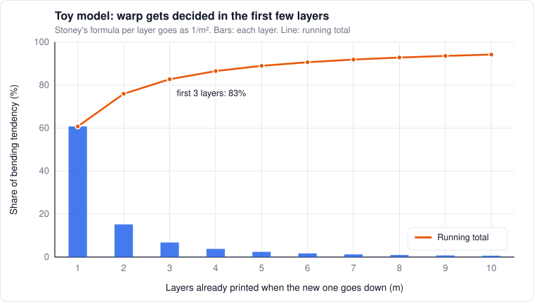

# 7. Shrink, stress and warp

*Level 3.*

## Why parts shrink

Plastic shrinks as it cools, like everything else. The question is from what temperature. Above
$`T_g`$ the melt can flow and relax, so it doesn't hold onto any strain. The shrink that actually
gets locked into the part starts around where it stops flowing ($`T_{set}`$): roughly $`T_g`$ for
amorphous plastics, the crystallization temperature for semi-crystalline ones.

```math
\frac{\Delta L}{L} \approx \alpha\,(T_{set} - T_{room})
```

$`\alpha`$ here is the thermal expansion coefficient. Quick sanity check with rough values:

| Plastic | $`\alpha`$ (rough) | $`T_{set}`$ | Predicted shrink | What people typically set |
|---|---|---|---|---|
| ABS | about 90 × 10⁻⁶ /K | about 105 °C | about 0.7% | about 0.5 to 0.8% |
| PLA | about 70 × 10⁻⁶ /K | about 60 °C | about 0.25% | about 0.2 to 0.3% |

That simple model lands right where people's shrink settings end up, which makes me trust it.

Semi-crystalline plastics have a second shrink on top: crystals are denser than the tangled stuff.
With $`X`$ the crystalline fraction and $`\rho_a`$, $`\rho_c`$ the amorphous and crystalline densities:

```math
\frac{\Delta V}{V} \approx X\left(1 - \frac{\rho_a}{\rho_c}\right)
```

For nylon 6 ($`\rho_a \approx 1.08`$, $`\rho_c \approx 1.23`$ g/cm³) that's about 12% volume change per
unit of crystallinity. Crystallize another 10% of it during annealing and you get about 1.2% in
volume, around 0.4% in each direction if it's isotropic. That's annealing shrink, and it's on top of
the print shrink.

## Stress builds up layer by layer

Each new layer goes down hot on cooler layers. It wants to shrink, the layer below says no, and
the mismatch turns into stress:

```math
\varepsilon_{th} \approx \alpha\,(T_{set} - T_{chamber}), \qquad \sigma \approx \frac{E\,\varepsilon_{th}}{1 - \nu}
```

For ABS ($`E \approx 2`$ GPa):

| Chamber | Strain | Built-in stress (upper bound) |
|---|---|---|
| 25 °C | 0.72% | about 22 MPa |
| 70 °C | 0.32% | about 10 MPa |

ABS breaks around 40 MPa. Some of that stress relaxes, so these are upper bounds, but they show why
ABS cracks in a cold box.

**How it turns into warp.** Here's a toy model I like. Stoney's formula (1909) gives the curvature
a thin stressed layer puts on a thicker plate. For a layer of thickness $`h`$ on a stack of $`m`$ layers,
same material:

```math
\Delta\kappa_m = \frac{6\,\varepsilon_{th}\,h}{(m h)^2} = \frac{6\,\varepsilon_{th}}{m^2\,h}
```

Add up the bending tendency over all the layers and it goes like $`\sum 1/m^2`$. **The first three
layers carry about 83% of the total.** Stoney's formula isn't really valid when the layer and the
stack are similar in thickness, and the bed is holding the part down, so don't take the numbers
literally. But the shape of it is right: **warp gets decided in the first few millimeters.** That's
why bed adhesion and a hot bed matter so much.



*The toy model's 1/m² weighting. The first three layers carry most of it.*

[Armillotta et al.](https://www.semanticscholar.org/paper/Warpage-of-FDM-parts:-Experimental-tests-and-model-Armillotta-Bellotti/9ee2ce3b84cf9620980c53c3bcd8544d8db7b4b5)
built a better warp model for ABS blocks. They found the worst warp at medium part heights, with heat
from the newest layer spreading the stress over several layers below. The two don't fight, as I read
them. Stoney says which layers do the pulling, and the bottom ones pull hardest. Whether the part
actually bends is a contest between that pull and how stiff the stack has gotten: a short part
doesn't have much pulling on it yet, a tall one is too stiff to bend, and in between the pull wins.

## Why hot chambers fix warping

Two effects stack up:

1. **Less strain to begin with.** $`T_{set} - T_{chamber}`$ gets smaller
2. **The stress relaxes faster.** Close to $`T_g`$, chains can still move a bit, and built-in stress bleeds away while the part prints

Industrial machines lean on this hard. A
[Stratasys patent](https://image-ppubs.uspto.gov/dirsearch-public/print/downloadPdf/6722872) describes
their FDM machines building in a chamber heated to between 70 and 90 °C. Hobby printers rarely get
past 60.

For this printer at 70 °C, that's 35 K below ABS's $`T_g`$. For Bambu PPA-CF ($`T_g`$ = 85 °C) it's only
15 K below. **A 70 °C chamber is close to ideal for PPA-CF.**

## Stress relaxation

The Maxwell model from chapter 2 again. Built-in stress decays like

```math
\sigma(t) = \sigma_0\,e^{-t/\lambda(T)}
```

Above $`T_g`$, $`\lambda`$ shifts with the WLF factor and relaxation is quick. Below $`T_g`$ it slows down
enormously (the glass is nearly frozen), but not to zero.

The hot bed does exactly this for the bottom layers: they sit above $`T_g`$, stay relaxed, and don't
lock in stress until the print is done and everything cools together. The chamber does a milder
version for the whole part.

## Crystallization and annealing

Semi-crystalline plastics printed in a cool chamber come out only partly crystallized, because they
cooled too fast. Annealing heats them above $`T_g`$ (but well below $`T_m`$), and the tangled regions
organize into crystals. The part gets stiffer, much more heat resistant, and it shrinks while doing
it.

Bambu's [PPA-CF datasheet](https://store.bblcdn.eu/s8/default/f592e57fe69c40289897513bdd2b61bc/Bambus_PPA-CF_Technical_Data_Sheet_2ab26420-79f5-4692-888e-090006814050.pdf)
gives: $`T_g`$ 85 °C, $`T_m`$ 258 °C, anneal at 120 to 140 °C, heat deflection 196 °C at 1.8 MPa. A part
annealed at 130 °C is well above its $`T_g`$, so it's soft while it crystallizes, and thin features can
sag.

Some practices I'd borrow from glassmaking, where annealing schedules are a solved science:

- **Ramp up slowly,** so the part heats evenly
- **Hold** at the annealing temperature long enough to crystallize through
- **Cool slowly,** especially through the range where stress freezes in
- **Support it.** Pack it in salt or sand, or fixture it, if it has thin or overhanging features
- **Measure the annealing shrink once** per material and part type, and pre-scale the model for it. One shrink number in the slicer can't cover print shrink and annealing shrink at the same time

## Fillers make it directional

Carbon and glass fibers line up with the print path
([Tekinalp et al. 2014](https://doi.org/10.1016/j.compscitech.2014.10.009)). Along the fibers the
plastic barely expands or shrinks. Across them it's nearly the base plastic. So a CF part's shrink
depends on which way the lines ran in each region. Slicers apply one XY shrink number to the whole
part. For CF parts with dominant line directions, that's wrong in a predictable way.

## Dimensional accuracy

What actually moves the dimensions:

- **Scale vs offset.** Shrink scales everything. Line width errors shift every edge by a fixed amount, outward on outside edges and inward on holes. A test part with several sizes of both separates the two ([models](../calibration/models.md#dimensions))
- **Holes come out small:** polygon approximation plus the bead squishing inward. Hole compensation fixes the offset part
- **Elephant foot:** the first layer squishes out
- **Z quantization.** On this printer Z moves 0.04 mm per full step (`rotation_distance` 40, 80:16 gearing, 200 steps per rev). Layer heights that are multiples of 0.04 (0.20, 0.24, 0.28, 0.32) land on full steps, where the motor positions most consistently. With 32 microsteps and 5:1 gearing the gain is small and people argue about it, but it costs nothing
- **Corners and seams:** PA errors bulge corners, seams add a zit. Both show up as dimension errors if you measure at the wrong spot
- **The machine drifts too.** The frame and gantry grow as they warm up over a long print (chapter 9)

## Seams eat tolerance

A pin in a hole touches the highest point. Put one bump of height $`b`$ on the wall of a hole and the
biggest pin that fits is $`D - b`$, however round the rest of it is. ABS shrinking 0.7% takes
0.035 mm off a 5 mm hole. The seam dips in the tube scans in chapter 5 were 0.17 to 0.25 mm deep,
and a zit a third that size beats the shrink on a hole that small. So some of the CAD hole offsets in
the rant below are quietly compensating seams, not shrink.

A scarf spreads that error along 20 mm of the loop instead of piling it next to the seam point
([chapter 5](05-laying-a-line.md#the-scarf-joint)). Two catches. Orca's "Contour" mode skips holes,
it's "Contour and hole" that includes them, and holes are where fits live. And a hole under about
6 mm has a loop shorter than the default 20 mm scarf, so Orca turns the whole loop into the ramp.

## A rant about the shrinkage box

This one genuinely blows my mind. ABS shrinks about 0.7% after it sets, PLA about 0.25% (the table
at the top of this chapter). It's the most predictable difference between filaments there is, and
every slicer has a box for it: Orca's [Shrinkage (XY) and (Z)](https://www.orcaslicer.com/wiki/material_settings/filament/material_basic_information),
and Bambu Studio's too. What's in the box? 100%. For everything.

Bambu gets me the most. They make the filament, the printer, the enclosure and the slicer, and every
filament they sell ships with a tuned profile: temperatures, flow ratio, max volumetric speed,
cooling. Shrink sits at 100% for every one of them. I learned that on my own Bambu Lab X2D, using it
and running my own tests on it. So what's the filament picker for, if it ignores the
property that moves your tolerances the most? On a 100 mm ABS part that's 0.7 mm, and when I print
ABS on those machines it lands right where the shrink math says. The number is known, it just isn't
used. That's how you end up running a [Calilantern](https://vector3d.shop/products/calilantern-calibration-tool-mk2)
on a Bambu, re-measuring a material property the manufacturer could have shipped.

The worst part is what it does to the community. Designers print on uncompensated machines, parts
come out small, so they fudge the CAD: heat-set insert holes get opened up until the insert goes in,
bearing seats get looser. Then a machine that prints ABS true makes those holes too big. Inserts
spin or pull out, bearings rattle. The file now describes one person's uncorrected printer, not the
part.

What people say back:

- **"Shrink isn't one exact number."** It moves a little with chamber, part size and fillers, but it
  lands in a range per family (ABS, ASA, lower for CF blends). I can ballpark a new filament before
  printing it. 0.6% for ABS is wrong by a little, 100% is wrong by the whole amount. I refuse to
  believe the filament teams don't know this
- **"Multi-material makes it impossible."** Bambu Studio skips shrink on
  [painted multi-filament models](https://github.com/bambulab/BambuStudio/releases/tag/v02.08.04.57).
  But each material's toolpaths can be scaled by its own shrink about the same origin,
  $`x_{print,i} = x_{design}/(1 - s_i)`$, so every region cools back to size. The leftover mismatch
  where materials meet (about 0.45 mm per 100 mm for ABS against PLA) happens on cooling either way
- **"Just calibrate it yourself."** I do. That's the point

What I'd like to see: real shrink values per filament, keyed to chamber mode, per-material
compensation in multi-material prints, and designs drawn at true size. Until then my library carries
measured shrink ([slicer plan](../calibration/slicer.md)), and I assume any downloaded tight fit was
tuned on somebody else's mistake.

## Cooling down

Two things go wrong at the end of a print:

**Part vs bed.** A PEI spring-steel sheet expands at roughly 11 to 17 × 10⁻⁶ /K. ABS is about
90 × 10⁻⁶ /K. Cool the bed from 100 °C to room temperature with the part still stuck to it and the
mismatch is around 0.6% strain at the interface. That's why parts pop off when cool, which is
good, and why thin or brittle parts sometimes crack or curl at the corners, which isn't.

**Thick parts.** Cooling a part from the outside sets up an internal temperature difference. For a
slab of half-thickness $`L`$ cooling at rate $`\dot T`$:

```math
\Delta T \approx \frac{\dot{T}\,L^2}{2\,\alpha}
```

A 20 mm thick part cooling at 5 K/min has about a 40 K difference between its middle and its skin.
At 1 K/min it's about 8 K. Below $`T_g`$ that stress is mostly elastic and goes away once the part is
uniform again. Close to or above $`T_g`$ it can relax and then come back inverted, which is how parts
end up with locked-in stress.

**Theory, low risk:** a controlled chamber cool-down for big ABS, ASA and PPA parts. Ramp the chamber
down at 1 to 2 K/min instead of shutting everything off. It's just software on this printer.

## What I'd like to try on this printer

Small stuff, mostly software, if time allows:

- A slow cool-down ramp at the end of hot-chamber prints
- Separate print shrink and annealing shrink for PPA-CF in the library, and measure both once
- Layer heights in multiples of 0.04 mm
- The dimensional test part to separate scale from offset, per material and chamber mode

## References

- [Stratasys patent US 6722872](https://image-ppubs.uspto.gov/dirsearch-public/print/downloadPdf/6722872). FDM build chambers at 70 to 90 °C
- [Armillotta, Bellotti, Cavallaro](https://www.semanticscholar.org/paper/Warpage-of-FDM-parts:-Experimental-tests-and-model-Armillotta-Bellotti/9ee2ce3b84cf9620980c53c3bcd8544d8db7b4b5). Warp model for ABS
- [Tekinalp et al. (2014)](https://doi.org/10.1016/j.compscitech.2014.10.009). Fiber orientation in printed composites
- [Northcutt et al. (2018)](https://www.sciencedirect.com/science/article/abs/pii/S0032386118308541) and [Costanzo et al. (2020)](https://doi.org/10.3390/polym12122980). Crystallization during printing
- [Bambu PPA-CF datasheet](https://store.bblcdn.eu/s8/default/f592e57fe69c40289897513bdd2b61bc/Bambus_PPA-CF_Technical_Data_Sheet_2ab26420-79f5-4692-888e-090006814050.pdf)
- Stoney (1909). *The tension of metallic films deposited by electrolysis.* Proc. Royal Society A 82
