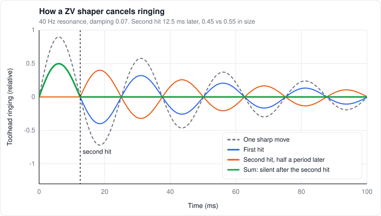

# 8. Motion

*Level 3 to 4.*

The plastic side gets most of the attention in this handbook, but none of it matters if the
toolhead isn't where the G-code says it is. This chapter covers how the motion system works, why
it shakes, and how input shaping actually cancels the shaking.

## Steppers in one paragraph

A stepper has 200 full steps per revolution (1.8° motors) or 400 (0.9°). The driver doesn't just
flip between steps. It feeds the two coils sine and cosine shaped currents, which lets the rotor
sit anywhere in between (microstepping). Torque is roughly proportional to coil current. That's
all fine until the motor spins fast, and then the driver can't push the current in anymore.

## Why torque falls off with speed

Each coil is a resistance $`R`$, an inductance $`L`$, and a back-EMF that grows with speed. For the
driver to keep the full current $`I`$ flowing, the supply voltage has to cover all three, roughly:

```math
V \gtrsim \sqrt{\left(I R + k_e\,\omega\right)^2 + \left(\omega_e\,L\,I\right)^2}
```

$`\omega`$ is the shaft speed, $`k_e`$ the back-EMF constant, and $`\omega_e`$ the electrical frequency.
The motor goes through one electrical cycle every four full steps, so

```math
\omega_e = \frac{N_{steps}}{4}\,\omega
```

That's 50 electrical cycles per turn for a 1.8° motor and 100 for a 0.9°. Once the right side of
that inequality passes the supply voltage, current drops and so does torque.

What falls out:

- **0.9° motors run out of voltage at lower speed** than 1.8° motors with similar windings, because their electrical frequency is twice as high. The inductive term doubles
- **48 V roughly doubles the speed** where that happens, for the same motor. That's the whole case for 48 V
- **Lower inductance motors** push the limit up too, at the cost of needing more current for the same torque

On a CoreXY with 20-tooth pulleys, each motor turn is 40 mm of belt. 500 mm/s along X or Y is 12.5
turns per second, which is 1,250 Hz electrical on a 0.9° motor. On a diagonal one motor does all the
work at 707 mm/s, about 1,770 Hz, so that's the case to check. Plug your motor's datasheet $`R`$, $`L`$ and torque
constant into that formula and you'll see whether 24 V is still keeping up at that speed.

## Belts are springs

The toolhead hangs on belts, and belts stretch. Each belt span acts like a spring with stiffness

```math
k = \frac{E\,A}{L_{span}}
```

and the toolhead (or toolhead plus gantry, for Y) is the mass. So the system has a natural
frequency

```math
f_0 = \frac{1}{2\pi}\sqrt{\frac{k}{m}}
```

Two consequences:

- **The span length changes as the toolhead moves,** so the resonance changes with position. That's why resonance testing happens at one spot, usually the middle, and why it's never quite right everywhere
- **Stiffer or lighter means higher frequency.** Wider belts raise $`k`$, a lighter toolhead lowers $`m`$

## Resonance and ringing

When acceleration changes suddenly, the toolhead overshoots and rings at $`f_0`$. The size of the
ringing is roughly how far the "spring" stretches under the inertial load:

```math
x \approx \frac{a}{\omega_0^2}, \qquad \omega_0 = 2\pi f_0
```

At 5,000 mm/s²:

| Resonance | Ringing amplitude |
|---|---|
| 40 Hz | about 0.08 mm |
| 75 Hz | about 0.02 mm |

0.08 mm is very visible on a surface. And it goes as $`1/f^2`$, which is why stiffness matters so much.

## Input shaping from scratch

The trick: instead of sending one sharp command, split it into a few smaller ones, timed so their
vibrations cancel each other out.

A hit at time $`t_i`$ with size $`A_i`$ makes the toolhead ring like

```math
x_i(t) \propto A_i\,e^{-\zeta\omega_0 (t - t_i)}\,\sin\big(\omega_d (t - t_i)\big), \qquad \omega_d = \omega_0\sqrt{1 - \zeta^2}
```

**Zero Vibration (ZV) shaper.** Two hits. The second one comes half a ringing period later, so it
rings exactly out of phase with the first. Size it to match the first one's ringing after it has
decayed for half a period, and they cancel:

```math
t_2 = \frac{\pi}{\omega_d}, \qquad K = e^{-\zeta\pi/\sqrt{1 - \zeta^2}}, \qquad A_1 = \frac{1}{1 + K}, \quad A_2 = \frac{K}{1 + K}
```

Every move gets convolved with those two hits. The machine now takes half a period longer to
finish each acceleration change, and in exchange the ringing at $`f_0`$ is gone.



*The first hit rings, the second rings exactly out of phase, and after the second hit the sum is flat.*

**How well it works off-frequency.** Singer and Seering's residual vibration for a shaper with hits
$`A_i`$ at times $`t_i`$ (last one at $`t_N`$):

```math
V(\omega, \zeta) = e^{-\zeta\omega t_N}\sqrt{\left(\sum_i A_i e^{\zeta\omega t_i}\cos\omega_d t_i\right)^2 + \left(\sum_i A_i e^{\zeta\omega t_i}\sin\omega_d t_i\right)^2}
```

ZV hits zero right at $`f_0`$ but climbs fast if the real frequency is a bit off. MZV, EI, 2HUMP_EI and
3HUMP_EI add more hits to widen the notch, so they tolerate frequency error and multiple peaks
better. The cost is a longer shaper.

## What the shapers trade

Roughly, from how each shaper is built (the [Klipper docs](https://www.klipper3d.org/Resonance_Compensation.html) cover choosing one):

| Shaper | Duration (periods of $`f`$) | Good at |
|---|---|---|
| ZV | 0.5 | One clean peak, exactly known |
| MZV | 0.75 | One peak, a bit of tolerance |
| EI | 1 | Wider tolerance |
| 2HUMP_EI | 1.5 | Two-ish peaks, wide tolerance |
| 3HUMP_EI | 2 | Messy, multi-peak, or uncertain resonance |

A longer shaper smooths the commanded path more, which rounds corners. The rounding grows with
acceleration times duration squared, so for a fixed amount of rounding

```math
a_{max} \propto \frac{1}{t_{shaper}^2} \propto f^2
```

This printer: X is 3HUMP_EI at 75 Hz (about 27 ms), Y is MZV at 36 Hz (about 21 ms). Similar
smoothing, which is why both land near the same recommended acceleration. Getting X off 3HUMP_EI
(by fixing the A/B asymmetry) would cut its duration a lot.

## CoreXY quirks

On a CoreXY, both motors drive every move. With Klipper's convention $`a = x + y`$ and $`b = x - y`$:

- A pure X move turns both motors the same way
- A pure Y move turns them opposite ways
- **A diagonal move turns only one motor**

So if one motor, belt or pulley path is different from the other, it shows up on one diagonal and
not the other. That's exactly the asymmetry my printer has, and I'm
still hunting it. Unequal belt paths can also rack the gantry
(twist it slightly as it accelerates). [Okwudire's group](https://arxiv.org/abs/2105.09878) compensated
racking on H-frame printers in software. CoreXY's crossed belts are there to cancel that twisting
moment, so it only racks when the two sides don't match, which is exactly the asymmetry above.

## Motor resonance speeds

The motor, driver and load have their own resonance, separate from the belts. It shows up as
vibration peaks at specific speeds, which is what Shake&Tune's vibrations profile maps. On this
printer the peaks moved when the motor tuning changed, so they're motor resonance, not the frame. The practical fix is
dumb but effective: don't print walls at those speeds.

## Beyond input shaping

- **Model inversion.** Instead of canceling one frequency, invert a model of the machine's dynamics and pre-distort the commands. That's the filtered B-spline approach ([Okwudire](https://www.sciencedirect.com/science/article/abs/pii/S0957415817301277)), sold commercially as [Ulendo](https://www.ulendo.io/solutions/ulendo-vc). It handles several modes at once and dynamics that change with position ([delta printer version](https://arxiv.org/abs/2209.06791))
- **Phase stepping.** [Prusa](https://help.prusa3d.com/article/phase-stepping-core-one_914247) measures each motor's quirks with an accelerometer and corrects its drive waveform, killing the fine vertical artifacts that come from motor imperfections. Klipper and Kalico don't have it. Some Trinamic drivers let you load a custom microstep table, which is the hook you'd need. I'd have to check which ones
- **Position-dependent shaping.** The shaper is measured at one spot. A shaper that changes with toolhead position is an obvious next step that nobody ships in Klipper

## When speed is really limited by acceleration

A move of length $`L`$ that never reaches cruise speed takes

```math
t = 2\sqrt{\frac{L}{a}}, \qquad v_{peak} = \sqrt{a\,L}
```

A 10 mm segment at 4,000 mm/s² peaks at 200 mm/s. Set the speed to 500 and nothing changes. On
small, detailed parts, acceleration and corners decide the print time, not max speed or max flow.
[Read et al. (2024)](https://pmc.ncbi.nlm.nih.gov/articles/PMC11636983/) ran into exactly this: their
method roughly doubled the allowed flow, and a Benchy printed only 12% faster.

## References

- [Klipper: resonance compensation](https://www.klipper3d.org/Resonance_Compensation.html)
- Singer, Seering (1990). *Preshaping command inputs to reduce system vibration.* J. Dynamic Systems, Measurement, and Control 112
- [Shake&Tune](https://github.com/Frix-x/klippain-shaketune) and [klipper_tmc_autotune](https://github.com/andrewmcgr/klipper_tmc_autotune), what this printer was tuned with
- [Okwudire: filtered B-splines](https://www.sciencedirect.com/science/article/abs/pii/S0957415817301277), [H-frame racking](https://arxiv.org/abs/2105.09878), [position-varying dynamics](https://arxiv.org/abs/2209.06791)
- [Prusa: phase stepping](https://help.prusa3d.com/article/phase-stepping-core-one_914247)
- My printer's tuning results are in my lab notes, which go public once they're cleaned up
