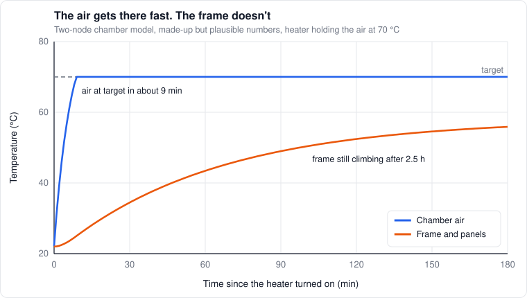

# 9. Heat control

*Level 3 to 4.*

A printer has at least three things it's trying to hold at a temperature: the hotend, the bed, and
(on this one) the chamber. They're very different control problems. Plus a fourth thing nobody
controls but everybody suffers from: the frame warming up.

## PID, and why it's always late

The standard controller:

```math
u(t) = K_p\,e(t) + K_i\int e\,dt + K_d\,\frac{de}{dt}
```

where $`e`$ is the error between target and measured temperature. It works, and it's simple. Its
basic problem: **it only reacts once there's an error.** When the flow jumps, the plastic starts
pulling heat out of the block, the block cools, the heat travels to the thermistor, the thermistor
reads low, and only then does PID add power. By then the plastic coming out is already a bit cold.

## MPC: the hotend as a model

Kalico's MPC (model predictive control) does it the other way around. It runs a little physics
model of the hotend and decides how much power to apply from the model, using the sensor only to
keep the model honest. From the Kalico docs, the model has four thermal masses: the heater block,
the sensor, the ambient air, and the filament. In equation form, roughly:

```math
C_b\,\frac{dT_b}{dt} = P - \big(h_a + h_f(u_{fan})\big)(T_b - T_{amb}) - \rho\,c\,Q\,(T_b - T_{fil})
```

```math
\frac{dT_s}{dt} = r_s\,(T_b - T_s)
```

$`C_b`$ is the block's heat capacity, $`h_a`$ and $`h_f`$ the heat loss to still air and to the fan,
$`r_s`$ how quickly the sensor follows the block. The last term in the first equation is the
filament: Kalico knows $`Q`$ from the planned moves, so **it adds the power for the plastic before
the temperature drops.** That's feedforward.

The controller picks the power that brings the modeled block to target within `target_reach_time`
(2 s by default), and blends in the sensor error with some smoothing so the model tracks reality.
Filament density and heat capacity can be set per material at print start (`MPC_SET`), which ties
directly into the [filament library](../calibration/library.md). It needs the heater's wattage and a
calibration run.

What it buys: steadier temperature when the flow swings around, which at high speed is all the time.
What it doesn't fix: the heat transfer limit from chapter 3. MPC can pour power into the block, it
can't make heat reach the core of the filament faster.

## The bed

The bed is a big, slow thermal mass, and its sensor is underneath the plate. The surface, under a
magnetic sheet and a PEI sheet, is cooler than what the sensor reads, and the edges are cooler than
the middle. A hot chamber helps here: less heat lost from the top means the surface sits closer to
the setpoint.

The bed also changes shape as it heats, which is why the mesh has to be taken at print temperature.
This printer does an adaptive mesh in every `PRINT_START` for that reason. Kalico's MPC works on beds
too, but its docs call it experimental.

## The chamber is a small building

The simplest model is one heat balance, the same one I used to size my chamber heater:

```math
C\,\frac{dT}{dt} = P_{heater} + P_{bed} - UA\,(T - T_{room})
```

with a single time constant $`\tau = C/UA`$. That's useful for sizing the heater, but it hides
something important. The air and the walls/frame are really two separate heat stores:

```math
C_a\,\frac{dT_a}{dt} = P - H\,(T_a - T_w) - UA_{a}\,(T_a - T_{room})
```

```math
C_w\,\frac{dT_w}{dt} = H\,(T_a - T_w) - UA_{w}\,(T_w - T_{room})
```

The air is light and heats up in minutes. The frame, panels and bed structure are heavy and take
tens of minutes to hours. **That's why the chamber air hits its target quickly while the frame keeps
drifting, and why Z keeps creeping for a long time after "the chamber is at temperature."** The slow
time constant is the one that matters for precision.



*Made-up but plausible numbers. The air reaches 70 °C in about 9 minutes, the frame is still climbing after two and a half hours.*

Building engineers identify exactly this kind of two-node RC model from logged data
([Bacher & Madsen 2011](https://doi.org/10.1016/j.enbuild.2011.02.005)). Log a heat-up and a
cool-down, fit the model, and the chamber is characterized.

**Control.** For the rear thermal module I'd use:

- **Feedforward** from the heat balance: the power it should take to hold the target, given the room temperature and the bed
- **Feedback** on whatever's left over
- **A cascade:** a fast inner loop on the duct or heater-outlet temperature, and a slow outer loop on chamber air that sets the inner loop's target. The inner loop keeps the heaters from overshooting, the outer loop gets the chamber right. Kalico supports this directly as `control: dual_loop_pid` with an `inner_sensor_name`, so it's a config change, not code
- **Blowers** fast while heating, slow while holding. PTC heaters put out less power as they get hotter, and slowing the air over them makes them hotter, so holding mode naturally throttles itself

And because it's mains-powered heat inside a box full of plastic: a thermal cutoff fuse in series
with the heaters, heaters never on without airflow (check the blower tach), a fused zero-cross SSR,
earth on any metal, and a smoke detector near the printer.

## The frame and Z drift

As the frame, gantry and bed warm up, the distance from the nozzle to the bed changes. Klipper's
`z_thermal_adjust` corrects it with one sensor and one coefficient. Machine tool builders have been
here before: [Mayr et al. (2012)](https://www.researchgate.net/publication/256673861_Thermal_issues_in_machine_tools)
report thermal effects make up 60 to 75% of all geometric error in machine tools, and the standard fix
is a few temperature sensors plus a fitted model:

```math
\Delta z \approx \sum_i k_i\,(T_i - T_{i,0})
```

With the frame, top and bottom chamber, and bed temperatures as inputs, fitted from logged probe
readings at different temperatures. QGL and autoz already log what's needed. That's a small Kalico
plugin I'd like to write.

The other half is waiting until the drift is small enough before starting, and doing that smartly
instead of with a fixed timer: [predictive soak](../calibration/slicer.md#soak-stop-guessing).

## References

- [Kalico](https://github.com/KalicoCrew/kalico): MPC docs, `dual_loop_pid`, `z_thermal_adjust`
- [Bacher, Madsen (2011)](https://doi.org/10.1016/j.enbuild.2011.02.005). Grey-box thermal models from data
- [Mayr et al. (2012)](https://www.researchgate.net/publication/256673861_Thermal_issues_in_machine_tools). Thermal errors in machine tools
