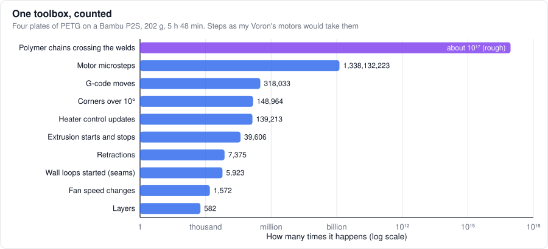
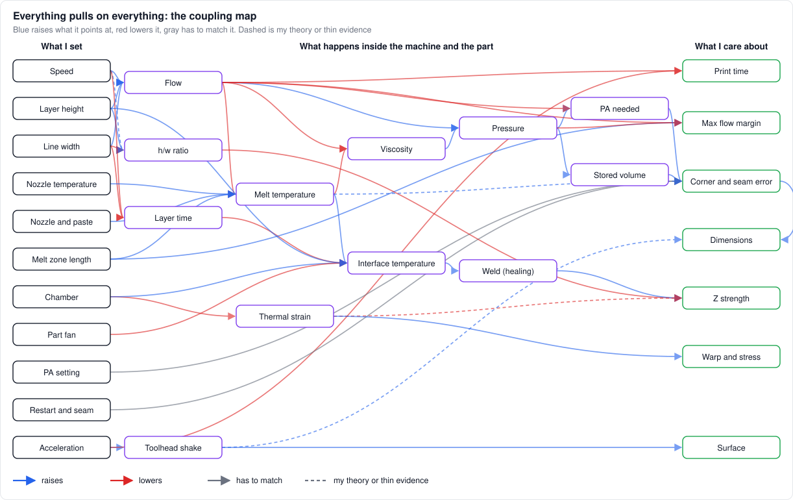
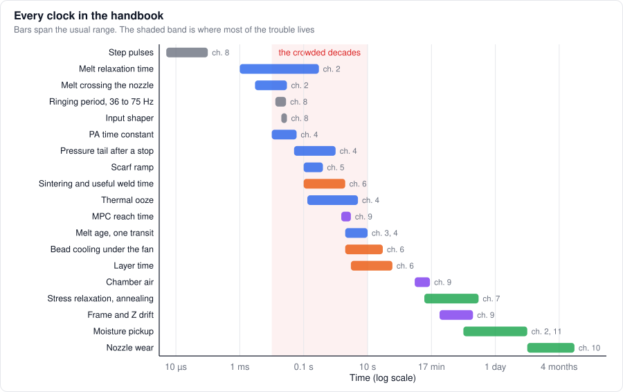
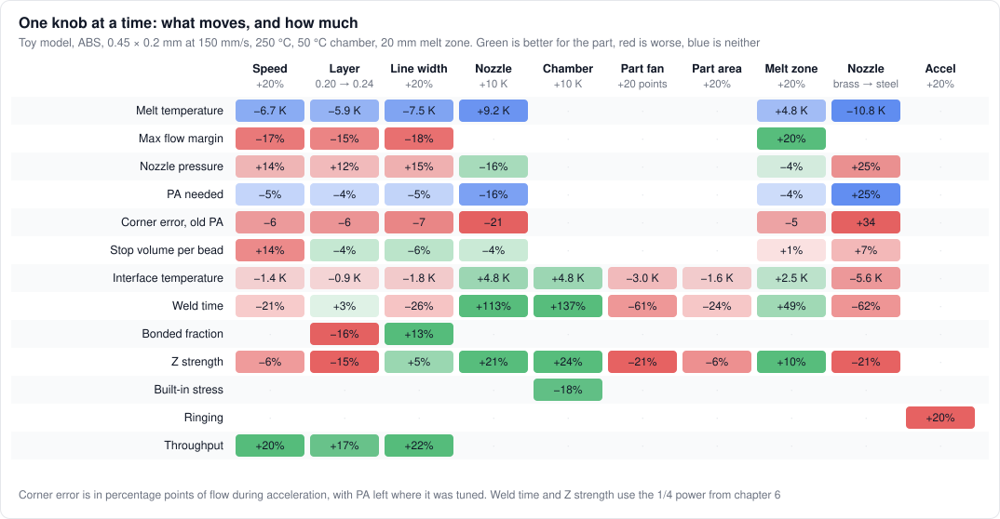
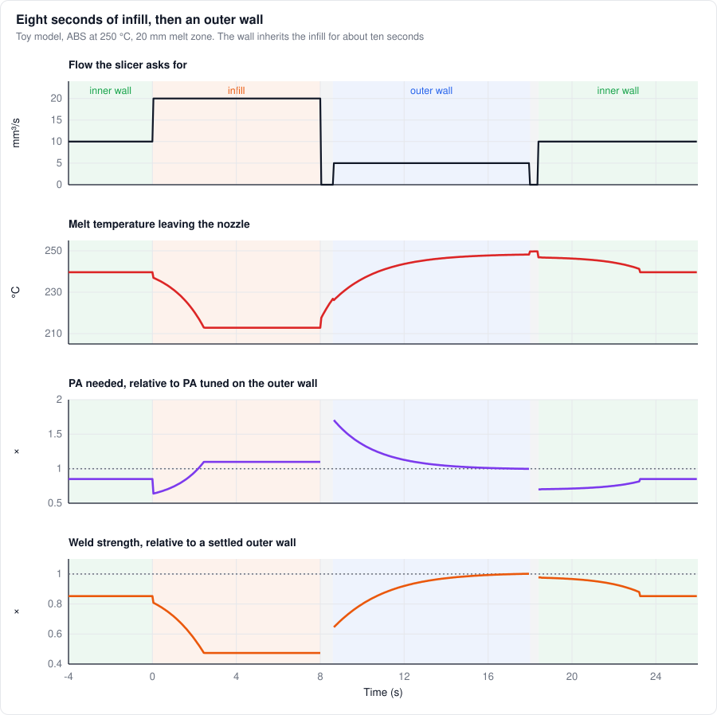
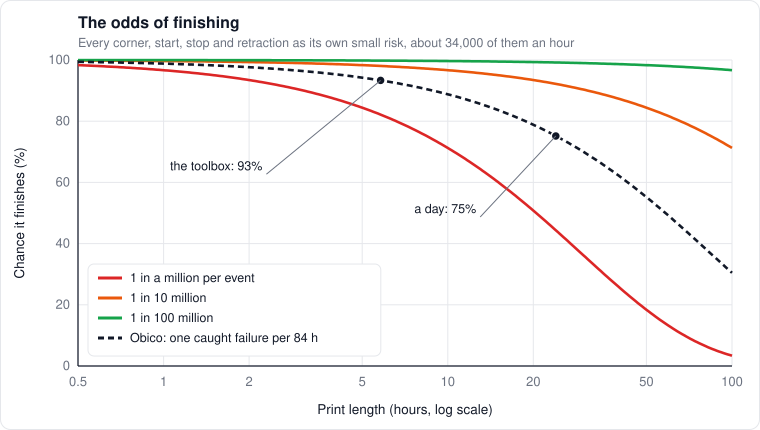

# 14. Bringing everything together

*Level 4, and then some. Every chapter at once.*

When I watch a print, I don't see thirteen chapters. I see one machine where every knob pulls on
everything else: the speed I pick changes the melt temperature, which changes the pressure, which
changes what PA should be, which changes the seam, while the same melt temperature decides how well
this layer welds to the last one, which also depends on how long ago the last one was printed,
which depends on the speed again. That picture lives in my head as a sort of web that lights up
when I touch any part of it.

This chapter is my attempt to put that web on paper, with numbers. It's theoretical from start to
finish. Every piece comes from an earlier chapter, but bolting them together is my own work, some
of the connections are rough, and a few are guesses (I'll mark them). The point isn't precision.
It's seeing the whole thing at once, so the influences and the dynamics are visible from above.

## How much happens in one print

Before any model, I wanted to know how much actually happens in a print, so I counted. I sliced a
real project, a four-plate PETG toolbox for a Bambu P2S (202 g, 5 h 48 min, the standard 0.2 mm
profile), and tallied the G-code line by line:



*Steps are counted as my Voron's motors would take them. The chain count is an order of magnitude, the rest is exact.*

Every second, for almost six hours straight: 64,000 motor steps, 15 moves, 7 corners, a new line
starting about once a second, and a retraction every 2.8 s. The motors step more times in that one
print than a heart beats in 36 years. The nozzle draws 2 km of bead, about 20 football fields, and
the welds between layers add up to 0.41 m² of interface, a square about 64 cm on a side, built in
strips under half a millimeter wide. Across it, around $`10^{17}`$ polymer chains, something like a
million times the number of stars in the Milky Way, have to wriggle from one layer into the next in
the second or two before it freezes (rough: 50 kg/mol chains, coils about 7 nm in radius).

Every corner, start, stop and retraction is a pressure transient (chapter 4), about 197,000 of
them, and every millimeter of bead is a weld (chapter 6). Nearly all of it has to go right, for six
hours, with nobody watching. I still find it a little ridiculous that it usually does.

## The whole printer in one block

In control terms, a print is a system with inputs I choose $`u`$, states I mostly can't see $`x`$,
disturbances I don't choose $`d`$ (wet filament, a new spool, a cold room), and outcomes I care
about $`y`$. Chained together from the chapters, at one operating point:

```math
\begin{aligned}
q &= A(w,h)\,v && \text{flow (5)}\\
T_w &= T_{set} - \tfrac{1}{4}\,\rho c\,q\,(T_w - T_{in})\,R_{tip} && \text{heat path (3, 4)}\\
\bar T &= T_w - (T_w - T_{in})\,\bar\theta(Fo), \qquad Fo = \pi\alpha L/q && \text{melting (3)}\\
P &\propto q^{\,n}\,a_{T,eff}(T_w, Fo) && \text{pressure, } r^3 \text{ weighted (4)}\\
\tau &= C\,n\,P/q, \qquad V_s = C\,P && \text{PA and stored volume (4)}\\
T_i &= \frac{\bar T + T_{ch}\left(1 - e^{-t_L/\tau_c}\right)}{2 - e^{-t_L/\tau_c}}, \qquad \tau_c = \frac{\rho c\,h}{h_{conv}} && \text{landing (6)}\\
H &= \frac{1}{\tau_{rep}}\int \frac{dt}{a_T\big(T_i(t)\big)} && \text{weld (6)}\\
\sigma_z &\approx \sigma_{bulk}\,(1 - h/w)\,\min\left(1, H^{1/4}\right) && \text{Z strength (5, 6)}\\
\sigma_{res} &\approx \frac{E\,\alpha\,(T_g - T_{ch})}{1 - \nu}, \qquad x_{ring} \approx \frac{a}{\omega_0^2} && \text{stress (7), ringing (8)}
\end{aligned}
```

The landing line is the only new piece. Each layer lands on the one before it, which had a layer
time $`t_L`$ to cool toward the chamber, so the interface settles at a fixed point instead of a
guess. Everything below runs on this block, for ABS on a 0.4 nozzle: 0.45 × 0.2 mm lines at
150 mm/s (12.2 mm³/s), 250 °C, brass, a 20 mm melt zone, a 50 °C chamber, 30% fan and 10 s layers.
PA is scaled to 40 ms there, and the reptation time is picked so the weld lands at 70% of bulk,
Seppala's number. It's in [`make_figures.py`](figures/make_figures.py), so anyone can poke it.

## The map

Here's the web, drawn left to right: what I set, what happens inside, what I care about.



*Blue raises what it points at, red lowers it, gray has to match it. Dashed means my theory or thin evidence.*

A few things jump out once it's all on one page:

- **Melt temperature is the hub.** Four knobs feed it, and it feeds viscosity, the weld and the seam. Half the chapters are about it under different names
- **PA needed sits downstream of almost everything.** Speed, layer height, width, nozzle temperature, the heat path and the melt zone all reach it. No wonder one PA value never stays tuned
- **There are really three trunks.** Flow (speed, width, layer height), heat (nozzle temperature, heat path, melt zone on one side, chamber and fan on the other), and motion. Motion barely touches the plastic. Acceleration shakes the toolhead and saves time, and that's it
- **There are 108 routes through it.** 30 boxes and 44 arrows make 108 distinct routes from a knob to an outcome, up to 7 links long. Speed alone reaches the outcomes 24 different ways
- **Two arrows go nowhere you'd expect.** Speed reaches Z strength twice with opposite signs, and so do layer height and line width. That's "Tug of war" below

## Follow one slice of filament

The same machine from the plastic's point of view, one slice at a time, at the base point:

| Where | When | What it's like | What gets decided there |
|---|---|---|---|
| Enters the melt zone | 0 s | 50 °C, solid | Whether it's wet (chapter 2) |
| Leaves the melt zone | 3.9 s | 234 °C on average, 217 °C in the core, 246 °C at the wall | Viscosity, pressure, PA, how much stays stored |
| Through the orifice | 6 ms | Sheared at about 2,700 /s, $`De`$ near 1 | Die swell, how much lag the next speed change sees |
| Lands | 3.9 s | Interface at 146 °C, 41 K above $`T_g`$ | Contact (from $`h/w`$ and squish) |
| Welds | Next 2.2 s | Cools with $`\tau_c`$ about 4 s, falls below $`T_g`$ | 70% of bulk strength, almost all of it in the first second |
| Gets buried | About 14 s | Surface at 58 °C when the next layer lands | A second, smaller hit of weld time |
| Cools to the chamber | Minutes | Locks in up to 15 MPa | Warp, mostly in the first few layers (chapter 7) |
| Leaves the printer | Hours | Shrinks 0.7% to room temperature | Dimensions |

Four seconds in the hotend, two seconds to weld, everything else is slow. Which is why the next
section is about clocks.

## Every clock at once

Here's every time scale in the handbook on one axis:



*Step pulses on the left, nozzle wear on the right, and most of the interesting stuff piled up in between.*

From the controls side, this picture is the whole strategy. Things much faster than what you're
looking at can be treated as instant. Things much slower can be treated as constant: chamber air,
frame drift, moisture and nozzle wear are just slowly drifting parameters for everything else.
That's why calibration works at all, and why the slow stuff belongs to learning across prints
(chapter 10) rather than to a fast loop.

The problem is the shaded band. Between about 10 ms and 10 s sit PA, the pressure tail, the scarf
ramp, the weld, thermal ooze, MPC, melt age, bead cooling and the layer time, all on top of each
other. **Nothing in that band can be treated as instant or constant relative to the rest**, so
they couple. Almost every hard problem in this handbook lives in those three decades.

## One knob at a time

Now the numbers. Each column is one knob moved by a typical step, everything else held:



*The whole toy model on one page. Green is better for the part, red is worse, blue is neither.*

What I read off it:

- **The chamber and the nozzle are the strongest knobs for Z strength**, about +20% each per 10 K, through the weld. Chamber also takes 18% off the built-in stress and costs nothing at the nozzle
- **A steel nozzle is a quiet disaster for ABS** in this model: the melt 11 K colder, pressure up 77%, and if PA isn't retuned, the corner flow error is off by about 100 points. After a nozzle swap I'd recalibrate everything that's red in that column
- **The part fan costs as much Z strength as the chamber buys.** 20 points of fan undoes 10 K of chamber
- **Speed, width and layer height all spend melt margin.** Throughput goes up 18 to 22%, margin goes down 15 to 18%. There's no free flow
- **Acceleration only touches ringing,** which is why chapter 8 could ignore the plastic entirely

The 1/4 power from chapter 6 does a lot of quiet work here. Weld time swings by ±100%, strength by
±20%. That's why welds feel forgiving until they suddenly aren't.

## Tug of war

The cells that surprised me most are the ones where one knob pulls the same outcome two ways. Split
into paths (toy model again, each path alone, then everything together):

| Knob | Paths to Z strength | Net |
|---|---|---|
| Speed +20% | Melt comes out cooler: −14%. Layers come around sooner, so the old layer is hotter: +9% | −6% |
| Line width +20% | More contact: +13%. Melt cooler (more flow): −15%. Layers sooner: +9% | +5% |
| Layer 0.20 → 0.24 | Less contact: −16%. A thicker bead holds its heat longer: +14%. Melt cooler: −12% | −16% |

And for the seam, a hotter nozzle cuts the pressure left over at a stop by 36% while adding 5% of
thermal ooze, net −12%.

That's why so many forum arguments never end. "Faster prints are weaker" and "faster prints are
stronger" are both true, depending on whether the hotend or the layer time is the bottleneck on that
part. Chapter 6's debate (geometry or temperature?) is the same shape. Each side is reading one path
of a two-path arrow.

## How many knobs there really are

Orca's config code defines 852 settings. With just two choices each, that's about $`10^{256}`$
combinations, against roughly $`10^{80}`$ atoms in the observable universe. Nobody is searching that
with test prints, so the question is how many of those settings are really independent.

Here's the most controls-flavored part, and the part I trust least. Stack the grid into a matrix
$`J`$, with each row scaled by what counts as a meaningful change for that outcome (5 points of corner
error, 5% Z strength, 10% throughput, and so on), and ask which combinations of knobs move the
outcomes the most. That's the singular value decomposition:

```math
J = U\,\Sigma\,V^T, \qquad \frac{\sigma_1^2 + \dots + \sigma_k^2}{\sum_i \sigma_i^2} = \text{share of the effect in the top } k \text{ directions}
```

Nine continuous knobs (leaving the nozzle swap out, since nobody keeps their PA through one). Four
directions carry 94% to nearly all of the effect, under every scaling I tried (four quite different ones):

1. **Heat in the melt:** nozzle temperature, melt zone, a bit of layer height
2. **Heat in the part:** chamber up, fan down
3. **Flow:** speed, width and layer height together, trading throughput against melt margin
4. **Motion:** acceleration, alone

The exact mix inside the two heat directions rotates with the scaling, the count doesn't. So my
reading: a slicer exposes hundreds of settings, and physically there are about four things to
decide. Everything else is either one of those four in disguise, or a correction for not modeling
one of them.

## Eight seconds of infill, then a wall

Everything so far is steady state. The real thing moves. Here's the same model running through a
short stretch of print: inner wall, eight seconds of fast infill, a travel, then the outer wall.



*The outer wall inherits the infill. Melt age (chapter 4) runs the top half, the weld (chapter 6) runs the bottom.*

The infill drags the melt down to 213 °C within its first transit. Then the outer wall starts, and
for about the next ten seconds it's printing infill-temperature plastic at wall speed: 226 °C at
the start, PA needed 1.7 times what the wall was tuned at, and a weld only 65% as strong as the
same wall manages ten seconds later. It's gentler than chapter 4's "5× stiffer", because the hot
outer layer of the melt carries most of the flow, but it's still the most visible line on the part
starting with the wrong PA and a weaker weld.

None of the single chapters shows this. It needs melt age, the r³ weighting, PA and the weld at the
same time. It only happens when the outer wall comes right after fast infill, so the wall and infill
order setting is quietly a melt temperature setting. And it suggests something cheap (theory): put
an inner wall between the infill and the outer wall to use up the cold melt, or let PA and
temperature follow melt age, which every input for already exists in Kalico.

## The odds

So how reliable are these machines? The biggest number I've found is Obico's: their failure detection
has watched [89.8 million hours of printing and caught 1,067,608 failed prints](https://www.obico.io/blog/ai-failure-detection-in-3d-printing/),
one per 84 hours. It only counts what a camera caught, from people who set one up, so the real rate
is probably higher. Treated as a constant hazard, a print finishes with probability $`e^{-t/84}`$:
99% for an hour, 93% for the toolbox, 75% for a day, a coin flip at about two and a half days.

Now spread that over the events. With $`N`$ independent chances to fail, each with probability $`p`$:

```math
P(\text{finish}) = (1 - p)^N \approx e^{-Np} \quad\Longrightarrow\quad p \approx \frac{5.8/84}{197{,}000} \approx 3.5 \times 10^{-7}
```

**Every corner, start and stop already goes right about 2,999,999 times out of 3 million.** Factories
call 3.4 defects per million "six sigma". Per event, on the failures that end a print, a hobby
printer beats that by 10×. It just does so many events that the tiny number still wins on long
prints: a 99% chance on the toolbox needs fewer than 5 failures per 100 million events.

Sit with that for a second. A box of belts, plastic and a few cheap chips, on a desk, holds every
single step of its job to a standard factories treat as the gold standard, and mostly pulls it off.



*Obico's observed rate sits between one in a million and one in ten million per event.*

Surveys that count every failure are harsher: 41% failed in a university makerspace, about a quarter
of all prints from human error ([Song & Telenko 2019](https://doi.org/10.1016/j.procir.2018.12.007)),
and early RepRaps ran around 20% ([Petsiuk & Pearce 2020](https://arxiv.org/abs/2003.05660)). None of
it counts defects either. If each transient had a 1 in 10,000 chance of leaving a zit, a bulge or a
gap, the toolbox would carry about 20, which might be why a print that worked still has a handful of
flaws up close.

## How far this has come

This is the part that makes the controls engineer in me grin. Almost every trick in this handbook
started somewhere expensive:

- **Input shaping** goes back to Otto Smith's posicast in 1957 and Singer and Seering's work on vibrating robots and structures in 1990 (chapter 8)
- **The Kalman filter** (1960) helped navigate Apollo to the Moon (chapter 10)
- **Model predictive control** grew up in oil refineries in the late 1970s, and now runs hotends in Kalico (chapter 9)
- **Pressure sensing and feedforward** were industrial process control long before anyone pointed them at a nozzle (chapter 4)

The first FDM machine, Stratasys's 3D Modeler, went on sale in 1992 for $130,000, or $178,000 with
the Silicon Graphics workstation to run it. Roughly $300,000 in today's money.

As I write this, Bambu's US store sells the A1 mini for $209. Before every print it probes its own
bed with the nozzle, shakes itself to measure its resonances on both axes and sets its input shaper,
and calibrates pressure advance from an eddy current sensor that reads the pressure in the nozzle,
which it keeps using to correct the flow while it prints. That's system identification,
feedforward and closed-loop pressure control, the sensor this handbook keeps wishing for, in a
machine that costs less than a thousandth of the first one in real terms.

It took nearly seventy years of control theory, the RepRap project throwing the doors open in 2005, and the
core FDM patent running out in 2009 to put that on a desk. And because so much of it is open source,
anyone curious can read the code that does it. I think that's one of the most underrated things to
happen to engineering education in my lifetime.

## What the map says about tuning order

Draw the arrows as a graph and it's nearly a tree. That's good news, because it means there's an
order where each step only depends on the ones before it:

1. **The machine first:** motion (it's decoupled), then the hotend's heat path and the chamber (they set every temperature downstream)
2. **Then flow capacity:** the melt margin, at the temperature I'll actually print
3. **Then PA,** at the flow and temperature I'll actually print, because both feed it
4. **Then the restart and seams,** which depend on PA and on the stored volume
5. **Then dimensions and strength,** which depend on all of it

That's the [calibration order](../calibration/README.md) I wrote before I had this picture, which
was a relief. The one real loop is flow ↔ melt temperature ↔ PA, and the map says why calibrating
PA at one flow and printing at another fails: the arrow from flow to PA is two arrows with opposite
signs (shear thinning and the cooler melt), and which wins moves with the operating point. At this
base point they nearly cancel (+7% PA for +20% speed), in a short melt zone or a steel nozzle they
don't.

## What it would take to see all of it

Look at the map's middle column and ask which boxes my Voron can measure today (the A1 mini
above already reads one of them):

| State | Seen today | Could be seen with |
|---|---|---|
| Flow | Planned, not measured | Filament encoder (slip), heater power (chapter 10) |
| Melt temperature | No | Model plus heater power, or pressure at known flow (chapter 3) |
| Viscosity, pressure | No | Pressure sensor |
| PA needed, stored volume | No | Pressure sensor, every move |
| Interface temperature | No | IR spot at the toolhead |
| Weld | No | Interface history plus the model |
| Layer time | Planned | Already known |
| Toolhead shake | Once, during tuning | The accelerometer, during prints |

Today the purple boxes are dark, apart from layer time and a one-off accelerometer run. With a
pressure sensor, an encoder, heater power and one IR spot, every purple box is either measured or
one model away from it. That's the
sensor list from [chapter 12](12-gaps.md) and the loops from [chapter 13](13-where-this-goes.md)
seen from above: the gaps are missing arrows, the future is closing loops around the right-hand
column instead of the left.

## Where the picture is solid, and where it's a guess

| Connection | Confidence |
|---|---|
| Flow from speed and bead shape, contact from $`h/w`$ | Established geometry (chapter 5) |
| Melt temperature from flow and melt zone | Established physics, plug flow is an idealization (chapter 3) |
| Tip drop with nozzle material | Measured trends, my numbers (chapters 3, 4) |
| Pressure and PA from shear thinning and temperature | Established, the combination is mine (chapter 4) |
| Stored volume and the restart | My theory (chapters 4, 5) |
| Landing temperature, cooling, weld time | Established ideas, toy numbers (chapter 6) |
| Speed changing squish | Shown in simulation (Comminal), not in my model |
| Melt temperature adding thermal ooze | My theory, sized from the melt model (chapter 4) |
| Built-in stress from the chamber | Upper bound (chapter 7) |
| Moisture, crystallization, fibers, flow-induced alignment | Not in the model at all |

The model is a cartoon of the printer, the way an RC circuit is a cartoon of a hotend. Its job is
to get the signs and the sizes roughly right, and to show which arrows matter.

## What I'd like to build from this

The obvious next step is to run this model along a real G-code file instead of a made-up stretch:
annotate every move with melt age, PA needed, the stored volume at each stop and the weld each layer
gets. That's a post-processor, software only. It would flag the walls that inherit cold melt, the
seams that need a different restart, and the layers whose weld drops below some line, before
printing anything. Then, if time allows, I'd check its predictions against the pressure sensor and an
IR spot on the Voron, and find out which arrows on the map I drew wrong.

## Where this started for me

I'll end on something personal, because none of this exists without the community it's written for.

One of the first printers I got my hands on was a Solidoodle at work, when I was 13. It was,
rightfully, a terrible machine, and getting it to print anything at all was a fight. Then came a few
that were OK, back in the ABS slurry days. At 16 I built my first kit, a Folgertech FT-5, and went
pretty far with it: I learned C and C++ from Marlin, built a ton of upgrades, picked up the
fundamentals of control theory along the way, and eventually got it printing rather accurately. From
there it was Klipper, and everything since.

I can't imagine how different my life would be if the RepRap community hadn't been so open. I
probably wouldn't be an engineer at a leading robotics company today. Everything in this handbook,
the math, the models, the arguments with myself about seams, grew out of people sharing their
machines, their firmware and their mistakes for free.

So, thank you. To the RepRap project, to the people who write and maintain Marlin, Klipper, Kalico,
Orca and PrusaSlicer, and to everyone who ever answered a stranger's question about a clogged nozzle.
This handbook is my attempt to give a little of it back.

## References

Everything here comes from the earlier chapters, and their references carry the papers. The pieces
used most:

- Melting and the melt zone profile: [chapter 3](03-melting.md)
- PA, stored volume, melt age, the r³ weighting: [chapter 4](04-extrusion-dynamics.md)
- Bead shape, contact, seams: [chapter 5](05-laying-a-line.md)
- Landing temperature, weld time, the healing number, Seppala's ABS fit: [chapter 6](06-layer-bonding.md)
- Built-in stress and warp: [chapter 7](07-shrink-stress-warp.md)
- Ringing: [chapter 8](08-motion.md)
- Observability and the SVD's cousin, the Fisher information: [chapter 10](10-sensing-estimation.md)
- [Obico: AI failure detection](https://www.obico.io/blog/ai-failure-detection-in-3d-printing/). 89.8 million monitored print hours, 1,067,608 failures caught
- [Song, Telenko (2019)](https://doi.org/10.1016/j.procir.2018.12.007). 41.1% of prints failed in a university makerspace, 26.3% of prints from human error
- [Petsiuk, Pearce (2020)](https://arxiv.org/abs/2003.05660). Failure rates from about 20% on early RepRaps to about 10%, with community polls at 1 to 20%
- Skogestad, Postlethwaite (2005). *Multivariable Feedback Control.* Wiley. Where the singular value view of a plant comes from
- Smith (1957). *Posicast control of damped oscillatory systems.* Proceedings of the IRE 45. Input shaping's ancestor
- [Stratasys, Inc. (company history)](https://www.encyclopedia.com/books/politics-and-business-magazines/stratasys-inc). The 3D Modeler: April 1992, $130,000, $178,000 with a workstation
- [Bambu Lab A1 mini](https://bambulab.com/en-us/a1-mini). Nozzle probing, resonance calibration on both axes, pressure advance from an eddy current nozzle pressure sensor, active flow compensation
- Kokotović, Khalil, O'Reilly (1999). *Singular Perturbation Methods in Control.* SIAM. The formal version of "fast things are instant, slow things are constant"
