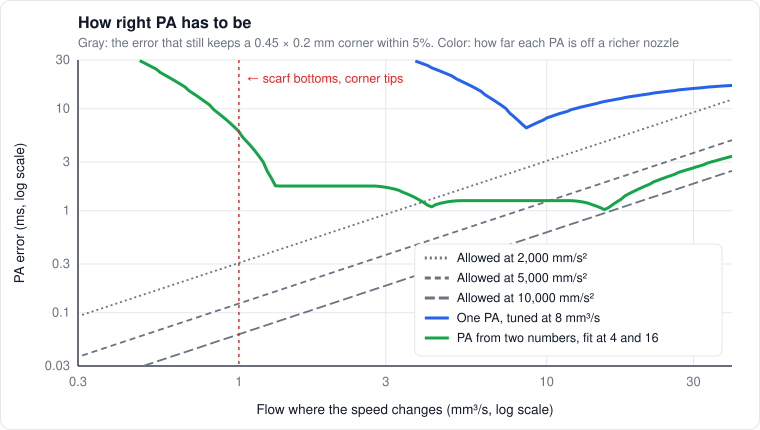
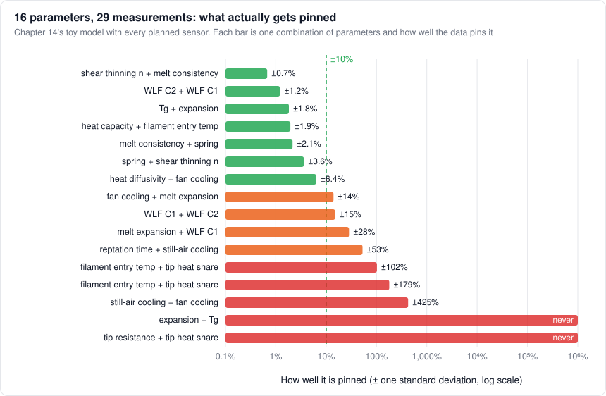
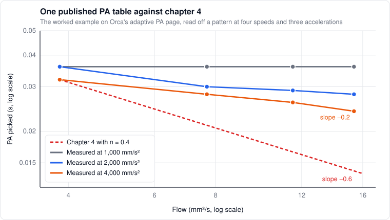
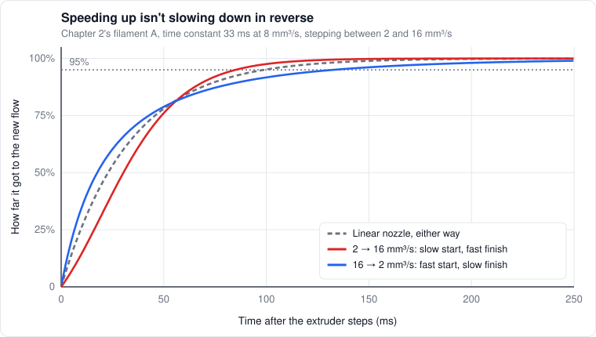
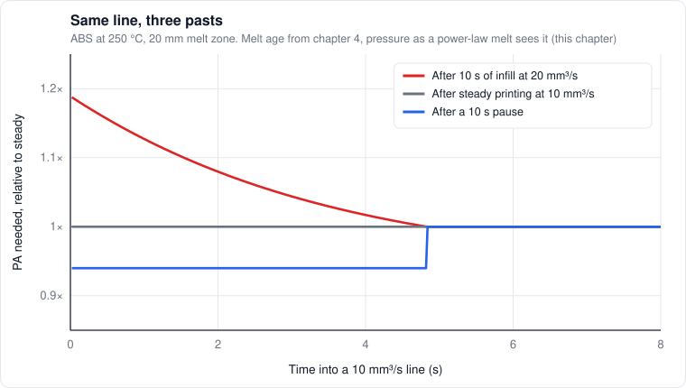
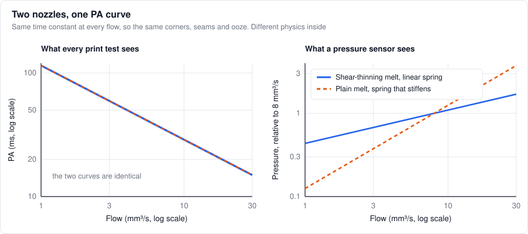

# 15. Trying to prove it wrong

*Level 4. Everything up to here was a claim. This is where the claims get attacked, starting with my favorite.*

Fourteen chapters in, the models hang together. Melt temperature feeds the pressure, pressure feeds
PA, PA feeds the seam, and the numbers mostly agree with each other. That's exactly what worries
me. A coherent model isn't an accurate one. A stack of assumptions can agree with itself all the way
down and still be wrong at the bottom.

This is what I do at work every day, just across thousands of robots and pieces of automation
equipment instead of one printer. The failure I've learned to fear most isn't the model that
breaks. It's the one that works for the wrong reason. It passes every check anyone thought to run,
the next layer gets built on top of it, and when it finally lets go it takes the layers with it.

So this chapter switches sides. I can already feel where some of the gaps are, from what I've seen
on machines and from what people in the community have roughly worked out by engineering intuition,
and the research has gotten us decently far. Now I'm trying to break things on purpose. I started
with pressure advance, the model I trust most. It didn't come out untouched, and neither did
chapters 4 and 14.

## How this works

Every model gets the same six questions:

1. **The claim,** and the assumptions it runs on
2. **What would contradict it,** in this application. I don't care that the PA model fails for ABS at 500 °C or at 1,000 mm/s. I care about the window below
3. **Competing explanations:** what else would produce the same observation
4. **The test,** and how well it can actually measure
5. **What I expect,** worked out before any test, with numbers, so the goalposts can't move afterwards
6. **The decision**

| Decision | What it means |
|---|---|
| Retain | Survived everything I could throw at it on paper. Still owes a test |
| Restrict | True inside an envelope, wrong or unknown outside it. The edges get written down |
| Revise | Right idea, wrong detail. Fix the math and every number that came from it |
| Replace | The mechanism is wrong. Something else explains the observation better |
| Reject | Wrong, and nothing else in the handbook gets to lean on it |

Every decision here is made on paper: theory, simulation and other people's published data. They're
provisional until the bench says otherwise. What makes them worth anything is item 5. A prediction
written down before the test can fail. One written after can't.

The window that counts:

| | Range |
|---|---|
| Materials | PLA, PETG, ABS/ASA, PC, nylon, PPA-CF, TPU |
| Nozzles | 0.4 to 0.8 mm, brass to hardened steel |
| Flow | about 0.3 mm³/s (the bottom of a scarf, the tip of a corner) to 35 mm³/s |
| Acceleration | 1,000 to 20,000 mm/s² |
| Nozzle temperature | Each material's normal range, ±20 K |
| Chamber | Room temperature to 70 °C |

## Validity envelopes

Every model is wrong somewhere. The useful question is where. A validity envelope is the part of
that window where the model's error, measured on an output I care about, stays under a tolerance I
picked before looking.

Both halves of that sentence matter. The error goes on the output (line width at a corner, weld
strength, the size of a hole), not on an internal parameter, because a parameter can be 30% off and
change nothing anyone can see. And the tolerance comes first. Pick it afterwards and the edge of the
envelope moves to wherever the data happened to land.

For PA the output is the width during a speed change. From chapter 4, PA set to $`K`$ on a nozzle
whose real time constant is $`\tau(q)`$ gives

```math
\frac{\delta w}{w} = \big(\tau(q) - K\big)\,\frac{a}{v} \quad\Longrightarrow\quad \lvert\tau(q) - K\rvert \le \varepsilon\,\frac{v}{a}
```

for a tolerance $`\varepsilon`$. That right-hand side is brutal. At 5,000 mm/s² on a 0.45 × 0.2 mm
line, holding 5% takes PA right to about 1 ms at 8 mm³/s and 0.1 ms at 1 mm³/s. Here's how two
versions of PA measure up against a richer nozzle model (chapter 2's filament A for the shear
thinning, chapter 3's melt zone and the brass tip for the heat), taking the worst error within 1.5×
of each flow, since a speed change never sits at one flow:



*Where a colored curve sits under a gray line, that PA holds corners to 5% at that acceleration.*

The PA from two numbers (chapter 4's idea, fit at 4 and 16 mm³/s) holds 5,000 mm/s² from about
10 mm³/s up, or from about 5 at a 10% tolerance. Below 2 mm³/s nothing holds at that acceleration:
the melt stops shear thinning there, the power law keeps going, and the allowed error is a fraction
of a millisecond.
That's the bottom of every scarf ramp and the tip of every corner.

Taken literally, one constant PA never holds 5% anywhere. That can't be the whole truth, next to all
the good-looking corners people print on one PA value at 5,000 mm/s². Either 5% is stricter than the
eye, or real nozzles shear-thin less than filament A (the next section has data that says they
might), or both. And the "truth" in this plot is just another model. An envelope measured against a
richer model tells me where to point the test, not where the real edge is.

## Too many knobs

Every parameter I add makes a model better at fitting things, and a model that can fit anything
confirms nothing. There are two ways it goes wrong:

- **Structural.** Two parameters only ever appear together, as a product or a sum. No amount of data separates them. Bellman and Åström named this in 1970
- **Practical, or sloppy.** Separable in principle, but the data barely constrain some combinations. Gutenkunst and colleagues found every systems biology model they looked at had its sensitivities spread over many decades, and called those models sloppy

I took chapter 14's toy model, exposed all 16 of its constants, and gave it every measurement the
planned sensors could make: pressure, PA and heater power at three flows and two temperatures,
ooze at two flows, an IR spot on the interface and Z strength at four fan and chamber combinations,
and shrink. That's 29 measurements, each with a realistic error. The Fisher information from
[chapter 10](10-sensing-estimation.md#designing-tests-that-actually-tell-you-something), worked out in log-parameter space, says how well each combination of parameters gets pinned:



*Each bar is one combination of parameters. Short bars are pinned, long ones are guesses.*

The eigenvalues span 17 decades. Seven of the 16 combinations come out better than ±10%. Two get
pinned at nothing at all: the tip's thermal resistance and the share of heat that comes through the
tip only ever appear as a product, and the expansion coefficient and $`T_g`$ only show up in shrink,
as $`\alpha(T_g - T_{room})`$.

The part that gets me is the one-at-a-time view:

| Parameter | Pinned on its own | Pinned with the rest free |
|---|---|---|
| WLF $`C_1`$ and $`C_2`$ | ±1 to 2% | ±114 to 122% |
| Tip thermal resistance | ±14% | ±102% |
| Convection, still air and fan | ±12 to 22% | ±260 to 280% |
| Spring (the C in PA) | ±2% | ±16% |
| Power-law index $`n`$ | ±0.9% | ±16% |
| Melt consistency | ±1% | ±7% |

Move one parameter with the rest held at my guesses and everything looks nailed down. Let them all
move and they trade off against each other. The model can match all 29 measurements with the WLF
constants off by a factor of two, because something else quietly compensates. That's a model
fitting for the wrong reasons, in numbers. I find it the most sobering figure in the handbook.

It also says which predictions to trust. One that leans only on the pinned combinations is safe.
One that leans on a sloppy direction isn't, however good the fit looked. Chapter 14's "a steel
nozzle is a quiet disaster" needs the tip resistance on its own, and this data set knows that to
±100%. The fix isn't fewer parameters, it's tests that push on the sloppy directions: both nozzles
in the same session makes the tip resistance identifiable, and stepping the fan separates
convection from everything else.

## Pressure advance on trial

### The claim

From [chapter 4](04-extrusion-dynamics.md): between the gears and the tip sits one spring $`C`$ and
one flow resistance, and the time constant is the spring times the incremental resistance, at
whatever temperature the melt has right then:

```math
\tau(q, T) = C\,\frac{\partial P}{\partial q}\bigg\rvert_{T}, \qquad \tau \propto q^{\,n-1} \ \text{for a power-law melt}
```

What it runs on, and what each assumption looks like when it breaks:

| Assumption | If it's wrong |
|---|---|
| One linear spring holds everything stored | A fast extruder tap gives a different pressure jump per volume at different pressures |
| The melt is purely viscous, and in its power-law range | Small steps show two time constants. PA stops falling at low flow |
| The melt temperature doesn't move during a PA transient | PA depends on what came before, for longer than a few $`\tau`$ |
| The extruder delivers what it's told | Errors that follow direction changes instead of flow |
| Width follows flow the moment it leaves the nozzle | Width errors smeared along the line |

One suspect I could rule out on paper: the motor's own magnetic spring. A small extruder motor with
about 0.15 N·m of holding torque, geared to roughly 4.6 mm of filament per turn, is around
14,000 N/mm stiff at the filament. At 12 N of push (5 MPa on 1.75 mm filament) it lags by under a
micron. Not it.

### Does the time constant change with flow?

The model says yes. With a real melt (Cross, chapter 2) it levels off at low flow instead of
running away: filament A with $`\tau`$ = 33 ms at 8 mm³/s is at 120 ms at 1 mm³/s, 81 at 2, and 21 at
16. The melt zone flattens the drop a bit at high flow, because the melt runs cooler there.

What would contradict it: PA that stays flat across flows when measured properly, or that falls at a
slope with nothing to do with the melt's measured $`n`$.

The only public data I have is the worked example on
[Orca's adaptive PA page](https://github.com/OrcaSlicer/OrcaSlicer/wiki/adaptive_pressure_advance_calib):
twelve PA values at four speeds and three accelerations.



*If n = 0.4 were the whole story, every row would fall like the dashed line.*

| Acceleration | Slope of PA against flow | Chapter 4 says ($`n`$ = 0.4) |
|---|---|---|
| 1,000 mm/s² | 0.00 | −0.60 |
| 2,000 mm/s² | −0.18 | −0.60 |
| 4,000 mm/s² | −0.20 | −0.60 |

Taken at face value that's a third of the predicted slope, plus an acceleration dependence the
model doesn't have at all. One table, unknown filament, unknown printer, read by eye. But it's
exactly the kind of observation this chapter exists for, so before believing it or dismissing it, I
wanted to know what the instrument measures.

### What a PA pattern actually measures

I simulated one: slow into a corner at 5 mm/s, speed back up, Klipper-style smoothing, a nozzle with
a known time constant, and the PA a few reasonable "looks best" criteria would pick. Three things
came out of it:

- **The test doesn't return $`\tau`$ at the flow on its label.** The corner sweeps the flow from the test speed down to nearly nothing, so it returns something like an average of $`\tau`$ over that whole range. For filament A at 50 mm/s, $`\tau`$ at the labeled flow is 52 ms and the test picks 58 to 67
- **The test has its own speed and acceleration dependence.** A perfectly linear nozzle, 33 ms at every flow, read by the worst width near the corner with 40 ms of smoothing, comes out anywhere from 39 to 80 ms or more, depending on speed and acceleration. Read by RMS width, 35 to 62. Read by net volume, 33 everywhere. The answer depends on how you look at the corner
- **Shear thinning on its own makes PA fall with acceleration.** At high acceleration the corner rushes through the sluggish low-flow region before the nozzle settles into it, so the test sees a smaller time constant: 10 to 20% from 1,000 to 4,000 mm/s² at 200 mm/s, depending on how strongly the melt shear-thins. Orca's table shows 33%. Chapter 4 couldn't derive the acceleration effect at all, so this is part of it

The test's resolution moves around too. A PA error only shows once the width error it causes is
visible, and at 5% that's $`\Delta K = 0.05\,v/a`$: 0.6 ms at 4,000 mm/s² and 50 mm/s, but 10 ms
at 1,000 mm/s² and 200 mm/s. The 1,000 row is 16 times less sensitive than the slow end of the
4,000 row, and couldn't have seen what a mildly shear-thinning melt does.

A milder melt ($`n`$ around 0.6) read by net volume gives a slope of about −0.24 at 4,000 mm/s²,
close to Orca's −0.20. So the table fits shear thinning, just less of it than chapter 4 assumed,
plus the test's own bias. It doesn't settle anything, which is the honest result.

Here's my problem with fitting PA curves to pattern tests. Adaptive PA works, corners get better,
and that's how it earns trust. But the curve it fits is a blend of the melt, the smoothing window,
the corner speed and whoever read the pattern. Change the smoothing time and the meaning of the curve
changes underneath it, without anything telling you. It works, and nobody can say how much of it
works for the right reason without a pressure trace. Anyway.

**Decision on PA against flow: restrict.** PA falls with flow: kept, every source agrees on the
direction. The slope from a rheometer's $`n`$: not established, and the one table I have says it's
weaker. Below about 1 mm³/s the power law is wrong. And pattern tests measure the test as much as
the nozzle.

### Does temperature do something the model can't predict?

It does, and the first thing it caught was my own math. Chapter 4 used to say the melt's consistency
scales with $`a_T`$, so PA does too. Time-temperature superposition (chapter 2) says something more
specific: heating a melt slides its whole viscosity curve along the shear rate axis, it doesn't just
lower it:

```math
\eta(\dot\gamma, T) = a_T\,\eta(a_T\dot\gamma,\ T_0) \quad\Longrightarrow\quad \eta = K\,a_T^{\,n}\,\dot\gamma^{\,n-1} \ \text{in the power-law range}
```

So at printing shear rates, pressure and PA go as $`a_T^n`$, not $`a_T`$. For ABS going from 230 to
240 °C, $`a_T`$ drops 40% and PA should drop about 18%, not 40%. Only near the Newtonian plateau, at
very low flow, does the full $`a_T`$ come back.

The same idea gives a sharp test. Pressure depends on flow and temperature only through the product
$`a_T q`$, so

```math
P = F(a_T\,q) \quad\Longrightarrow\quad \frac{\tau}{a_T} = C\,F'(a_T\,q)
```

Plot PA divided by $`a_T`$ against $`a_T q`$, for three temperatures, and every point should land on
one master curve, with $`a_T`$ from a rheometer or Seppala's WLF fit. If the curves don't collapse,
either the spring changes with temperature (the softened stretch of filament above the melt moves
when the setpoint does) or the melt isn't at the temperature I think it is, which chapter 3 says it
isn't at high flow. Correct for the melt model, check the collapse again, and that tests chapter 3
too.

The exponent fed into a lot of numbers, so I fixed it everywhere:

| Where | Before | After |
|---|---|---|
| Chapter 4, PA at 25 vs 5 mm³/s, good brass setup | 0.55× | 0.44× |
| Chapter 4, same, steel nozzle | 1.34×, the trend flips | 0.63×, bottoms out near 22 mm³/s |
| Chapter 4, pressure slope near the max flow knee | $`q^3`$ to $`q^5`$ | $`q^{0.7}`$ at most |
| Chapter 14, PA at the start of the wall after infill | 1.7× | 1.2× |
| Chapter 14, PA for +20% speed | +7% | −5% |
| Chapter 14, steel nozzle, pressure | +77% | +25% |

**Decision: revise** PA's temperature scaling. Done, in chapters 4 and 14.

### The max flow wall isn't viscous

The third row of that table needs its own section. Done properly for a power-law melt, the flow
through the melt zone is carried by $`\int r^{2+1/n}/a_T\,dr`$, which weights the wall even harder than the Newtonian $`r^3`$
(the 4.5th power for $`n`$ = 0.4), and the pressure goes as that average to the power $`n`$. The hot
sleeve at the wall carries the flow and the cold core just rides along. My old version used the mean
temperature, which made a lovely story about the max flow wall being a pressure spike from the cold
core. The exact version of my own model says the core barely moves the pressure.

So whatever stops the extruder at max flow, it isn't viscous flow in the bore. My best candidate now
is the cone: the unmelted core arrives at the taper, can't fit through, and has to be melted by
contact under force, which is the regime [Osswald et al. (2018)](https://doi.org/10.1016/j.addma.2018.04.030)
modeled. The other is melt leaking back up the gap (chapter 3). A pressure trace through the knee
tells them apart: a smooth $`q^{0.7}`$ climb, then a step when the core reaches the cone.

**Decision: replace** the viscous pressure spike, with the cone as the candidate.

### Does speeding up look like slowing down?

Not for a real melt. A linear nozzle answers a step up and a step down with mirror images. A
shear-thinning one starts each step on the time constant of where it came from and finishes on the
time constant of where it's going:



*Same nozzle, same two flows, both directions. A linear nozzle would draw one curve for both.*

For filament A with $`\tau`$ = 33 ms at 8 mm³/s:

| Step (mm³/s) | 63% of the way | 95% of the way |
|---|---|---|
| 2 → 16 | 39 ms | 85 ms |
| 16 → 2 | 28 ms | 133 ms |
| 7 → 9 | 34 ms | 96 ms |
| 9 → 7 | 32 ms | 102 ms |
| Any step, linear nozzle | 33 ms | 99 ms |

A slowdown starts fast and finishes slow, a speedup the other way around. Small steps are nearly
symmetric, so the asymmetry is a fingerprint of the nonlinearity, and it grows with the size of the
step: the ratio of the 95% times goes 1.06, 1.3 and 1.6 for flow ratios of 1.3, 3 and 8. The linear
model says 1.0 for all of them. That's the prediction I'm writing down now. A full stop from
8 mm³/s drains to 1% in 690 ms, against 150 ms for the linear nozzle, the slow ooze tail from chapter 4.

The competing explanation is mechanical, and sneaky. With PA on, the extruder runs backward during a
slowdown whenever $`v < K a`$. At $`K`$ = 0.04 s and 5,000 mm/s² that's every slowdown below
200 mm/s before smoothing softens it, so most of them. Slowdowns reverse the extruder and speedups
reverse it back, and any slack in the gears or the filament grip gets eaten every time. That looks just like too little PA: a bulge
going into the corner, a gap coming out. Tune PA by eye and you'd raise it to cover the slack without
ever knowing. It can be separated, though. Slack costs a fixed volume per reversal whatever the flow,
shear thinning scales with the flow ratio, and step tests with PA off never reverse at all.

**Decision: retain** the asymmetry as the model's prediction, and **restrict** linear PA. Klipper's
single $`K`$ is symmetric by construction, so on every slowdown into low flow it's wrong in one
direction. That's where seams and corners live.

### Does it remember what came before?

A one-spring nozzle only remembers its pressure, and that's gone after a few $`\tau`$, about 100 ms.
Anything longer means there's a second state somewhere. The candidate from chapter 4 is melt age:
the plastic leaving now was heated by whatever the extruder was doing one melt zone ago. With the
corrected exponent, here's the PA a 10 mm³/s line needs after three different pasts:



*Same line, three pasts. A slow perimeter at 2 mm³/s lands almost exactly on the pause.*

| Before the line | Melt at the start | PA needed | Back within 5% after |
|---|---|---|---|
| 10 s of infill at 20 mm³/s | 215 °C | 1.19× | 2.8 s |
| Steady at 10 mm³/s | 240 °C | 1.00× | |
| A 10 s pause, or 10 s at 2 mm³/s | 247 °C | 0.94× | 4.8 s, all at once |

That's a 25% spread in PA from history alone, on the same line at the same flow. The pause is a
plateau that snaps back after exactly one melt zone of volume, because that's when the last plastic
that sat still in the hot zone leaves.

There are other ways to get a long memory: creep where the gear teeth bite (the filament is a
viscoelastic solid too), the heater controller recovering from a flow step (MPC takes a second or
two), and leftover pressure from an incomplete drain. The way to tell them apart is lovely: melt age
runs on volume pushed, the others run on the clock. Send the same history into a probe line at 5 and
at 10 mm³/s. Melt age recovers after one zone volume, 9.6 s and 4.8 s. Creep and the heater recover
in the same time either way.

**Decision: revise** the size (about 1.2×, not 1.7×) and **retain** melt age as the hypothesis, with
volume against time as the decider.

### The degeneracy no print test gets out of

This is the result that changed how I think about PA testing. For any nozzle with a single spring,
wherever the nonlinearity lives, the time constant at a steady flow is how much more volume gets
stored per unit of extra flow:

```math
\tau(q) = \frac{dV_s}{dq} \quad\Longrightarrow\quad V_s(q) = \int_0^{q} \tau(q')\,dq'
```

Chapter 4's $`\tau q/n`$ is that integral for a pure power law. The bigger point is what it implies:
the whole flow-in to flow-out behavior, every corner, every seam, every ooze, is fixed by the curve
$`\tau(q)`$ alone. A shear-thinning melt behind a linear spring, and a plain melt behind a spring
that stiffens under load (gear teeth biting deeper, chapter 4's other suspect), can have identical
PA curves, and then they behave identically in every print-based test there is. Temperature doesn't
break the tie either, both collapse onto a master curve.



*Two nozzles with different physics. Every print sees the left panel. Only a pressure sensor sees the right.*

Pressure breaks it immediately: one goes as $`q^{0.4}`$, the other as $`q`$. So does a fast extruder
tap, which reads the spring directly, $`\Delta P = \Delta V/C`$, before any flow has time to happen.
In the parameter count, a print-only PA campaign at three flows and two temperatures pins 2
combinations of the ten pressure and heat parameters, and the spring and the melt's consistency only
ever show up as a product. Add pressure and, with the heat side known, the spring, the consistency
and $`n`$ each come out to within a few percent.

Why care, if the prints come out the same? Because the two stories extrapolate differently. Swap
the extruder, and the melt story says the PA curve just scales up or down, while the spring story
says it changes shape. Swap the filament and it's the other way around. The model that fit for the
wrong reason predicts the wrong one.

### The experiment

On the ALPS (a load cell, about 488 samples a second, [guide](../guides/alps-load-cell.md)) or the
bd_pressureE, both on order. Nozzle in the air, PA off, extruder-only moves:

1. Heat, tare, push three melt zone volumes through to settle
2. A staircase of flows, 1, 2, 4, 8, 16 and 24 mm³/s and back down, each held 1 s, at the setpoint and ±15 K. That's pressure against flow and temperature, and every big step up and down
3. Small ±10% steps around each flow: the small-signal $`\tau`$, where the nonlinearity can't hide
4. Fast extruder taps at each steady flow: the spring at each pressure, directly
5. History blocks: 10 s at 20 mm³/s, a pause, or steady, then probe lines at 5 and 10 mm³/s with small steps riding on them every 150 ms
6. The same flows as a pattern test, at 0 and 40 ms of smoothing, to compare the test against the $`\tau`$ it's supposed to measure

How well can it measure? For a first-order step of size $`A`$ in noise $`\sigma`$, sampled at
$`f_s`$, the Cramér-Rao bound from chapter 10 works out to

```math
\sigma_\tau \ge \frac{2\,\sigma}{A}\sqrt{\frac{\tau}{f_s}}
```

A 1.5 MPa step on 1.75 mm filament is about 370 g of force. Even with 5 g of noise that's ±0.2 ms
per step on a 33 ms time constant. A small step (0.17 MPa, about 42 g) gets ±0.4 to 2 ms, depending
on the noise. **The noise isn't the problem. The systematics are:**

| Source | What it does | How I'd handle it |
|---|---|---|
| The load cell's filter and mount | Adds a lag that looks exactly like $`\tau`$ | Measure the sensor's own step with a known force and take it out |
| Strain gauge drift on a hot hotend | A slow offset | Tare before each block, remove the trend |
| Filament friction in the heatbreak | Force that isn't pressure, and it flips sign on reversal | Compare steps with and without reversals |
| The extruder's acceleration limit | The "step" is really a ramp | Fit against the commanded motion, not an ideal step |
| Melt below the setpoint at high flow | Bends the master curve | Correct with chapter 3, then test that correction |
| Filament drying or soaking up water during the test | The viscosity drifts | Dry spool, repeat the first block at the end |

[Kazmer et al. (2021)](https://doi.org/10.1016/j.addma.2021.102106) already fit compressibility and
viscosity together from pressure on an instrumented ABS hot end, and
[autopa](https://github.com/G0BL1N/autopa) gets PA from the ALPS's force signal, so the hardware side
is proven. What I'd add is the design: steps both ways, taps, temperatures and histories, chosen to
break the ties above.

### What the results would look like

| Hypothesis | Pressure vs flow | Taps vs pressure | Master curve | Big steps, up vs down | History recovers by |
|---|---|---|---|---|---|
| Chapter 4: linear spring, shear-thinning melt | $`q^{0.4}`$ to $`q^{0.6}`$ | Constant | Collapses | Asymmetric, grows with the step | Volume |
| Spring that stiffens, plain melt | $`q`$ | Stiffens with pressure | Collapses | Same as above | Volume |
| Slack at reversals | | | | A fixed volume per reversal, only with PA on | |
| An elastic melt | | Depends on tap speed | | An extra fast tail | |
| Creep, or the heater recovering | | | | | Time |

An empty cell means no signature of its own. The first two rows only differ in the first two
columns, and both of those need the sensor.

### Decisions for PA

| Claim | Decision | What would change it |
|---|---|---|
| PA is the nozzle's time constant at an operating point | Retain | Two time constants in a small step |
| PA falls with flow as $`q^{n-1}`$ | Restrict: the direction yes, the slope unproven, wrong below about 1 mm³/s | The staircase |
| PA scales with $`a_T`$ | Revise: $`a_T^n`$, and a master curve | The curves not collapsing |
| The acceleration dependence is unexplained | Revise: shear thinning explains part of it | Pattern tests at 0 and 40 ms of smoothing |
| Stored volume is $`\tau q/n`$ | Revise: $`\int\tau\,dq`$, which is $`\tau q/n`$ only for a pure power law | Taps plus drain volume |
| The max flow wall is a viscous pressure spike | Replace: the cone, or melt leaking back | A pressure trace through the knee |
| Melt age moves PA by 1.7× | Revise: about 1.2× | History blocks |
| One constant PA | Restrict: good near its tuning flow, at gentle accelerations | The staircase, then the envelope again |

## Everything else on trial

Shorter, the same six questions each. Ordered roughly by chapter.

### Melting and max flow (chapter 3)

| | |
|---|---|
| Claim | Plug flow through the melt zone, a knee near $`Fo \approx 0.3`$, so max flow grows with melt zone length |
| Would contradict it | The knee not moving when the melt zone does, same filament |
| Other explanations | The clearance gap insulating the filament (chapter 3's own table), contact melting at the cone, the heater running out first |
| Test | The flow ladder by mass with heater power and pressure logged, on two melt zone lengths. Mass to ±1 mg on samples of a few hundred mg, the knee to about ±1 mm³/s from a two-line fit |
| What I expect | Knee flows in the ratio of the zone lengths, both about 25% below what a filament filling the bore would give. Pressure climbing no faster than $`q^{0.7}`$ until the cone takes over |
| Decision | **Restrict:** a scaling law for $`Fo`$ above about 0.2, not an absolute number. Wüst's optimum length already says "longer is better" stops somewhere |

### Heater power as a calorimeter (chapters 3 and 10)

| | |
|---|---|
| Claim | The slope of heater power against flow is $`\rho[c(T_n - T_f) + X\Delta H_m]`$, so it reads crystallinity, and heater power reads flow |
| Would contradict it | The slope changing with the range of flows it's fit over, same filament |
| Other explanations | The plastic leaving below the setpoint, which my own melt model says it does. Fans and drafts (chapter 10). $`c`$ changing with temperature |
| Test | Power against flow at low flow, fan off and then stepped, an amorphous grade first. At 2 mm³/s the plastic takes about 1 W against 10 to 20 W of losses, so the losses have to hold still to about half a percent |
| What I expect | Fit over 2 to 15 mm³/s on a 20 mm zone and the slope comes out 11% low, because the plastic isn't fully at the setpoint. For PLA that reads as 39 points less crystallinity than the spool has. Over 1 to 5 mm³/s it's within a point |
| Decision | **Restrict** to flows where the melt zone has time ($`Fo`$ above about 1) and **revise** to use the exit temperature from the melt model. As a crystallinity meter it's one bad assumption away from rejected |

That one surprised me. The calorimeter idea from chapter 3 was undone by chapter 3.

### The scarf seam (chapter 5)

| | |
|---|---|
| Claim | The PA error cancels between the ramp and the end pass. What's left scales as $`A^{n-1}v^n/L`$. Thicker layers help through $`1/A`$, $`A^{n-1}`$ and the squeeze, $`h^{-(1+n)}`$ |
| Would contradict it | Seam error not shrinking with scarf length, or not growing with scarf speed |
| Other explanations | All three "thicker layers help" mechanisms point the same way, and so does heat soaking into a slow ramp. Seeing thicker layers help confirms none of them |
| Test | Matched cross-sections: 0.60 × 0.20 mm (0.111 mm²) against 0.45 × 0.27 mm (0.106 mm²). Same $`1/A`$, same $`A^{n-1}`$, different squeeze. Crossed with scarf lengths of 10, 20 and 30 mm and speeds of 50 and 100 mm/s. The seam profile from a scan or the line laser, to about ±10 µm |
| What I expect | Error going as $`1/L`$, about 1.4× for double the speed, and the 0.27 mm pair at about 0.66× of the 0.20 mm pair if the squeeze matters, equal if it doesn't |
| Decision | **Retain** the cancellation (it's exact for a linear nozzle). **Restrict** "why thicker layers help" to three suspects until the matched pair |

### Contact between layers (chapter 5)

| | |
|---|---|
| Claim | The bonded fraction is $`\phi_c = 1 - h/w`$ |
| Would contradict it | Measured bonded width not following $`h/w`$ |
| Other explanations | Squish and a little extra flow filling the corners, surface tension pulling hot beads together |
| Test | Cut stacked walls at three $`h/w`$ ratios and measure the bonded width under the USB microscope, to about ±5 µm on 0.3 mm |
| What I expect | Above $`1 - h/w`$ everywhere (chapter 5 already says real beads flow into the corners), with the same trend |
| Decision | **Revise** to a lower bound, $`\phi_c \ge 1 - h/w`$, with an offset to measure |

### Welds: geometry or temperature (chapter 6)

| | |
|---|---|
| Claim | PLA's welds heal in milliseconds, so only geometry matters. ABS sits near $`H = 1`$, so temperature matters too |
| Would contradict it | ABS strength per bonded area not changing with chamber temperature, or PLA's changing |
| Other explanations | The chamber moves three things at once: weld time, built-in stress (−18% per 10 K in chapter 14) and how far the bead spreads. A stronger coupon from a hotter chamber confirms none of them on its own |
| Test | ABS Z coupons at two chamber temperatures and two layer times (layer time moves the landing temperature without moving the bulk stress much), strength divided by bonded area from the microscope. Half of each set relaxed a little below $`T_g`$ before testing, which (theory) relaxes stress faster than it heals welds |
| What I expect | From chapter 14's model, about +20% strength per bonded area for +10 K of chamber in ABS, close to nothing in PLA |
| Decision | **Retain** as the leading explanation. Until the per-area test separates the three, it's a reconciliation, not a result |

Z coupons scatter a lot, often around 10%, and for two groups the coupon count goes as

```math
n \approx 2\,(z_{\alpha/2} + z_\beta)^2\left(\frac{\mathrm{CV}}{\delta}\right)^2
```

At 95% confidence and 80% power, that's 7 coupons per group to see a 15% change and 16 to see 10%.
The usual tensile standard (ASTM D638) asks for at least 5.

### Shrink (chapter 7)

| | |
|---|---|
| Claim | Shrink is about $`\alpha(T_{set} - T_{room})`$: about 0.7% for ABS, 0.25% for PLA |
| Would contradict it | Big differences along and across the lines in an unfilled amorphous plastic, or shrink that depends on part size |
| Other explanations | Frozen-in chain orientation relaxing along the lines, the bed holding the bottom, crystallization in PLA |
| Test | 25, 50 and 100 mm squares, lines along and across, two chamber temperatures. Calipers at ±0.02 mm on 100 mm is ±0.02%, plenty |
| What I expect | ABS at 0.7 ± 0.1% both ways. My ABS prints on the X2D already land there |
| Decision | **Retain** for unfilled amorphous plastics. **Restrict** for fibers (directional, chapter 7) and anything that crystallizes |

### Built-in stress and warp (chapter 7)

| | |
|---|---|
| Claim | Stress up to $`E\alpha(T_{set} - T_{ch})/(1 - \nu)`$, the bottom layers do the pulling, the worst warp at medium heights |
| Would contradict it | Warp not dropping with chamber temperature, or growing steadily with height |
| Other explanations | Stress relaxing while it prints, bed adhesion giving way, the first layer's temperature |
| Test | 100 × 10 mm bars at four heights and two chamber temperatures. Corner lift with the probe, ±0.01 mm |
| What I expect | A peak at medium height (Armillotta), lower at 70 °C |
| Decision | **Restrict:** the formula is an upper bound for cracking, not a warp predictor |

### Ringing (chapter 8)

| | |
|---|---|
| Claim | Ringing is about $`a/\omega_0^2`$, shapers cancel it, and the resonance moves with position |
| Would contradict it | A shaper tuned in the middle leaving visible ringing near the edges |
| Other explanations | Several modes close together, the frame, the bed |
| Test | The accelerometer at five positions |
| What I expect | A few hertz of shift, inside what MZV and EI tolerate |
| Decision | **Retain.** Klipper's whole resonance machinery runs on it every day. **Restrict** to the positions measured |

### The chamber and the frame (chapter 9)

| | |
|---|---|
| Claim | Two heat stores (air and frame) describe the chamber, and Z drift is a weighted sum of a few temperatures |
| Would contradict it | A two-node fit from a heat-up missing a cool-down by more than about 1 K, or Z coefficients that change between sessions |
| Other explanations | A third heat store (the bed, the gantry), stratification, the PTC heaters' own curve. For Z drift, inputs that move together |
| Test | Fit on a heat-up, predict a cool-down and a door opening. For Z, break the pattern on purpose: bed on with the chamber heater off, then the reverse |
| What I expect | Residuals under 0.5 K. Z coefficients that only settle down after the decorrelated runs |
| Decision | **Retain** the two-node chamber. **Restrict** the Z model to the kind of warm-up it was fit on |

The Z one is a textbook trap. The frame and the chamber warm up together, and two inputs with a
correlation of 0.99 make each fitted coefficient about 7 times less certain (a variance inflation
factor of $`1/(1 - \rho^2)`$, 50). It fits a normal warm-up perfectly and fails the first time the
chamber cools faster than the frame.

### The whole printer (chapter 14)

| | |
|---|---|
| Claim | The coupling map, the one-knob table, and four directions that carry most of the effect |
| Would contradict it | A knob moving an outcome the opposite way the map says |
| Other explanations | Everything the model leaves out: moisture, crystallization, fibers, chain alignment |
| Test | An 8-run fractional factorial over the four directions, measuring whatever the sensors can |
| What I expect | Signs right, sizes within a factor of two |
| Decision | **Restrict** to signs and rankings. Sizes that lean on a sloppy direction (the tip resistance, the WLF constants) aren't pinned. The four directions survived the exponent fix: 91 to 97% of the effect under three scalings, 83% under the bluntest |

## The ledger

| Claim | Chapter | Decision |
|---|---|---|
| PA is the nozzle's time constant | 4 | Retain |
| PA falls as $`q^{n-1}`$ | 4 | Restrict |
| PA scales with $`a_T`$ | 4 | Revise, to $`a_T^n`$ |
| Nobody knows why PA falls with acceleration | 4 | Revise, part of it is shear thinning |
| Stored volume $`\tau q/n`$ | 4 | Revise, to $`\int\tau\,dq`$ |
| The max flow wall is viscous | 4 | Replace, with the cone |
| Speeding up mirrors slowing down (one PA value) | 4 | Restrict, to small steps |
| Melt age moves PA by 1.7× | 4, 14 | Revise, to about 1.2× |
| Plug flow, the knee at $`Fo \approx 0.3`$ | 3 | Restrict |
| Heater power as a calorimeter | 3, 10 | Restrict and revise |
| The scarf cancels the PA error | 5 | Retain |
| Why thicker layers help the scarf | 5 | Restrict, three suspects |
| Bonded fraction $`1 - h/w`$ | 5 | Revise, to a lower bound |
| Welds: geometry for PLA, temperature for ABS | 6 | Retain, confounded |
| Shrink from $`\alpha\,\Delta T`$ | 7 | Retain, for amorphous plastics |
| Built-in stress | 7 | Restrict, an upper bound |
| Ringing and input shaping | 8 | Retain |
| The two-node chamber | 9 | Retain |
| The Z drift model | 9 | Restrict |
| The whole-printer model | 14 | Restrict, to signs and rankings |

Nothing got rejected outright, and I'm a little suspicious of that. Paper is gentler than a bench.

## What I'd love to test first

In order of how much of the handbook each one could knock over, per afternoon:

1. **The pressure staircase** on the ALPS. It answers PA's flow, temperature and asymmetry questions, breaks the degeneracy, and tests the max flow wall. Chapters 4, 5 and 14 all lean on it
2. **Pattern tests against the staircase,** at 0 and 40 ms of smoothing. How much of adaptive PA is the melt, and how much is the test
3. **History blocks,** volume against time
4. **The matched-area scarf pair**
5. **ABS Z coupons per bonded area,** two chambers, two layer times, enough coupons to see 15%
6. **The decorrelated warm-up** for the Z model

## References

- Popper (1959). *The Logic of Scientific Discovery.* Hutchinson. A claim is only worth something if it says what would prove it wrong
- [Box (1976)](https://doi.org/10.1080/01621459.1976.10480949). Science and statistics. All models are wrong, so the question is which ones are useful, and where
- [Bellman, Åström (1970)](https://doi.org/10.1016/0025-5564%2870%2990132-X). On structural identifiability. Parameters that no data can separate
- [Gutenkunst et al. (2007)](https://doi.org/10.1371/journal.pcbi.0030189). Universally sloppy parameter sensitivities in systems biology models
- [Transtrum et al. (2015)](https://doi.org/10.1063/1.4923066). Sloppiness and emergent theories in physics, biology and beyond
- Ferry (1980). *Viscoelastic Properties of Polymers,* 3rd ed. Wiley. Time-temperature superposition, which is where the $`a_T^n`$ comes from
- [Osswald, Puentes, Kattinger (2018)](https://doi.org/10.1016/j.addma.2018.04.030). Melting by contact at the cone, the candidate for the max flow wall
- [Kazmer, Colon, Peterson, Kim (2021)](https://doi.org/10.1016/j.addma.2021.102106). Compressibility and viscosity from an instrumented hot end
- [Orca: adaptive pressure advance](https://github.com/OrcaSlicer/OrcaSlicer/wiki/adaptive_pressure_advance_calib). The worked example tested above
- [Klipper: pressure advance](https://www.klipper3d.org/Pressure_Advance.html). The smoothing time, and tuning PA by eye
- [autopa](https://github.com/G0BL1N/autopa). PA from a load cell, built on the ALPS
- Montgomery. *Design and Analysis of Experiments.* Wiley. Sample sizes, factorials, confounding
- [Chapter 10](10-sensing-estimation.md) for the Fisher information and the Cramér-Rao bound used throughout

That's the end of the handbook for now. The next part gets written on the bench, in my lab notes
(not public yet), and comes back here as results, or as more revisions.
